# FLOW_DIAGRAMS — agent-joker 功能流程图

> 交付物：设计阶段 TASK-D01（父任务 t_5f373ddc，本卡 t_5dab4229）。作者：史强（系统分析师），2026-09-22。
>
> **来源声明**：本项目处于设计阶段，无存量代码、无运行系统、无截图可逆向。本文档完全依据
> `00-management/BRIEF.md` §2（用户原话逐条）、§3（模块范围）、§4（推测范围）、§5（技术栈约束）推导。
> 凡超出 BRIEF 原话、属于团队推断的内容，一律以 **【推测】** 前缀标注（图表内以 `[推测]` 标注）。
> 05-temp/assets/ 为空（RISK-001），需求以 BRIEF.md 为准。
>
> **下游契约**：本文档所有图中的组件命名遵循第 1 章「组件命名清单」，全文保持同一组件同一名称。
> 章北海的 ARCHITECTURE.md / DB_DESIGN.md 必须沿用此命名（命名冲突时以本文档为准并回填修改）。

> **修订记录**：2026-09-22 修订（TASK-D05，t_743863e7）——依据 5 份审阅 `04-analysis/REVIEW_*.md`（chuyan/luoji/zhangbeihai/yuntianming/shiqiang）：
> ① D-A 裁定（official tag 文档级，两级判定：文档级 tag=official，或文档级为空且所属知识库 tag=official）；
> ② D-B 裁定（工具调用拦截边界，用户裁定 2026-09-22 确认：MCP 工具调用必须经 ToolInterceptor 拦截；
> 简易 agent 对平台内部服务（RAG 检索/文件上传下载）的 API 直调属平台内部服务调用、不产生 tool_call 事件，
> 但必须保留用户身份校验 + (agent_id, kb_id) 勾选校验（未勾选 403）+ 落 rag/file 事件）；
> ③ S3 时序图：内部 RAG API 补充勾选校验、ToolInterceptor 明确为 SAR 进程内共享库（DECISION-015）；
> ④ §3.5 MCP 关联调用方检测范围限定为平台内 agent 勾选；⑤ §1 组件清单 ToolInterceptor 条目对齐；
> ⑥ 「39 条」字样检查（本文档无此字样，口径统一为「45 个标准 ID（源自 BRIEF §2 的 41 条 bullet）」）；⑦ 与 D-A/D-B 冲突表述全文修正。

> **修订记录**：2026-09-22 修订（TASK-D14，t_8b7247d2）——用户新增「切分对比查看」需求（与 zhangbeihai 在 ARCH 的接口定义为同一功能）：
> ① §3.4 M4 RAG 新增第 4 张图「切分对比查看」（左右分栏：左栏原文档渲染 + 右栏 chunk 列表；chunk→原文 pos/chunk_index 反向定位、原文→chunk 反查，双向联动；原文档类型分支：文本类=页/节/行级、表格=单元格/行列级、图片/扫描 PDF=图片区域级；chunk 修改后刷新）；
> ② §4.2 S2 时序图写入侧末段新增一步「进入对比查看」；③ 组件命名沿用第 1 章 31 项契约（WebConsole/RAGService/StorageService/VectorStore 等），未引入新组件；
> ④ 图数 21 → 22（本文档无图数统计文字，全文图数已核对）。

---

## 1. 组件命名清单（全文统一，下游契约）

| 组件名 | 中文名 | 职责 | 来源 |
|---|---|---|---|
| WebConsole | Web 管理控制台 | 全部管理功能与对话交互的前端控制台 | 【推测】BRIEF §4.1 |
| BFFGateway | BFF 网关 | 统一鉴权、多租户隔离、流量控制、API 路由、OpenAI 兼容协议转换、工具调用拦截入口 | BRIEF §2-BFF 网关 |
| ToolInterceptor | 工具调用拦截器 | BFF 提供的**进程内共享库**（非独立进程，DECISION-015）：在 SimpleAgentRuntime 进程内执行拦截——scope 校验 / 强制覆写参数（注入 Access Token）/ 机器凭证代理执行；拦截范围 = MCP 工具调用（含平台内置 MCP 工具与 URL 注册的外部 MCP server），不含简易 agent 对平台内部服务的 API 直调（用户裁定 2026-09-22） | BRIEF §2-BFF「统一工具执行拦截」；进程内共享库形态见 ARCH DECISION-015 |
| AuthService | 认证服务 | 登入登出、JWT access/refresh 令牌签发与校验、租户识别 | BRIEF §2-基础功能「登入登出」、§2-BFF「统一鉴权（Access Token）」；JWT 细节【推测】§4.2 |
| IAMService | 用户/角色/权限服务 | 用户、角色、权限（scope）管理 | BRIEF §2-基础功能 |
| AuditLogService | 接口操作日志服务 | 记录与查询接口操作日志 | BRIEF §2-基础功能「接口操作日志」 |
| StorageService | 存储模块 | 统一文件上传/下载/按文件名访问接口、上传记录、后端配置切换 | BRIEF §2-存储模块 |
| StorageBackend | 存储后端 | LocalFS / GCS / 阿里云 OSS 三种后端 | BRIEF §2-存储模块 |
| UploadRecord | 文件上传记录 | 每次文件上传的记录（PG 表【推测】） | BRIEF §2-存储模块「保存文件上传记录」 |
| LLMNodeService | LLM 节点管理服务 | LLM endpoint、embedding 模型、reranker 模型信息维护 | BRIEF §2-LLM 节点 |
| RAGService | RAG 知识库服务 | 知识库管理、文档解析流水线、chunk 管理、检索、知识检索 MCP 工具 | BRIEF §2-RAG |
| DocParser | 文档解析器 | txt/word/excel/pdf 文本抽取 | 【推测】BRIEF §2-RAG（解析库选型待定，§4.5） |
| ChunkSplitter | 切分引擎 | 定长/父子/语义/结构化-文档树/表格 5 种策略 | BRIEF §2-RAG「切分策略」 |
| VectorStore | 向量库 | chunk 向量存储与检索 | 【推测】BRIEF §4.4（pgvector 或独立向量库，团队选型） |
| MCPRegistryService | MCP 注册管理服务 | MCP server URL 注册（多个）、工具列表、禁用/启用/删除 + 关联调用方查询 | BRIEF §2-MCP |
| SkillsService | Skills 管理服务 | skill 添加/上传；元数据入 PG，文件走 StorageService | BRIEF §2-Skills |
| AgentService | Agent 管理与对话服务 | agent 创建/维护（简易/第三方）、能力勾选、会话列表、对话详情 | BRIEF §2-Agent |
| TraceService | Trace 服务 | 记录与检索会话交互、工具调用、RAG 调用、时间点、token 耗费 | BRIEF §2-Trace |
| SimpleAgentRuntime | 简易 agent 运行时 | 基于 LangChain 的本地 agent 运行时（推理循环、记忆读写、知识沉淀） | BRIEF §2-Agent「本地通过 langchain 实现」；编排方式【推测】§4.7 |
| ThirdPartyAgent | 第三方 agent | 通过 URL 创建/维护/交互的外部 agent，记忆由提供方实现 | BRIEF §2-Agent、§2-第三方 agent |
| ObsidianVault | Obsidian 知识库 | 知识沉淀 vault（结构化笔记） | 【推测】BRIEF §4.6 |
| LLMNode | LLM 推理端点 | LLM 推理（含具备视觉能力的 endpoint） | BRIEF §2-LLM 节点、§2-RAG「LLM 视觉能力」 |
| EmbeddingNode | embedding 模型服务 | 文本向量化 | BRIEF §2-LLM 节点 |
| RerankNode | rerank 模型服务 | 检索候选重排序 | BRIEF §2-LLM 节点、§2-RAG「rerank 模型（可选）」 |
| MCPServer | 第三方 MCP server | 通过 URL 注册的外部 MCP server | BRIEF §2-MCP |
| PlatformMCPServer | 平台内置 MCP server | 将平台能力暴露为 MCP 工具：上传文档、查询文档、知识检索 | BRIEF §2-存储「可注册为 MCP 工具」、§2-RAG「支持 MCP server」、§2-第三方 agent |
| PostgreSQL | pgsql | 元数据、长期记忆、上传记录、trace 存储【推测】 | BRIEF §5（PostgreSQL 硬性要求） |
| Redis | Redis | 短期记忆、缓存 | BRIEF §2-简易 agent「redis（短期记忆）」、§5 |
| PlatformMCP-UploadDoc | 平台 MCP 工具：上传文档 | 将文件上传到存储模块 | BRIEF §2-第三方 agent「平台提供上传文档和查询文档的 MCP 工具」 |
| PlatformMCP-QueryDoc | 平台 MCP 工具：查询文档 | 按文件名/条件查询文档 | 同上 |
| PlatformMCP-RAGSearch | 平台 MCP 工具：知识检索 | 返回检索结果及引用原文档信息 | BRIEF §2-第三方 agent「平台提供知识检索结果及引用原文档信息」 |

> 说明：BFFGateway 为全部外部请求的统一入口（含 WebConsole 与 agent 对外暴露的 chat API）。
> 简易 agent 与第三方 agent 的 LLM 调用、工具调用均不绕过 BFF 的鉴权与拦截（拦截机制见 §3.8 与 §4.3/§4.4）。
> **拦截边界（用户裁定 2026-09-22，D-B 口径）**：拦截范围 = ① agent 对接业务系统（业务系统 AI chat / 业务系统调用 agent 能力，统一经 BFF 网关）；② MCP 工具调用（含平台内置 upload_doc/query_doc/rag_search 与 URL 注册的外部 MCP server，必须经 ToolInterceptor 统一拦截）。非拦截范围：简易 agent 在 agent 管理平台内部对平台内部服务的直接 API 调用（RAG 检索、文件上传/下载等）——属平台内部服务调用，不产生 tool_call 拦截事件，但必须保留 a) 用户身份校验（tenant/scope）；b) (agent_id, kb_id) 在 agent_knowledge_bases 的勾选校验（未勾选 403）；c) 落 trace 为 rag/file 事件（不产生 tool_call 事件）。

---

## 2. 总览：模块关系图

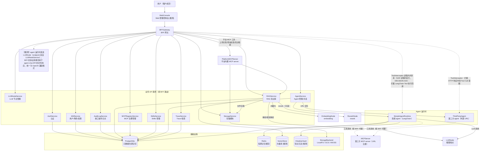

**数据流要点**（与 BRIEF 对应）：

- 所有用户请求（管理操作 + agent 对话）先过 BFFGateway：鉴权（提取 tenant_id/user_id/scopes）→ 租户隔离 → 流量控制 → API 路由（BRIEF §2-BFF 网关）。
- 存储模块是横向能力：RAG 文档、Skills 文件、agent 交互产生的文件全部经 StorageService 落 StorageBackend（BRIEF §2-RAG「上传文档（调用存储模块 API）」、§2-Skills「skill 相关文件调用存储模块 API」、§2-简易 agent「文件上传到存储模块」）。
- LLM 节点（LLMNodeService 维护的 endpoint/embedding/reranker）被 RAG（embedding/rerank/视觉解析）与 Agent（LLM endpoint 勾选）引用。
- Trace 由 BFF 与各运行时组件共同写入（写点见 §3.9）。

---

## 3. 逐模块功能图

### 3.1 M1 基础功能（用户/角色/权限/登入登出/接口操作日志）

功能地图：

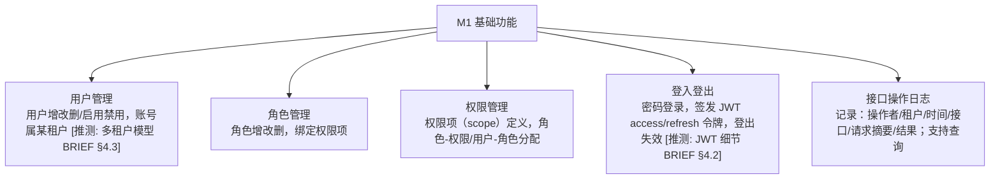

权限模型与校验（scope 即权限项，BFF 校验的单位【推测】）：

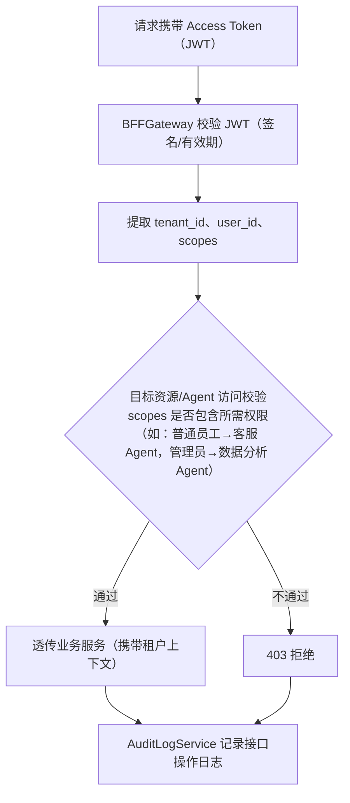

**关键分支说明**：

- 登入成功/失败分支、token 过期续期：见 §4.1 S1 时序图。
- 角色模型「用户→角色→scope 三级」为【推测】（BRIEF 仅列「用户管理、角色管理、权限管理」，未指定层级模型）。
- agent 级访问权限（「普通员工只能用客服 Agent，管理员能用数据分析 Agent」，BRIEF §2-BFF）落地为 scope 项【推测】。

### 3.2 M2 存储模块（本地/GCS/OSS + 统一接口 + 上传记录 + MCP 化）

功能地图：

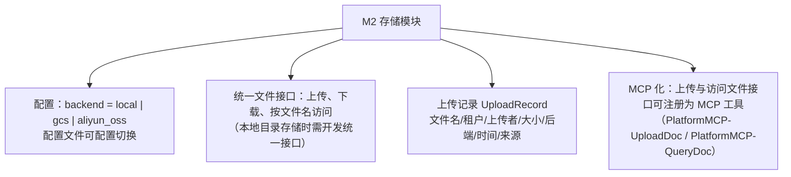

上传流程（含**本地 vs 云存储关键分支**）：

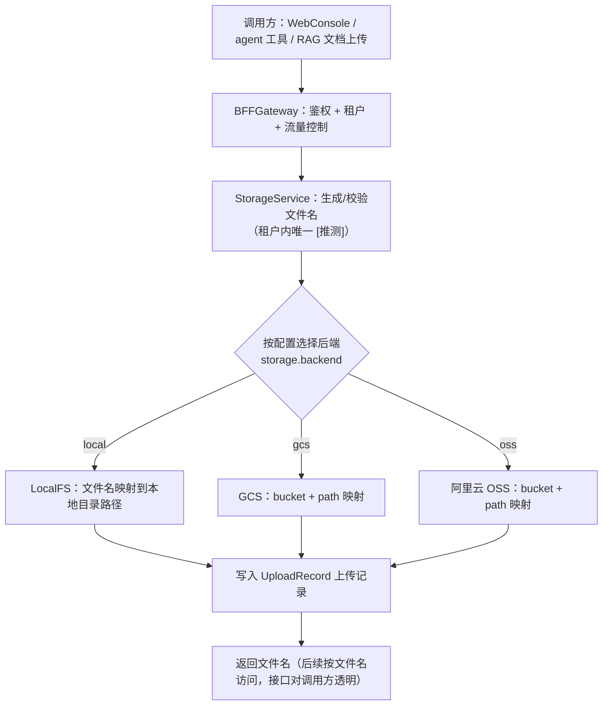

**关键分支说明**：

- **本地 vs 云存储路径分支**：上图 BE 三分支即强制要求画出的分支。对上层统一接口不变（按文件名访问），仅后端映射不同；切换后端改配置文件，不改代码（BRIEF §2-存储模块）。
- 文件名命名/唯一性规则（租户前缀、冲突处理）为【推测】，BRIEF 仅要求「可根据文件名称访问」。
- 上传与访问接口注册为 MCP 工具后，成为 PlatformMCPServer 的 PlatformMCP-UploadDoc / PlatformMCP-QueryDoc，供 agent（尤其第三方 agent）调用（BRIEF §2-第三方 agent）。

### 3.3 M3 LLM 节点（endpoint / embedding / reranker 维护）

功能地图：

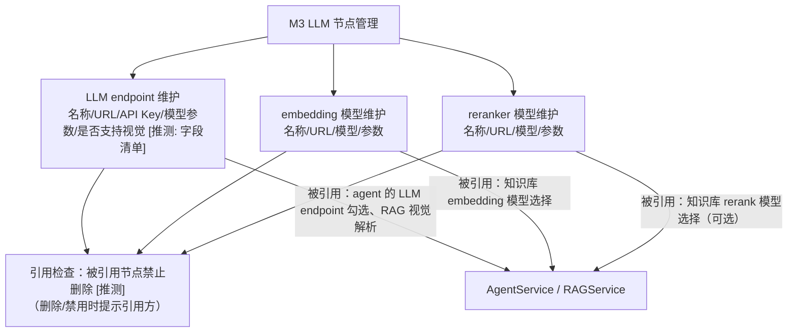

**关键分支说明**：

- 三类模型（endpoint/embedding/reranker）分开维护，对应 RAG「支持选择 embedding 模型、rerank 模型（可选）」与 Agent「配置 LLM endpoint」（BRIEF §2-RAG、§2-Agent）。
- 字段清单（名称/URL/Key/参数/视觉标记）为【推测】，BRIEF 仅要求「信息维护」。
- 删除/禁用被引用节点时的引用检查与提示为【推测】（BRIEF 未明确，参照 MCP 模块「操作需提示关联调用方」的同类约束）。

### 3.4 M4 RAG（核心模块）

功能地图：

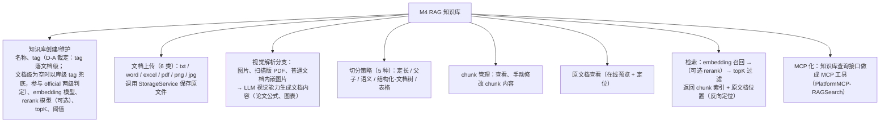

解析流水线（含**视觉 LLM 分支**与**5 种切分策略分支**）：

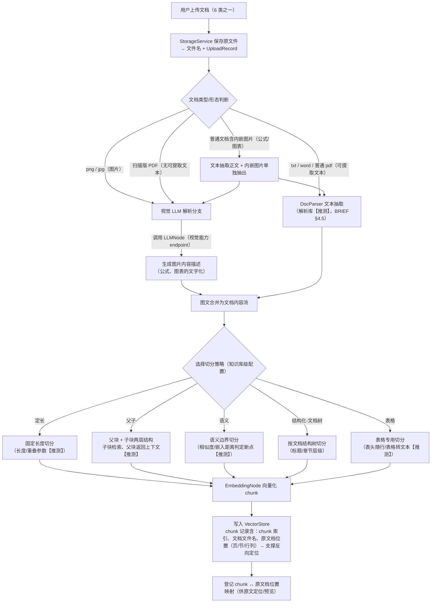

检索流程（含 **topK/阈值 rerank 分支**与**原文反向定位**）：

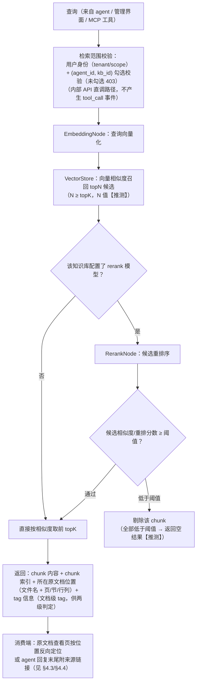

切分对比查看（**左右分栏双向联动**，用户 2026-09-22 新增需求；与 zhangbeihai 在 ARCH 的接口定义为同一功能）：

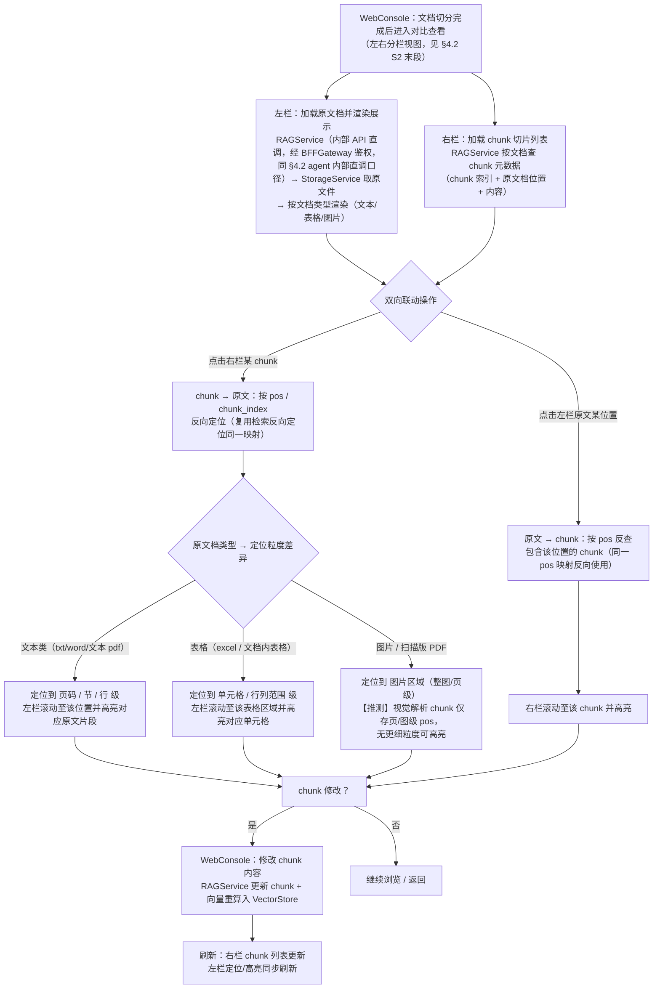

**关键分支说明**：

- **视觉 LLM 分支**：触发条件（图片/扫描 PDF/文档内图片）来自 BRIEF 原话「图片、扫描版 PDF 及普通文档中的部分图片，需通过 LLM 视觉能力提供文档内容」；视觉 endpoint 的具体调用方式、是否 OCR 前置为【推测】（BRIEF §4.5 解析流水线由团队设计）。
- **5 种切分策略**为 BRIEF 原话枚举；各策略实现细节（父子块比例、语义断点算法、表格转文本规则）均为【推测】。
- **topK/阈值**：BRIEF 原话「支持设置 topK、阈值」；阈值作用于「相似度」还是「重排分数」、未配置 rerank 时阈值是否生效为【推测】。
- **反向定位**：BRIEF 原话「支持检索返回 chunk 索引及所在原文档位置，用于反向定位内容位置」；chunk 索引的编号规则（文档内序号 vs 全局）为【推测】。

### 3.5 M5 MCP 注册管理

功能地图：

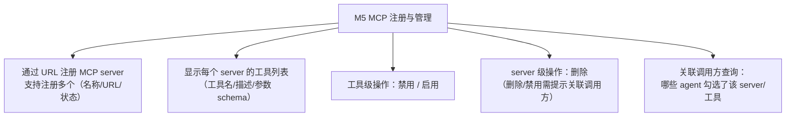

注册与工具操作（含**关联调用方提示分支**）：

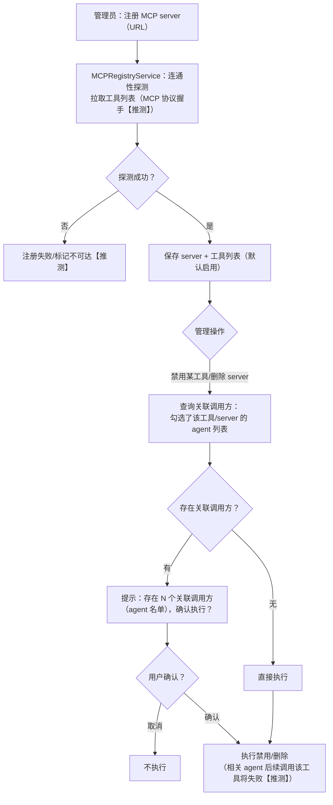

**关键分支说明**：

- 「删除、禁用等操作需提示可能存在关联的调用方」为 BRIEF 原话；**关联调用方检测范围限定为平台内 agent 勾选（agent_mcp_tools 表）**，即哪些平台内 agent 勾选了该 server/工具；第三方 agent 提供方的调用不在检测范围（用户裁定 2026-09-22 口径，yuntianming 审阅 P2-6）。
- URL 注册时的连通性探测与工具列表拉取方式（MCP 协议版本/认证头）为【推测】。
- 工具禁用后 agent 侧的行为（工具从 agent 工具列表剔除或调用时报错）为【推测】，倾向「从 agent 可用工具列表剔除」。

### 3.6 M6 Skills

功能地图：

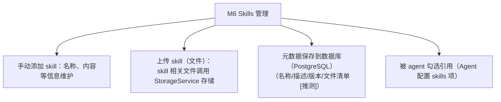

**关键分支说明**：

- 「skill 元数据保存到数据库，skill 相关文件调用存储模块 API」为 BRIEF 原话——元数据与文件分离是明确设计：PG 存元数据，StorageService 存文件。
- skill 文件的具体形态（目录包/单文件、SKILL.md 之类约定）为【推测】，BRIEF 未指定。
- skill 在运行时如何注入 agent（提示词注入 vs 按需加载）为【推测】，由 ARCHITECTURE 阶段确定。

### 3.7 M7 Agent（简易 + 第三方）

功能地图：

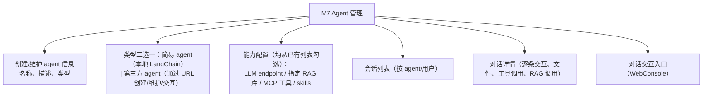

配置关系（勾选式绑定）：

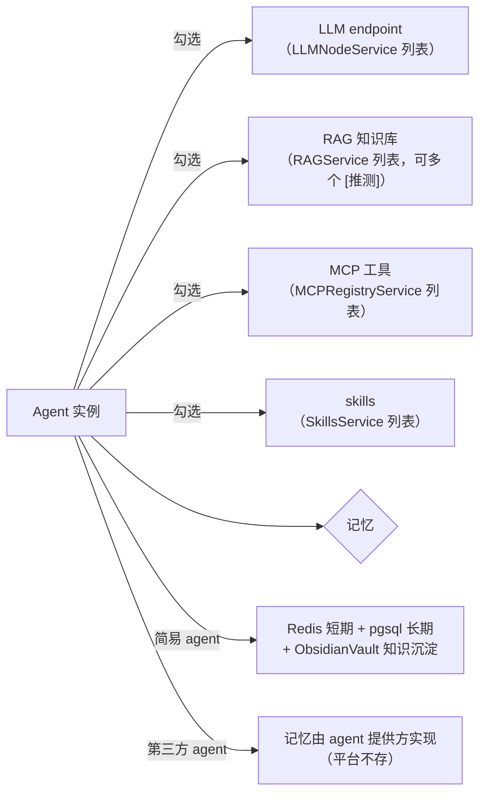

**关键分支说明**：

- 对话交互、会话列表、对话详情的入口统一在 WebConsole（经 BFF），BRIEF §2-Agent「支持 agent 对话交互、会话列表、对话详情」。
- 简易 agent 记忆三层为 BRIEF 原话（redis 短期 / pgsql 长期 / obsidian 知识沉淀）；各层切换/晋升策略为【推测】。
- 第三方 agent 的记忆在提供方（BRIEF 原话），平台侧仅保留会话与 trace 记录。

### 3.8 M8 BFF 网关（统一鉴权/多租户/流量控制/API 路由/协议转换/工具拦截）

功能地图：

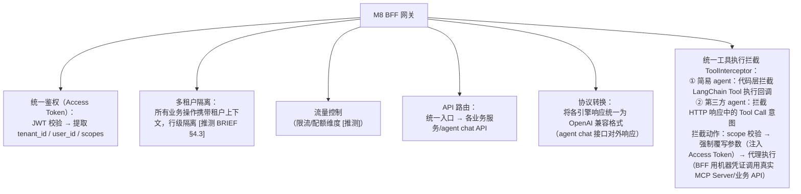

工具拦截统一动作（简易 + 第三方共用，**scope 校验失败分支**必须画出）：

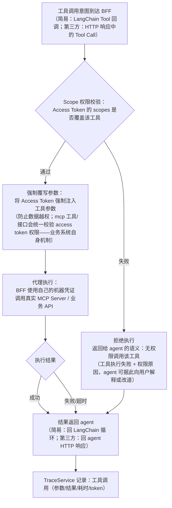

**关键分支说明**：

- **工具 scope 校验失败**：上图 SC 失败分支即强制要求画出的分支。拒绝语义（返回给 agent 的文案/错误结构）为【推测】，BRIEF 仅要求「校验 Scope 权限」。
- **强制覆写参数**的意图是防数据越权：工具端（MCP 工具或业务 API）统一校验 Access Token 权限，即平台把用户身份透传给工具端做二次校验（BRIEF 原话）。
- **代理执行**用 BFF 机器凭证而非用户凭证（BRIEF 原话「BFF 使用自己的机器凭证调用真实的 MCP Server 或业务 API」）——用户身份通过注入的 Access Token 参数传递。
- 流量控制维度（租户级 QPS/并发/token 配额）为【推测】。
- 协议转换作用面：agent chat 接口的对外响应统一为 OpenAI 兼容格式（BRIEF §2-BFF「将各引擎响应统一为 OpenAI 兼容格式」）。

### 3.9 M9 Trace + 检索

功能地图：

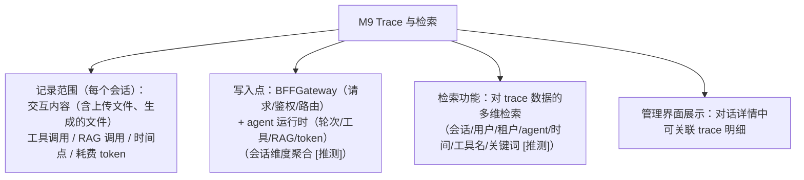

**关键分支说明**：

- 记录字段范围来自 BRIEF 原话「记录 agent 每个会话的交互内容（包含上传文件、生成的文件等）、工具调用、RAG 调用、时间点、耗费 token 等」。
- trace 的写点、存储（PostgreSQL【推测】，BRIEF §5）与检索维度均为【推测】，由 ARCHITECTURE/DB_DESIGN 细化。
- 文件类 trace（上传/生成文件）记录的是 StorageService 返回的文件名引用（【推测】），与存储模块的 UploadRecord 形成双向可追溯。

---

## 4. 跨模块关键时序图

### 4.1 S1 登录鉴权全链路

> 覆盖：密码登录 → JWT access/refresh 签发 → 后续请求 BFF 校验 → tenant_id/user_id/scopes 提取 → 接口操作日志。
> 依据：BRIEF §2-基础功能、§2-BFF「统一鉴权与多租户隔离」；JWT 双令牌为【推测】（BRIEF §4.2「JWT 访问/刷新令牌由团队确定」）。

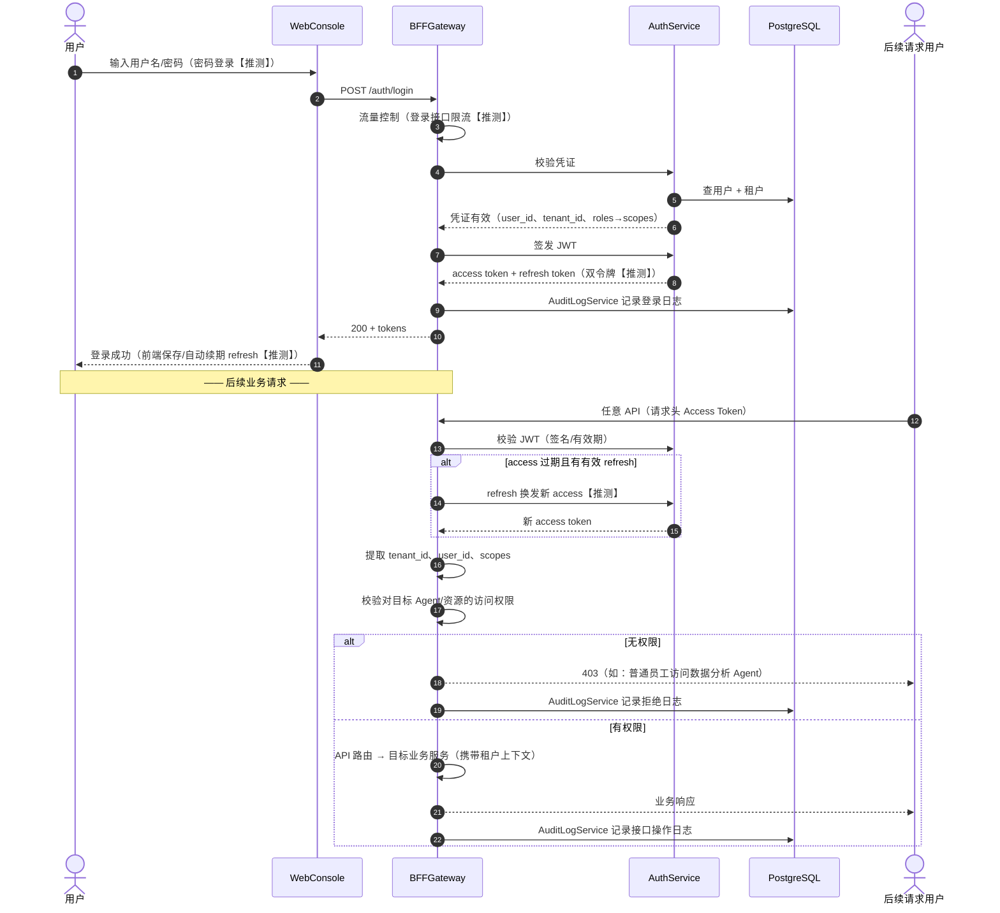

### 4.2 S2 RAG 流水线：文档上传 → 解析 → 切分 → 向量化 → 检索

> 覆盖：6 类文档上传（经存储模块）、视觉 LLM 分支、5 种切分策略分支、embedding/rerank、topK/阈值、chunk 索引与原文档位置反向定位、入库完成后进入对比查看（§3.4）。
> 依据：BRIEF §2-RAG、§2-存储模块；解析实现、topN 细节为【推测】（BRIEF §4.5）。

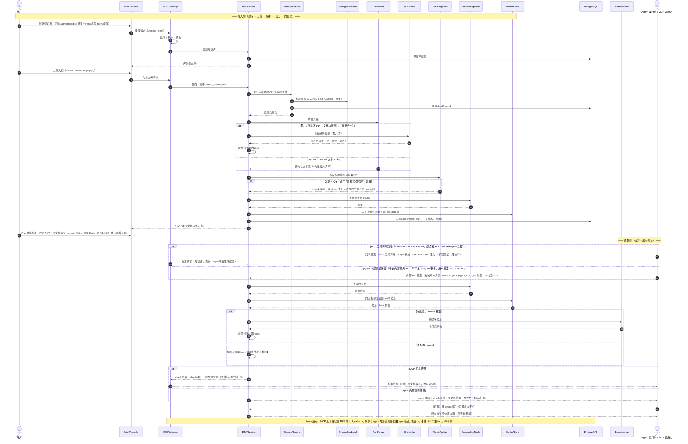

**关键分支**（图中 alt 均已画出）：视觉 LLM 解析分支；5 种切分策略分支；rerank 配置与否分支；阈值过滤分支；反向定位回查。

### 4.3 S3 简易 agent 对话（含 BFF 拦截 LangChain Tool 回调 + RAG 来源引用）

> 覆盖：agent 配置勾选、Redis/PG/Obsidian 记忆、文件上传存储模块、LangChain Tool 执行回调被 ToolInterceptor **进程内共享库**拦截（DECISION-015；scope 校验 → 注入 Access Token → 机器凭证代理执行）、内部 RAG/文件直调路径保留身份校验 + (agent_id, kb_id) 勾选校验（未勾选 403）并落 rag/file 事件（用户裁定 2026-09-22，D-B 口径）、RAG 命中满足 official 两级判定 / 用户要求时回复末尾附来源链接（D-A 口径）。
> 依据：BRIEF §2-Agent、§2-简易 agent、§2-BFF「统一工具执行拦截」；LangChain 编排方式（tool-calling loop）为【推测】（BRIEF §4.7）。

```mermaid
sequenceDiagram
  autonumber
  actor U as 用户
  participant WC as WebConsole
  participant BFF as BFFGateway
  participant AGS as AgentService
  participant SAR as SimpleAgentRuntime
  participant REDIS as Redis
  participant PG as PostgreSQL
  participant OBS as ObsidianVault
  participant LLM as LLMNode
  participant RAG as RAGService
  participant MCP as MCPServer
  participant SS as StorageService

  Note over U,BFF: 前置：agent 已创建，勾选了 LLM endpoint / RAG 库 / MCP 工具 / skills（均从已有列表）
  U->>WC: 打开 agent 对话页（会话列表 → 新建/选择会话）
  WC->>BFF: POST /agents/{id}/chat（Access Token，消息内容）
  BFF->>BFF: 鉴权 + 提取 tenant_id/user_id/scopes
  BFF->>AGS: 路由到 agent
  AGS->>PG: 校验用户对该 agent 的访问权限（scope）
  alt 无权限
    AGS-->>U: 403（如普通员工访问受限 agent）
  else 有权限
    AGS->>SAR: 启动/续接会话（langchain 编排【推测】）
    SAR->>REDIS: 读短期记忆（当前会话上下文）
    SAR->>PG: 读长期记忆（跨会话）【推测: 按需加载】
    SAR->>LLM: LLM 调用（endpoint 来自 agent 配置，携带 skills 注入内容）
    LLM-->>SAR: 推理结果（可能含 tool call 意图 / RAG 需求 / 文件需求）

    loop 工具/检索循环【推测: tool-calling loop】
      alt LLM 决定调用工具（MCP 工具，LangChain Tool 执行回调）
        SAR->>SAR: Tool 执行回调：进程内调用 ToolInterceptor（BFF 提供的共享库，SAR 进程内执行，非独立进程，DECISION-015）
        SAR->>SAR: ① scope 权限校验
        alt scope 校验失败
          SAR->>SAR: 拒绝执行 + 返回权限不足语义给推理循环<br/>（agent 据此向用户解释或改道）
        else scope 校验通过
          SAR->>SAR: ② 强制覆写参数：Access Token 注入工具参数
          SAR->>MCP: ③ 代理执行：机器凭证调用真实 MCP Server
          MCP-->>SAR: 执行结果返回推理循环
        end
      else 需要 RAG 知识检索（平台内部服务 API 直调，不产生 tool_call 事件）
        SAR->>RAG: 内部 API 检索（topK/阈值来自库配置）<br/>调用前校验：用户身份（tenant/scope）+ (agent_id, kb_id) 在 agent_knowledge_bases 已勾选（未勾选 403）
        RAG-->>SAR: chunk + 索引 + 原文档位置 + tag（两级判定，见关键分支说明）
      else 交互涉及文件（平台内部服务 API 直调，不产生 tool_call 事件）
        SAR->>SS: 文件上传到存储模块（生成/接收的文件，携带用户身份）
        SS-->>SAR: 文件名（供后续引用）
      end
      SAR->>LLM: 携带工具结果继续推理
      LLM-->>SAR: 下一轮输出
    end

    alt 任一 RAG 命中满足 official 两级判定（文档级 tag=official，或文档级为空且所属知识库 tag=official），或用户明确要求显示引用来源
      SAR->>SAR: 回复末尾附加 RAG 知识来源<br/>（链接可定位到原始文档对应位置）
    else 不满足 official 两级判定且用户未要求
      SAR->>SAR: 回复不附来源
    end

    SAR->>REDIS: 写短期记忆（本轮上下文）
    SAR->>PG: 写长期记忆【推测: 会话摘要/关键事实】
    SAR->>OBS: 知识沉淀：写入结构化笔记（vault 目录【推测】）
    BFF->>PG: TraceService 记录：请求/鉴权/路由事件（BFF 进程内写点）
    SAR->>PG: TraceService 记录：逐轮交互 / tool_call（MCP 工具）/ rag / file 事件 / 时间点 / token<br/>（SAR 进程内写点；内部直调路径落 rag/file 事件，不产生 tool_call 事件，用户裁定 2026-09-22）
    BFF-->>WC: 响应（协议转换：OpenAI 兼容格式，含末尾来源链接）
    WC-->>U: 展示回复（来源链接可点开定位原文档对应位置）
  end
```

**关键分支**（图中已画）：
- **工具 scope 校验失败**：拒绝执行 + 返回给 agent 的权限不足语义（agent 可向用户解释或改道，语义细节【推测】）。
- **official 两级判定 / 用户要求 → 回复末尾附来源**（D-A 裁定）：判定逻辑 = 文档级 tag=official，或文档级为空且所属知识库 tag=official，判定为 official（BRIEF 原话「如果知识文档 tag 是 official 或用户有明确要求显示引用来源」）；与「用户明确要求」为「或」关系；来源链接指向原文档对应位置（经 chunk 索引 + 位置反向定位）。
- **内部 RAG/文件直调的留痕边界**（用户裁定 2026-09-22，D-B 口径）：简易 agent 对平台内部服务的 API 直调不产生 tool_call 拦截事件，但保留 a) 用户身份校验（tenant/scope）；b) (agent_id, kb_id) 勾选校验（未勾选 403）；c) trace 落 rag/file 事件。

### 4.4 S4 第三方 agent 对话（BFF 拦截 HTTP 响应中的 Tool Call 意图 + 平台 MCP 工具）

> 覆盖：第三方 agent（URL 创建/交互）、agent 返回 Tool Call 意图 → BFF 拦截该 HTTP 响应 → 拦截动作同 S3（scope 校验 → 注入 Access Token → 机器凭证代理执行）、平台提供上传/查询文档 MCP 工具（agent 提供方决定是否调用）、RAG 引用同上、记忆由提供方实现。
> 依据：BRIEF §2-第三方 agent、§2-BFF、§2-存储模块 MCP 化；拦截实现细节为【推测】。

```mermaid
sequenceDiagram
  autonumber
  actor U as 用户
  participant WC as WebConsole
  participant BFF as BFFGateway
  participant AGS as AgentService
  participant TPA as ThirdPartyAgent
  participant TI as ToolInterceptor
  participant PMP as PlatformMCPServer
  participant MCP as MCPServer
  participant SS as StorageService
  participant RAG as RAGService
  participant PG as PostgreSQL

  Note over U,TPA: 前置：第三方 agent 通过 URL 创建/维护；记忆由 agent 提供方实现（平台不存）
  U->>WC: 打开第三方 agent 对话页
  WC->>BFF: POST /agents/{id}/chat（Access Token，消息）
  BFF->>BFF: 鉴权 + 提取 tenant_id/user_id/scopes
  BFF->>AGS: 校验用户对该 agent 的访问权限
  AGS->>TPA: 转发对话请求到 agent URL（携带平台凭证/上下文）
  TPA->>TPA: 自身推理（使用提供方自己的记忆）

  alt agent 返回 Tool Call 意图（HTTP 响应中）
    TPA-->>BFF: HTTP 响应（含 tool call 意图：工具名 + 参数）
    Note over BFF,TI: BFF 拦截该 HTTP 响应
    BFF->>TI: 进入统一拦截动作
    TI->>TI: ① scope 权限校验
    alt scope 校验失败
      TI-->>BFF: 拒绝执行 + 权限不足语义
      BFF-->>TPA: 返回工具失败（无权限）语义
    else scope 校验通过
      TI->>TI: ② 强制覆写参数：Access Token 注入工具参数
      TI->>TI: ③ 代理执行（BFF 机器凭证）
      alt 工具 = 平台 MCP 工具（上传文档/查询文档）
        TI->>PMP: 调用 PlatformMCP-UploadDoc / PlatformMCP-QueryDoc
        PMP->>SS: 走存储模块 API（上传/按文件名查询）
        SS-->>PMP: 文件名/文件信息
        PMP-->>TI: 工具结果
      else 工具 = 第三方 MCP server 工具
        TI->>MCP: 调用真实 MCP Server
        MCP-->>TI: 工具结果
      end
      TI-->>BFF: 工具结果
      BFF-->>TPA: 将结果回传给 agent（继续推理）
    end
  else agent 直接返回最终回复
    TPA-->>BFF: HTTP 响应（最终回复）
  end

  alt 回复涉及 RAG 知识（平台提供检索结果及引用原文档信息）
    BFF->>RAG: 知识检索（平台侧执行，topK/阈值）
    RAG-->>BFF: chunk + 索引 + 原文档位置 + tag（两级判定：文档级 tag=official，或文档级为空且所属知识库 tag=official）
    BFF->>BFF: 组装引用原文档信息，提供给 agent
    Note over BFF: agent 提供方决定是否在回复中显示引用（BRIEF 原话）
    alt 任一 RAG 命中满足 official 两级判定（D-A 口径）或用户明确要求 且 agent 决定显示
      BFF->>BFF: 回复末尾附 RAG 来源链接<br/>（可链接原文档对应位置）
    else 不显示
      BFF->>BFF: 回复不附来源
    end
  end

  BFF->>BFF: 协议转换：agent 响应统一为 OpenAI 兼容格式
  BFF->>PG: TraceService 记录：交互 / tool_call（MCP 工具）/ 时间点 / token<br/>（BFF 进程内写点；MCP 工具调用 100% 有 tool_call 拦截事件，用户裁定 2026-09-22）
  BFF->>PG: 平台侧 RAG 检索落 rag 事件（平台内部服务调用，非 tool_call 事件）
  BFF-->>WC: 响应
  WC-->>U: 展示回复（来源链接可点开定位原文档）
```

**关键分支**（图中已画）：
- **BFF 拦截 HTTP 响应中的 Tool Call 意图**：第三方 agent 的 MCP 工具调用必须经 BFF 统一拦截（用户裁定 2026-09-22，D-B 口径：拦截范围 = agent 对接业务系统 + MCP 工具调用）；拦截动作与 S3 完全一致（scope 校验 → 注入 Access Token → 机器凭证代理执行）。TI 为 BFF 提供的进程内共享库，拦截在 BFF 进程内执行。
- **平台 MCP 工具**：平台提供上传文档、查询文档的 MCP 工具（属 MCP 工具调用，必须经 ToolInterceptor 拦截），**agent 提供方决定是否调用**（BRIEF 原话）——即工具能力可用，但调用决策权在 agent 侧；调用时仍被 BFF 拦截与鉴权。
- **RAG 引用**：平台提供知识检索结果及引用原文档信息，**agent 提供方决定是否显示**（BRIEF 原话）——显示决策权在 agent 侧，但 official 两级判定 / 用户要求时的附来源规则同 S3（D-A 口径：文档级 tag=official，或文档级为空且所属知识库 tag=official）。
- scope 校验失败：同上（拒绝 + 语义回传 agent）。

---

## 5. 差异与遗留问题清单

| # | 问题 | 性质 | 去向 |
|---|---|---|---|
| 1 | 05-temp/assets/ 无原始素材，全部需求以 BRIEF §2 用户原话为准（RISK-001） | 范围受限 | 已知，DESIGN_REVIEW 复核 |
| 2 | 「权限管理」的模型（用户→角色→scope 三级）为推测，BRIEF 未指定层级 | 推测 | DECISIONS 待团队确认 |
| 3 | JWT 双令牌（access/refresh）细节为推测（BRIEF §4.2 留给团队） | 推测 | DECISIONS 待团队确认 |
| 4 | 切分 5 策略的实现参数（定长长度/重叠、父子比例、语义断点、表格转文本）均未指定 | 推测 | ARCHITECTURE/DB_DESIGN 细化 |
| 5 | topK/阈值的语义边界（阈值作用于相似度还是重排分数、无 rerank 时阈值是否生效）未指定 | 推测 | ARCHITECTURE 明确 |
| 6 | 第三方 agent 对话时「平台提供知识检索」的执行时机（BFF 侧自动注入 vs agent 调用 MCP 检索工具）BRIEF 两处表述并存（MCP 工具形式 vs 平台提供信息），S4 按「平台侧检索 + 信息提供给 agent」绘制 | 歧义 | 需罗辑/褚岩澄清 |
| 7 | 简易 agent 是否也经 PlatformMCPServer 调用上传/查询文档（BRIEF 仅明确第三方 agent 用 MCP 工具、简易 agent 直接上传存储模块） | 歧义 | S3 按「直接调存储模块 API」绘制 |
| 8 | 向量库选型（pgvector vs 独立）未定（BRIEF §4.4），本文档统一以 VectorStore 抽象命名 | 选型待定 | DECISIONS/ARCHITECTURE |
| 9 | 第三方 agent 的 URL 认证方式（机器凭证形态）未指定 | 推测 | ARCHITECTURE 明确 |
