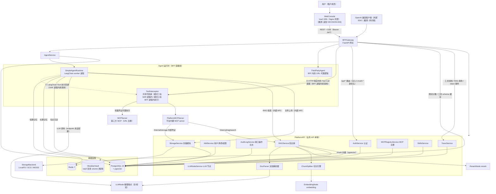
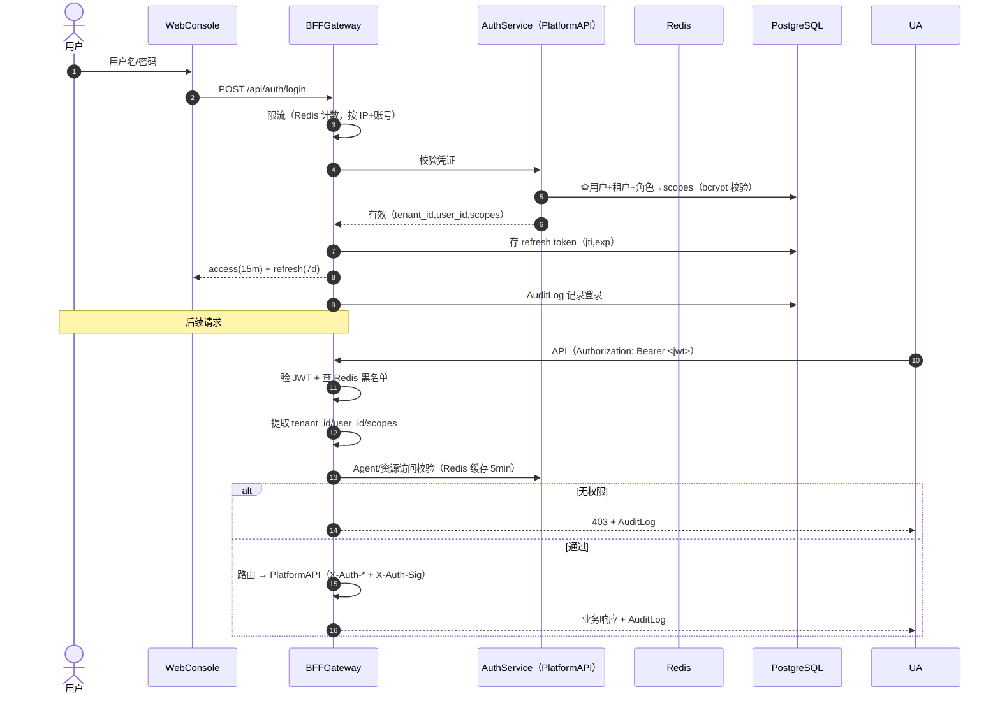
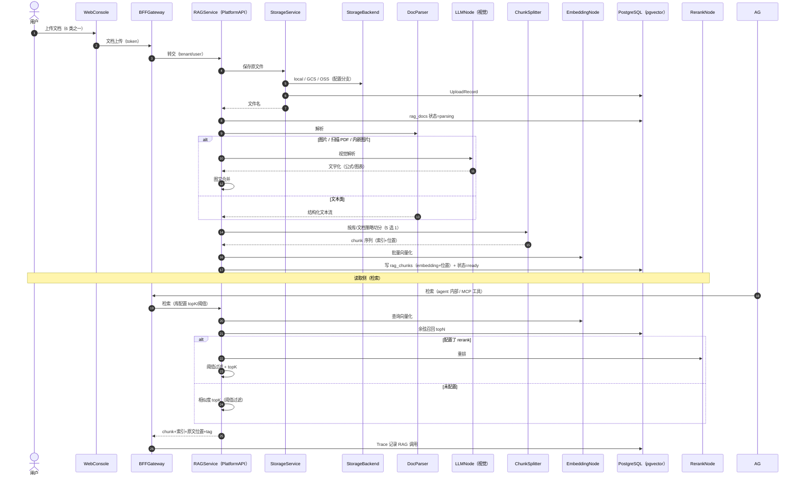
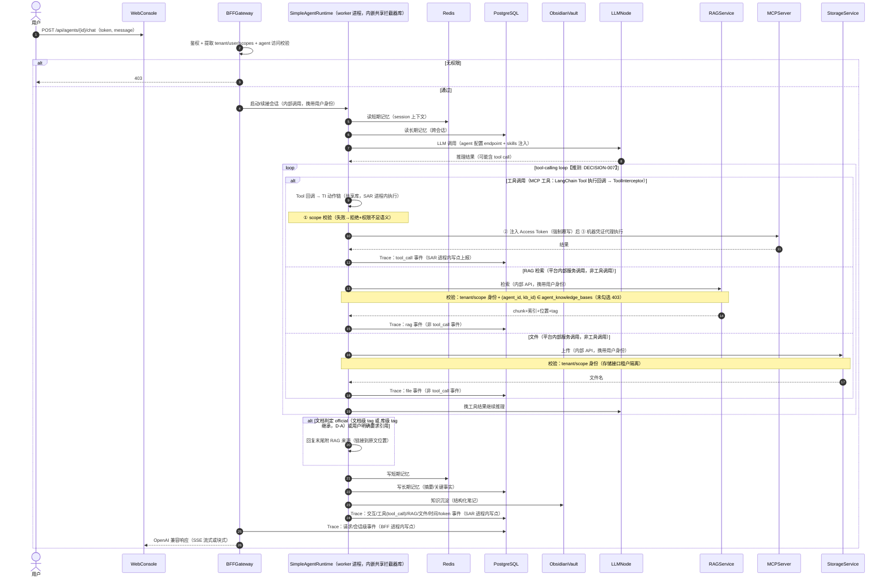
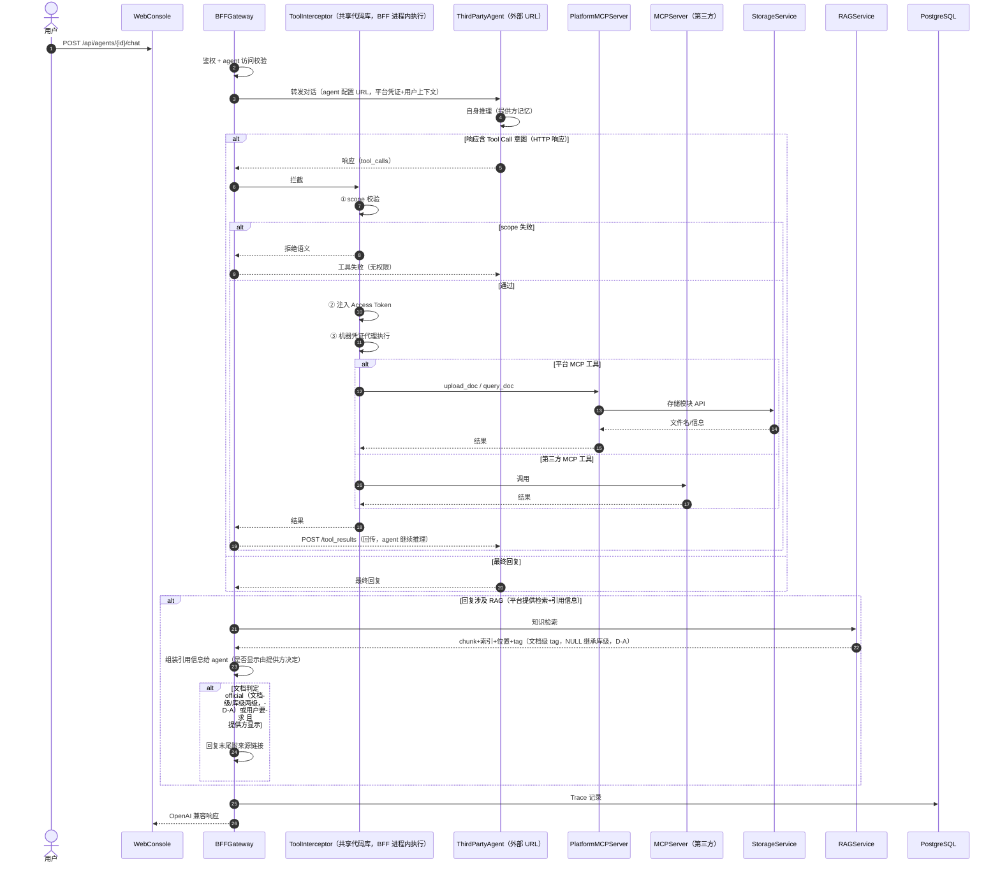
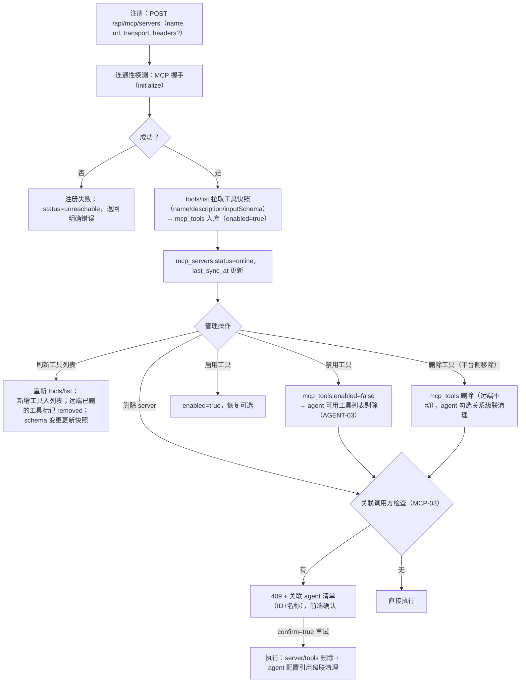
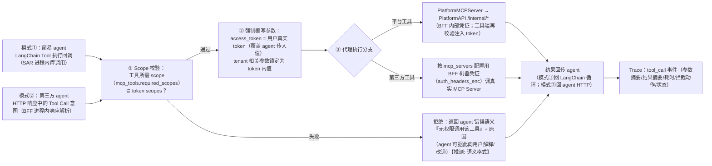
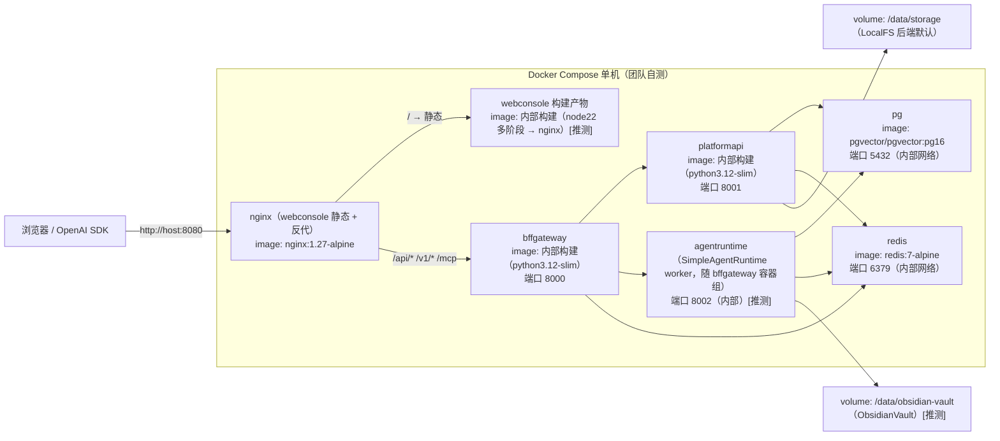

# ARCHITECTURE — agent-joker 架构设计

> 交付物：设计阶段 TASK-D03（父任务 t_5f373ddc，本卡 t_6ebd67ff）。作者：章北海（开发工程师），2026-09-22。
>
> **修订 2026-09-22（TASK-D07）**：依据 `04-analysis/REVIEW_*.md` 5 份审阅报告修订 8 项：
> ① 工具调用边界统一权威表述（D-B，**用户裁定 2026-09-22**：拦截 = ①agent 对接业务系统统一经 BFF 网关 ②MCP 工具调用 100% 经 ToolInterceptor；内部 API 直调非工具调用，保留身份校验 + KB 勾选校验 + rag/file trace）——§1.1/§1.3/§2.3/§4.3/§4.4/§9-7；
> ② ToolInterceptor 统一为「共享代码库、拦截在 SAR 进程内执行」语义，trace 写点明确（§1.1/§2.3/§4.3/§4.4/§5.1，DECISION-015）；
> ③ 「39 条」口径改为「45 个标准 ID（源自 BRIEF §2 的 41 条 bullet，其中 4 条含子项）」（§7）；
> ④ 后端切换裁定「保留原后端访问（不迁移）」显式成文（§1.1）；
> ⑤ DocParser 补「.doc 旧格式不支持（422 拒绝并提示转 .docx）」（§2.2）；
> ⑥ RAG 引用规则改 D-A 文档级两级判定（rag_docs.tag 优先，NULL 继承库级）（§4.5）；
> ⑦ OpenAI 兼容 model 参数统一语义 = agent 名称（租户内唯一，跨租户 404）并写明 BFF 解析路径（§4.5/§8）；
> ⑧ 全文「39 条」字样统一口径。
>
> **修订 2026-09-22（TASK-D10，用户裁定 2026-09-22）**：落实用户两条正式裁定——① 向量维度改「**按 embedding 模型维度、每库独立向量表**」（D-C / DECISION-024，废原「全平台统一 1536 维 + 低维补零 + 高维 422 拒绝」）——§2.2 向量化/检索、§6#4、§9-8/16 同步；② trace/审计日志保留策略改「**天数可配置**（`TRACE_RETENTION_DAYS`/`AUDIT_RETENTION_DAYS`，默认 90 天）+ 月分区 + 过期 DROP PARTITION」（D-D / DECISION-025，废「90 天【推测】」）。
>
> **修订 2026-09-22（TASK-D12，用户 2026-09-22）**：① 修复 REVISION_VERIFY_D10 §4 两处 P2 残留——F1：§9-16 状态机名 `re-embedding` → `reindexing`（与 DB_DESIGN §4.1/§4.2 枚举对齐）；F2：§5.3 env 变量表补 `TRACE_RETENTION_DAYS` / `AUDIT_RETENTION_DAYS`（D-D / DECISION-025）。② 新增「**切分对比查看（原文档-chunk 双向联动）**」需求的架构支撑（新增 §2.2.1：接口组合复用/新增清单 + `pos` 按文档类型坐标结构说明；DB_DESIGN 头部同步注记 `rag_chunks.pos` 结构确认无需变更；功能点由 luoji 在 FEATURES 新增（实际落点 **RAG-11**，见 FEATURES §4；接口细节以本文档 §2.2.1 为准）。
>
> **来源声明**：完全依据 `00-management/BRIEF.md`（§2 用户原话、§4 推测范围、§5 技术栈约束）、
> `01-product/FLOW_DIAGRAMS.md`（组件命名契约 + 关键流程）、`01-product/FEATURES.md`（56 功能点）推导。
> 超出 BRIEF 原话的团队推断一律以 **【推测】** 标注。
>
> **命名契约**：本文档所有组件名沿用 FLOW_DIAGRAMS.md §1「组件命名清单」（31 项），全文同一组件同一名称。
> 本文档不新增与清单冲突的组件名；新增的子组件在首次出现时给出中文名与职责，并归入清单组件的从属关系。
>
> **功能点回溯约定**：正文中以 `（F: xxx-NN）` 标注该设计所支撑的 FEATURES.md 功能点 ID，便于终审逐条核对。

---

## 目录

1. 总体架构（服务划分 + 组件交互图）
2. 关键时序（BFF 工具拦截两种模式 / RAG 流水线 / agent 对话 / 登录鉴权）
3. MCP server 设计
4. BFF 设计
5. 部署拓扑（Docker Compose）
6. 技术选型理由表
7. 与 BRIEF 逐条对照表
8. 架构决策摘要（同步 DECISIONS.md 的编号索引）
9. 遗留问题与假设

---

## 1. 总体架构

### 1.1 服务划分

按「**单体内模块化（modular monolith）**」划分，共 **1 个前端 + 3 个后端服务 + 2 个基础设施**：

| 服务 | 形态 | 包含组件（FLOW_DIAGRAMS 命名） | 职责 |
|---|---|---|---|
| **WebConsole** | Vue3 SPA 前端（Nginx 托管静态资源） | WebConsole | 全部管理功能 + agent 对话界面（F: BASE-08） |
| **BFFGateway** | 独立 FastAPI 服务（网关层） | BFFGateway、ToolInterceptor、PlatformMCPServer | 统一鉴权、多租户隔离、流量控制、API 路由、OpenAI 兼容协议转换、工具调用拦截（两种模式）、平台 MCP 工具对外暴露（F: BFF-01..09、STORE-06/07、RAG-10、AGENT-10/11） |
| **PlatformAPI** | 独立 FastAPI 服务（业务 API 层） | AuthService、IAMService、AuditLogService、StorageService、LLMNodeService、RAGService、MCPRegistryService、SkillsService、AgentService、TraceService | 全部业务 CRUD 与领域逻辑：认证、IAM、审计、存储（含 StorageBackend 后端适配 LocalFS/GCS/AliOSS）、LLM 节点、RAG（含 DocParser/ChunkSplitter/VectorStore 集成）、MCP 注册、Skills、Agent 管理、Trace 写入/检索（F: BASE-01..09、STORE-01..05、LLM-01..03、RAG-01..10、MCP-01..03、SKILL-01..02、AGENT-01..11、TRACE-01..02） |
| **AgentRuntime** | 独立 FastAPI 服务（agent 执行层） | SimpleAgentRuntime、ThirdPartyAgent | 简易 agent 的 LangChain 运行时（推理循环、记忆读写、Obsidian 沉淀）；第三方 agent 的 URL 代理交互（F: AGENT-02..09） |
| **PostgreSQL** | 基础设施（pg16 + pgvector） | PostgreSQL | 全部元数据、长期记忆、上传记录、chunk 向量（pgvector）、trace（F: 全部持久化功能点） |
| **Redis** | 基础设施（redis7） | Redis | agent 短期记忆、JWT 吊销、限流计数、工具 schema 缓存（F: AGENT-07、BFF-02、BASE-05） |

**划分理由**：

- **BFF 必须独立**：BRIEF §2 要求「Agent 工具调用必须经过 BFF 统一拦截」（边界定义见 §4.3「拦截范围裁定」，用户裁定 2026-09-22），且简易 agent 的拦截发生在「代码层面拦截 LangChain 的 Tool 执行回调」——工具回调必须运行在持有用户 Access Token 的进程内，故 SimpleAgentRuntime 作为 BFF 的子进程（sidecar）随 BFFGateway 同容器组启动，LangChain 工具回调直接进入 ToolInterceptor（TI 为共享代码库，拦截在 SAR 进程内执行，见 §2.3/§4.3，DECISION-015）。BFF 与业务 API 分服务，避免业务服务各自实现鉴权（F: BFF-01 验收要点 3）。
- **PlatformAPI 单体**：9 个业务模块共享同一 PostgreSQL，跨模块引用多（agent→LLM/KB/工具/skill），单体减少跨服务事务成本；FastAPI 内部按模块分 router（auth/iam/audit/storage/llm/rag/mcp/skills/agents/trace），边界清晰、可拆分。
- **AgentRuntime 独立**：agent 推理是长耗时、高并发的计算负载，与 CRUD API 隔离；SimpleAgentRuntime 由 BFF 以子进程方式拉起（同 Pod/容器组），ThirdPartyAgent 逻辑（URL 转发 + 响应拦截）实现在 BFF 的请求路径内（见 §2.3）。【推测：部署形态；闭环演示用 docker compose 单主机，AgentRuntime 进程内嵌于 BFFGateway 容器、SimpleAgentRuntime 为独立 worker 进程，见 §5】
- **StorageBackend** 是 StorageService 内部的策略适配层（local / gcs / aliyun_oss 三实现，配置切换），不是独立服务（F: STORE-01..03）。

### 1.2 组件交互图

> 组件名与 FLOW_DIAGRAMS.md §1 清单完全一致；数据流要点与其 §2 总览一致。



**数据流要点**（与 FLOW_DIAGRAMS §2 一致）：

- 所有用户请求（管理操作 + agent 对话 + OpenAI 兼容客户端）先过 BFFGateway：鉴权 → 租户隔离 → 流量控制 → API 路由（F: BFF-01..04）。
- 存储是横向能力：RAG 文档、Skills 文件、agent 交互文件全部经 StorageService 落 StorageBackend（F: RAG-02、SKILL-02、AGENT-06/10）。
- LLM 节点被 RAG（embedding/rerank/视觉）与 Agent（endpoint 勾选）引用（F: LLM-01..03、AGENT-03、RAG-06/07）。
- Trace 由 BFF（请求/鉴权/拦截事件）与各运行时组件（轮次/工具/RAG/token）共同写入（F: TRACE-01）。
- **工具调用拦截范围（权威表述，用户裁定 2026-09-22，D-B；§1.1/§2.3/§4.3/§9 全文统一于此）**：
  1. **拦截边界 ①**：agent 对接业务系统——业务系统 AI chat / 业务系统调用 agent 能力，统一经 BFF 网关（统一鉴权 Access Token、流量控制、API 路由、OpenAI 兼容协议转换）；
  2. **拦截边界 ②**：MCP 工具调用（含平台内置 MCP 工具 upload_doc / query_doc / rag_search 与 URL 注册的外部 MCP server 工具）**必须**经 BFF ToolInterceptor 统一拦截（scope 校验、Access Token 强制注入、机器凭证代理执行），100% 覆盖、无绕过路径；
  3. **非拦截范围（用户明确）**：简易 agent 在 agent 管理平台内部对**平台内部服务**的直接 API 调用——RAG 检索、文件上传/下载等——属于**平台内部服务调用，不是 agent 工具调用**，不产生 `tool_call` 拦截事件；但必须保留：a) 用户身份校验（tenant/scope）；b) RAG 检索额外校验 `(agent_id, kb_id)` 在 `agent_knowledge_bases` 已勾选（未勾选 403，见 §4.2）；c) 落 trace 为 `rag` / `file` 事件（§4.4）。
  因此：BFF-06 验收判据 = 「任一 MCP 工具调用 trace 中均可看到 BFF 拦截记录（无绕过路径）；内部 API 直调以 rag/file 事件留痕」。简易 agent 的 MCP 工具调用只有一条路径：LangChain Tool 回调 → ToolInterceptor（无裸注册路径，F: BFF-07 验收要点 3）。
- **存储后端切换裁定（S01，STORE-03 验收 2 要求成文）**：切换后端采用**保留原后端访问（不迁移）**：`storage_files.backend` 行级记录实际落点，访问按行分派；新上传走新后端（见 §2.2）。

### 1.3 服务端口与调用关系汇总

| 调用方 | 被调用方 | 协议/端口 | 鉴权方式 |
|---|---|---|---|
| 浏览器 / OpenAI SDK | BFFGateway | HTTP :8000 | JWT Bearer（Access Token） |
| BFFGateway | PlatformAPI /api/* | HTTP :8001 | X-Auth-* 身份头 + 内部服务凭证【推测】 |
| BFFGateway(ToolInterceptor) | PlatformMCPServer | HTTP :8000/mcp（同 BFF 进程内 MCP server，Streamable HTTP） | 用户 Access Token（强制注入） |
| ToolInterceptor（共享库：模式①在 SAR 进程内 / 模式②在 BFF 进程内执行） | MCPServer（第三方） | HTTP（Streamable HTTP / SSE，按注册配置） | 调用方进程持有的 BFF 机器凭证（配置文件） |
| PlatformMCPServer | PlatformAPI /internal/* | HTTP :8001 | 内部服务凭证 + 注入的用户 token【推测】 |
| AgentRuntime(SAR) | PlatformAPI /internal/rag、/internal/storage | HTTP :8001 | 内部服务凭证 + 用户身份（tenant/scope 校验；RAG 检索另校验 (agent_id, kb_id) ∈ agent_knowledge_bases，未勾选 403；落 rag/file trace 事件，非 tool_call 拦截事件——D-B 非拦截范围，用户裁定 2026-09-22） |
| SAR / RAG | LLMNode / EmbeddingNode / RerankNode | 外部 HTTP（endpoint 由 LLM 节点配置决定） | 各 endpoint 的 API Key（LLM 节点配置） |
| 外部 MCP client（如 Claude Desktop） | BFFGateway /mcp | HTTP :8000/mcp | MCP 认证（API Key 头，映射到 tenant/user/scope【推测】） |

---

## 2. 关键时序

> 以下 4 张时序图与 FLOW_DIAGRAMS.md §4.1–§4.4（S1–S4）一致，此处为架构视角的落地版本：
> 增加「进程/服务边界」与「拦截链路的具体实现点」。组件名沿用清单。

### 2.1 S1 登录鉴权全链路（与 FLOW_DIAGRAMS §4.1 一致）

要点：

- 登录：WebConsole → BFF `/api/auth/login`（限流）→ AuthService（PlatformAPI）校验凭证（bcrypt）→ 签发 JWT **access**（15min，claims: `tenant_id/user_id/scopes/exp/jti`）+ **refresh**（7d，存 `auth_refresh_tokens` 表，有状态，支持登出吊销）【推测：双令牌，BRIEF §4.2 / DECISION-002】。
- 后续请求：BFF 统一校验 JWT（本地公钥/对称密钥验证，无跨服务开销）→ 提取 `tenant_id/user_id/scopes` → 目标 Agent/资源访问校验（调 IAM 的权限能力，缓存于 Redis 5min【推测】）→ 路由到 PlatformAPI，身份以 `X-Auth-Tenant / X-Auth-User / X-Auth-Scopes` 头透传 + BFF 签名【推测：内部鉴权头防伪造，BFF→API 间用共享密钥 HMAC 签名头 `X-Auth-Sig`，DECISION-009】。
- 401/403 均写 AuditLogService（BFF 侧中间件统一写，写失败不阻断主流程，F: BASE-06 验收要点 4）。
- 登出：吊销 refresh token（DB 标记）；access token 未到期前进入 Redis 短黑名单（TTL=剩余有效期）【推测：BASE-05 验收要点 1 的「立即失效」策略选黑名单，DECISION-002】。



### 2.2 S2 RAG 流水线（与 FLOW_DIAGRAMS §4.2 一致）

要点（架构落地）：

- **建库流程（D-C / DECISION-024，用户裁定 2026-09-22）**：选 embedding 模型 → **按该模型维度动态建该库独立向量表 `rag_chunks_vec_<kb_id>`** + 固化 `rag_knowledge_bases.embedding_dim`（建库快照）→ 写入库配置。不同库可用不同维度，互不约束。
- **解析器 DocParser**：按扩展名分派——txt 直读；word 用 `python-docx`（**仅 `.docx`；`.doc` 旧格式不支持——上传时 422 拒绝并提示转 `.docx`**，luoji 审阅 P2-2 裁定）；excel 用 `openpyxl`（转 Markdown 表格）；pdf 用 `pymupdf`（可提取文本走文本流，提取不到 → 判定扫描版，转视觉分支）；png/jpg 直进视觉分支。内嵌图片由 pymupdf 抽取为独立图片项（F: RAG-03、RAG-02）。
- **存储后端切换裁定（S01，与 §1.1 权威表述一致）**：`STORAGE_BACKEND` 配置切换后，**既有文件采用保留原后端访问（不迁移）**：`storage_files.backend` 行级记录实际落点，访问按行分派；新上传走新后端（FEATURES STORE-03 验收 2 要求成文）。
- **视觉解析**：扫描页/图片 → 调用 LLMNode（多模态 endpoint，来自 LLM 节点配置，`supports_vision=true`）生成文字化内容（公式/图表描述），图文按文档顺序合并为内容流（F: RAG-03；解析选型 DECISION-005）。
- **切分 ChunkSplitter**：5 策略工厂（fixed / parent-child / semantic / structured-tree / table），策略与参数存 `rag_chunks.split_strategy + split_params`（知识库默认级，文档级可覆盖【推测：文档级覆盖】），支持重新切分（重建该文档全部 chunk + 向量，F: RAG-04）。
- **向量化**：EmbeddingNode 批量向量化（batch 32【推测】），写入**该库独立向量表** `rag_chunks_vec_<kb_id>`（**维度 = 该库所选 embedding 模型维度**，D-C / DECISION-024，用户裁定 2026-09-22，废原「统一 1536 维 + 低维补零 + 高维 422 拒绝」）；`rag_knowledge_bases.embedding_dim` 记录该库实际维度（建库快照）；换 embedding 模型 → 全量重算向量（重建该库向量表，DECISION-006 / DECISION-024）。
- **检索**：查询向量化（**用该库的 embedding 模型**）→ **路由到该库自己的独立向量表** `rag_chunks_vec_<kb_id>` 余弦相似度召回 topN（N = max(topK*3, 20)【推测】，D-C / DECISION-024：检索只走该 KB 向量表，不跨库）→ 配置了 reranker 则 RerankNode 重排 → 阈值过滤（阈值作用于 rerank 分数，无 rerank 时作用于余弦相似度【推测：语义裁定，DECISION-006】）→ 取 topK → 返回 chunk 内容 + chunk 索引 + 原文档位置（文件名+页/节/行列，F: RAG-09）。
- **反向定位**：原文档查看页（WebConsole）按 `?file=<name>&page=<p>&section=<s>&chunk=<idx>` 定位高亮（F: RAG-09、AGENT-05 来源链接）。
- 异步处理：上传后文档状态 `parsing`，解析/切分/向量化在 PlatformAPI 的 worker 任务中执行（FastAPI BackgroundTasks + 任务表 `rag_docs.status` 驱动【推测：进程内任务队列，闭环可演示；规模大时换 Celery】），状态机 `uploaded→parsing→splitting→embedded→ready / failed`（F: RAG-02 文档状态）。



### 2.2.1 切分对比查看（原文档-chunk 双向联动）— 接口组合与 pos 坐标结构

> **功能名（与 luoji 在 FEATURES 表述一致）**：切分对比查看（原文档-chunk 双向联动）。用户 2026-09-22 新增需求，流程见 FLOW_DIAGRAMS.md §2「切分对比查看」流程图；功能点在 FEATURES §4 已落地为 **RAG-11**（用户 2026-09-22 新增需求），**接口细节以本小节为准**。
> **定位**：文档切分完成后（`rag_docs.status=ready`），WebConsole 提供左右分栏视图——左栏 = 原文档渲染（txt/word/excel/pdf/图片），右栏 = chunk 切片列表；双向联动：点右栏 chunk → 左栏滚动定位 + 高亮对应原文；点左栏原文区域 → 右栏定位到包含该位置的 chunk。

**接口组合（复用 / 新增清单）**：

| # | 接口 | 方法/路径 | 参数 | 返回 | 复用/新增 |
|---|---|---|---|---|---|
| 1 | 原文档文件获取（左栏渲染源） | `GET /api/kb/{kb_id}/docs/{doc_id}/file` | 无（BFF 鉴权 + tenant 隔离） | 原文件二进制流（`Content-Type` 按 `rag_docs.doc_type`），经 StorageService → StorageBackend 透明取回（S02 统一文件 API 同路径）；前端按类型渲染：pdf（文本层预览 + 偏移高亮）、docx（在线预览/文本渲染）、xlsx（sheet 表格渲染）、txt 直读、png/jpg 直显 | **复用**（RAG-05 验收 1「原文档经 STORE-04 访问」；R06） |
| 2 | chunk 切片列表（右栏） | `GET /api/kb/{kb_id}/docs/{doc_id}/chunks` | 查询参数 `page`/`page_size`（可选） | `{items: [{chunk_id, chunk_index, content, pos, is_table, parent_id, edited_at}], total}`，按 `chunk_index` 升序 | **复用**（RAG-05 验收 3「chunk 编辑有列表视图（顺序+内容+位置）」；R06） |
| 3 | chunk → 原文位置映射（右→左联动） | `GET /api/kb/{kb_id}/docs/{doc_id}/chunks/{chunk_id}/location` | 无 | `{pos: <pos JSONB 全文，结构见下>}` | **新增**（检索返回的 pos 同构；此接口供右栏点击时按 chunk_id 精确取坐标，避免依赖右栏缓存；与检索反向定位「chunk 索引及原文档位置」同一 pos 字段，同一映射） |
| 4 | 原文位置 → chunk 反查（左→右联动） | `GET /api/kb/{kb_id}/docs/{doc_id}/chunks/by-location` | `pos`（JSON，按文档类型子集，见下） | `{items: [{chunk_id, chunk_index}], primary_chunk_id}`——包含该位置的全部 chunk（重叠切分可能多命中），`primary_chunk_id` = `chunk_index` 最小者（右栏滚动定位目标） | **新增**（同一 `pos` 映射反向使用，实现 = 文档级 `rag_chunks` 范围内按 pos 包含判定：文本类 page + `[char_start, char_end]` 包含；表格类 sheet + 行/列区间相交；图片类 page 相等） |
| 5 | chunk 编辑（对比视图内手改） | `PUT /api/kb/{kb_id}/docs/{doc_id}/chunks/{chunk_id}` | body `{content}` | 更新后 chunk（含重算向量写入该库 `rag_chunks_vec`）；右栏列表刷新，左栏不动（原文不可变） | **复用**（RAG-05 验收 2/4；R06） |

> 全部接口经 BFF 统一鉴权管线（§4.1）+ 行级租户隔离（§4.2），与 RAG 管理 API 同域；不产生 `tool_call` 事件（非工具调用），落 `file`/`rag` 事件（D-B 口径，§4.4）。

**`pos` 坐标结构（按文档类型，`rag_chunks.pos` JSONB，DB_DESIGN §4.3 字段）**——统一基础结构 `{page, section_path, char_start, char_end, table_row}`（ARCH §9-11 裁定），本功能对前端高亮消费语义细化如下：

| 文档类型 | 坐标字段（pos JSONB 键） | 说明 |
|---|---|---|
| `pdf`（文本层） | `page`（页码，1 起）+ `char_start`/`char_end`（**该页文本层字符偏移**，前端以页内偏移定位并高亮） | 高亮粒度 = 页内片段 |
| `pdf`（扫描页，视觉分支） | `page`（页级；该页多个视觉 chunk 以 `char_start/char_end` 区分文字化内容流内序号） | 高亮粒度 = 页级【推测：视觉解析 chunk 无更细粒度可高亮，与 FLOW_DIAGRAMS §2 一致】 |
| `docx` | `section_path`（章节标题路径，如 `["3","3.2"]`）+ `char_start`/`char_end`（章节内字符偏移） | 高亮粒度 = 节内片段；无章节结构的扁平文档 `section_path=[]` |
| `txt` | `char_start`/`char_end`（全文字符偏移） | 高亮粒度 = 片段 |
| `xlsx` | `table_row` = `{sheet: "sheet 名", table: 表序号(1 起), row_start, row_end, col_start?, col_end?}` | 高亮粒度 = 单元格/行列范围 |
| `png`/`jpg` | `page=1`（整图）；整图文档一个 chunk 即整图 | 高亮粒度 = 整图 |

> DB 侧：`rag_chunks.pos` 现有 JSONB 结构（DB_DESIGN §4.3，键 `page/section_path/char_start/char_end/table_row`）**已覆盖上述全部类型，无需变更表结构**；`table_row` 键的取值约定为 `{sheet, table, row_start, row_end, col_start?, col_end?}` 对象（此前文档未固定其内部形状，本小节予以明确，DB_DESIGN 头部修订记录已同步注记）。

### 2.3 S3 简易 agent 对话（与 FLOW_DIAGRAMS §4.3 一致，含模式①拦截）

**模式①拦截的实现**：SimpleAgentRuntime 是 BFFGateway 容器组内的 worker 进程（同一 docker compose 服务，独立进程）。**ToolInterceptor 是共享代码库（非独立进程/服务），拦截在 SAR 进程内执行**（DECISION-015 统一口径）：LangChain 的 Tool 对象不是原生执行器，而是由 ToolInterceptor 提供的「拦截包装 Tool」——LLM 产生 tool call 后，LangChain 的 `on_tool_start` 回调 / 自定义 Tool 执行钩子进入 ToolInterceptor（SAR 进程内库函数调用，无跨进程边界），**不存在可直接执行的裸 Tool 注册路径**（F: BFF-07 验收要点 3）。Tool 执行 = SAR 进程内 ToolInterceptor 方法调用 → 三动作链（§4.3）；**tool_call trace 事件由 SAR 进程内写点上报**（§4.4）。



### 2.4 S4 第三方 agent 对话（与 FLOW_DIAGRAMS §4.4 一致，含模式②拦截）

**模式②拦截的实现**：BFF 转发对话请求到第三方 agent URL，约定 **tool call 意图协议**（F: BFF-08；DECISION-008）：第三方 agent 在 HTTP 响应体中返回 OpenAI 兼容的 `choices[].message.tool_calls`（或独立 `tool_call` 事件 JSON），BFF 解析响应流：

- 响应含 tool call → **不向客户端透传**，进入 ToolInterceptor 统一动作链（与模式①完全一致的 ①②③）；工具执行完成后，BFF 将工具结果按约定回传第三方 agent（`POST {agent_url}/tool_results`【推测：回传端点约定】），agent 继续推理直至返回最终回复。
- 响应为最终回复 → BFF 做协议转换（OpenAI 兼容，§4.5）返回客户端。

平台 MCP 工具（上传文档/查询文档）经 ToolInterceptor 的 `PlatformMCPServer` 分支执行；**是否调用由 agent 提供方决定**（BRIEF 原话，F: AGENT-10）。RAG 引用：平台侧提供检索结果及引用原文档信息（经 PlatformMCP-RAGSearch 或平台注入的检索上下文），**是否显示由 agent 提供方决定**（F: AGENT-11）。记忆由提供方实现，平台不存（F: AGENT-09），平台侧仅保留会话与 trace。



---

## 3. MCP server 设计

> 覆盖功能点：MCP-01..03、STORE-06/07、RAG-10、AGENT-10/11。
> 组件：MCPRegistryService、MCPServer、PlatformMCPServer、PlatformMCP-UploadDoc / PlatformMCP-QueryDoc / PlatformMCP-RAGSearch。

### 3.1 两类 MCP server

| 类别 | 形态 | 注册方式 | 工具来源 |
|---|---|---|---|
| **平台内置**（PlatformMCPServer） | 进程内 MCP server，挂载在 BFFGateway 的 `/mcp` 端点（Streamable HTTP 传输） | 系统启动时自动注册，`is_platform=true`，不可删除（可整体禁用） | 代码注册 3 个工具：`upload_doc`（PlatformMCP-UploadDoc）、`query_doc`（PlatformMCP-QueryDoc）、`rag_search`（PlatformMCP-RAGSearch） |
| **第三方**（MCPServer） | 外部 HTTP 服务，用户通过 URL 注册（支持多个） | 管理界面 URL 注册 → 连通性探测 → 拉取 tools/list 快照入库 | 远端 MCP server 的 `tools/list` 响应（快照存储，支持刷新同步） |

**平台能力 MCP 化的实现**（BRIEF「上传和访问文件接口都可注册为 MCP 工具」「可将知识库相关查询接口做成 MCP 工具」，F: STORE-06/07、RAG-10）：

- PlatformMCPServer 使用 Python `mcp` SDK 在 BFFGateway 进程内注册 3 个工具（FastAPI MCP mount，Streamable HTTP）。
- 工具实现是薄封装：`upload_doc` → PlatformAPI `/internal/storage/upload`；`query_doc` → `/internal/storage/files`（按文件名/条件查询）；`rag_search` → `/internal/rag/search`（返回 chunk 内容 + chunk 索引 + 原文档位置 + 文档 tag，F: RAG-10、AGENT-11 引用信息完整性）。
- 每次工具执行时，参数中的 `access_token`（由 ToolInterceptor 强制注入，§4.3）被内部 API 校验：**业务系统自身的权限校验机制**（BRIEF 原话）——内部 API 用注入的 user token 校验 tenant 归属与 scope，实现数据越权防护（F: BFF-09）。
- 平台内置工具同样出现在 MCP 工具列表中（来源标记 `platform`，F: MCP-02 验收要点 4），同样可被 agent 勾选、受禁用/启用管理。

### 3.2 第三方 MCP server 注册与工具同步



**工具列表同步策略**【推测：DECISION-010】：

- 注册/手动刷新时全量同步（upsert 按 `server_id + tool_name` 唯一键）。
- 运行时**不做轮询**：agent 调用工具时以 `mcp_tools` 快照的 schema 为准构造调用；调用失败（如远端工具已删）返回明确错误并触发一次后台重新同步【推测】。
- 禁用状态（`mcp_tools.enabled`）只影响「agent 可勾选列表」与「拦截器放行」，不改动远端。

**删除/禁用 + 关联调用方检测**（F: MCP-03，BRIEF 原话）：

- 关联 = `agent_mcp_tools`（agent 勾选了该 server 的某工具）中 `deleted_at IS NULL` 的引用集合；查询返回 agent 列表（ID+名称）。
- 行为语义【推测】：禁用/删除后，**已勾选的 agent 该工具变为不可用**——对话时 LLM 拿到的工具列表不再包含该工具（agent 可用工具 = 勾选 ∩ enabled ∩ server 在线）；若 LLM 仍调用（历史上下文诱导），ToolInterceptor 返回「工具已禁用/删除」错误语义给 agent，不静默放行（F: BFF-06 验收要点 3）。

### 3.3 MCP 传输与协议约定

- **传输**：仅支持 HTTP 系传输——`streamable_http`（默认，MCP 规范现行标准）与 `sse`（兼容旧 server）；不部署本地 stdio 进程【推测：BRIEF 要求 URL 注册，闭环可演示，DECISION-011】。
- **第三方 server 认证**：注册时可填 `headers`（如 `Authorization: Bearer <machine-key>`），作为 BFF 机器凭证的一部分（F: BFF-09 代理执行；凭证存 `mcp_servers.auth_headers_enc`，加密存储，不进入日志/trace 明文，DECISION-012）。
- **Tool Call 意图协议（第三方 agent）**：见 §2.4；第三方 agent 的 tool call 意图用 OpenAI 兼容 `tool_calls` 表达，工具标识 = `mcp:<server_id>:<tool_name>` 或平台工具名（`platform:upload_doc` 等）【推测：DECISION-008】。闭环演示阶段准备一个 mock 第三方 agent server（测试资产，F: 遗留问题 6）。

---

## 4. BFF 设计

> 覆盖功能点：BFF-01..09。组件：BFFGateway、ToolInterceptor。

### 4.1 统一请求处理管线

所有进入 BFF 的请求（含 `/mcp` 端点的工具调用、`/v1/chat/completions` OpenAI 兼容端点）经过固定管线：

```
① 限流（流量控制）→ ② 鉴权（JWT 校验 + 黑名单）→ ③ 身份提取（tenant_id/user_id/scopes）
→ ④ 路由（API 路由表）→ ⑤ 资源/Agent 访问校验（scope 级）→ ⑥ 业务处理/协议转换 → ⑦ 审计 + trace 写入
```

| 管线步骤 | 实现 | 支撑功能点 |
|---|---|---|
| ① 流量控制 | Redis 固定窗口计数；维度：**租户级 QPS（默认 50）+ 用户级 QPS（默认 10）+ 登录接口 IP 限流（5/min）**；超限返回 429；阈值可经配置文件（`bff.rate_limit`）与 API 运行时调整（写 Redis，即时生效）【推测：维度与默认值，DECISION-013】 | BFF-02 |
| ② 统一鉴权 | JWT（HS256，BFF 与 AuthService 共享密钥；备选 RS256【推测：闭环用 HS256，DECISION-002】）本地验证 + Redis 登出黑名单；**业务服务不做二次 token 校验**（BFF 统一校验后透传签名身份头） | BFF-01 |
| ③ 身份提取 | 从 JWT claims 提取 `tenant_id / user_id / scopes`，构建 `AuthContext` 贯穿请求（记入 trace，F: BFF-05 验收要点 1「日志/trace 中可见解析结果」） | BFF-05 |
| ④ API 路由 | 配置化路由表（`bff.routes`：路径前缀 → 目标服务 + 路径模板），新增模块端点**无需改 BFF 代码**【推测：配置化机制，DECISION-014】；未知路径 404 | BFF-03 |
| ⑤ Agent 访问校验 | chat 请求：`agent_id` → 校验 token scopes 含 `agent:use:<agent_id>`（或 `agent:use:*`，见 §4.6）→ 无权限 403（如普通员工访问数据分析 Agent，F: BFF-05 验收要点 2）；跨租户（token 的 tenant ≠ agent 的 tenant）直接 403 | BFF-05 |
| ⑥ 协议转换 | 见 §4.5 | BFF-04 |
| ⑦ 审计/trace | AuditLog 中间件（异步写，失败不阻断）+ trace 事件上报（见 §2 各时序） | BASE-06、TRACE-01 |

### 4.2 多租户隔离

- **行级隔离**：所有业务表带 `tenant_id`，PlatformAPI 的 ORM 层实现 `TenantScope` 会话过滤器（SQLAlchemy event：所有 SELECT/UPDATE/DELETE 自动追加 `WHERE tenant_id = <ctx.tenant>`），绕过框架的裸 SQL 路径在 code review 中拦截【推测：实现机制，F: BASE-07】。
- **身份头防伪造**：BFF→PlatformAPI 的内部调用携带 `X-Auth-Tenant / X-Auth-User / X-Auth-Scopes` + `X-Auth-Sig`（`HMAC-SHA256(secret, tenant|user|scopes|nonce|ts)`），PlatformAPI 校验签名后**只信任头中的 tenant，不信任请求体里的任何 tenant 字段**（F: BFF-09 验收要点 3「agent 无法通过参数篡改访问他租户数据」）。
- **内部 RAG 检索 API 的 agent 勾选校验**（D-B 非拦截范围，用户裁定 2026-09-22）：SAR 经内部 API 调用 `/internal/rag/search` 时，PlatformAPI 除校验用户身份（tenant/scope）外，**还校验 `(agent_id, kb_id)` 在 `agent_knowledge_bases` 已勾选（`deleted_at IS NULL`）**；未勾选 → 403（agent 只能检索其勾选的 KB，防同租户数据面越权）。此校验与 MCP 工具路径的 `required_scopes` 校验等价，是内部 API 路径的强制安全边界。
- 详细隔离策略与索引设计见 `DB_DESIGN.md` §10（多租户隔离策略）。

### 4.3 工具调用拦截：ToolInterceptor 统一动作链

**拦截范围裁定（权威表述，用户裁定 2026-09-22，D-B；全文以此为准，与 §1.1 一致）**：

- **拦截范围** = 两个边界：① agent 对接业务系统（业务系统 AI chat / 业务系统调用 agent 能力）统一经 BFF 网关（统一鉴权、流量控制、API 路由、OpenAI 兼容协议转换）；② **MCP 工具调用**（含平台内置 MCP 工具 upload_doc / query_doc / rag_search 与 URL 注册的外部 MCP server 工具）必须经 ToolInterceptor 统一拦截（scope 校验、Access Token 强制注入、机器凭证代理执行），100% 覆盖。
- **非拦截范围**（用户明确）：简易 agent 在 agent 管理平台内部对平台内部服务的直接 API 调用（RAG 检索、文件上传/下载等）= 平台内部服务调用，不产生 `tool_call` 拦截事件；但必须保留 a) 用户身份校验（tenant/scope）+ b) RAG 检索的 `(agent_id, kb_id)` 勾选校验（未勾选 403，§4.2）+ c) 落 trace 为 `rag` / `file` 事件（§4.4）。

两种拦截模式进入**同一个**动作链（BRIEF：拦截动作两种模式完全一致）：



**实现细节**：

- **模式①（代码层拦截 LangChain 回调）**（F: BFF-07）：SimpleAgentRuntime 中所有 LangChain Tool 均由 `InterceptorTool` 工厂生成——其执行入口直接调用 ToolInterceptor（**ToolInterceptor 是共享代码库，拦截在 SAR 进程内以库函数调用执行**，非独立进程、非 HTTP 自调用，比 HTTP 自调用更简单可靠，DECISION-015）。不存在可绕过回调的裸 Tool 注册入口（F: BFF-07 验收要点 3「直连底层工具库绕过回调的路径不存在」）。
- **模式②（拦截 HTTP 响应）**（F: BFF-08）：BFF 的第三方 agent 客户端（`ThirdPartyAgent` 逻辑）解析响应流；检测到 `tool_calls` 即挂起透传、进入动作链（**在 BFF 进程内以共享库调用执行**），执行完把结果 POST 回 agent 的 `/tool_results` 端点（协议约定 §3.3 / DECISION-008），循环直到最终回复或达到最大轮次（默认 8 轮【推测】，超限返回部分结果 + 提示）。
- **② 强制覆写**：参数中凡名为 `access_token` / `token` / `Authorization` 的字段一律用 AuthContext 的真实 token 覆写（agent 传入值被丢弃）；`tenant_id` 类字段锁定为 token 内的 tenant（不一致则拒绝）；其余参数透传（F: BFF-09 验收要点 2「篡改 agent 传入的 token 参数，工具收到的仍是用户真实 token」）。
- **③ 机器凭证**：BFF 自身凭证（GCS/OSS 凭证、第三方 MCP server 的 API key）全部来自**配置文件/环境变量**（`bff.machine_credentials`），**不落业务表、不进日志明文**（F: BFF-09；遗留问题 5 的裁定：环境变量 + `.env`，docker compose 注入，DECISION-012）。
- **工具 scope 元数据**：`mcp_tools.required_scopes`（jsonb，工具所需 scope 列表；平台工具：`storage:write` / `storage:read` / `rag:search`【推测：scope 命名】；第三方工具默认 `mcp:tool` 通用 scope，可按工具细化）。
- **拒绝语义**【推测】：返回 tool 结果格式 `{"error": "permission_denied", "detail": "工具需要 scope X，当前 token 不包含"}`，agent 侧 LLM 可理解并改道。

### 4.4 拦截链完整链路与审计

每次**MCP 工具调用**（无论模式①/②）在 trace 中留下一条 `tool_call` 事件：`session_id, tool_server_id, tool_name, mode(simple/third_party), input_digest（脱敏摘要）, scope_check(pass/deny), token_injected(true), exec(proxy), machine_credential_ref, result_digest, status, latency_ms`（F: BFF-06 验收要点 1「任一 MCP 工具调用 trace 中均可看到 BFF 拦截记录（无绕过路径）」、BFF-09 验收要点 4「抓包/日志可验证」）。

**trace 写点与事件分类（进程级明确）**：

- `tool_call` 事件（MCP 工具调用）：**模式①在 SAR 进程内写点上报**（拦截在 SAR 进程内执行，见 §2.3/§4.3，DECISION-015）；**模式②在 BFF 进程内写点上报**（第三方 agent 响应解析在 BFF 进程内）。
- `rag` 事件（RAG 检索，含 SAR 内部 API 直调与 `rag_search` MCP 工具两条路径）、`file` 事件（文件上传/下载）、`message` 事件（交互/轮次）、`system` 事件：由 SAR 进程内写点上报；请求级/鉴权/路由事件由 BFF 进程内写点上报（写失败不阻断主流程，与审计日志同容错策略【推测】）。
- **内部 API 直调（RAG 检索/文件上传下载）只落 `rag` / `file` 事件，不产生 `tool_call` 事件**（D-B 非拦截范围，用户裁定 2026-09-22）；BFF-06 验收判据按此口径：拦截 100% 覆盖 MCP 工具调用，内部 API 直调以 rag/file 事件留痕。

### 4.5 协议转换（OpenAI 兼容）

- **端点**：`POST /v1/chat/completions`（BFF 直接路由到 agent 引擎）。
- **`model` 参数语义（统一口径，DECISION-016 修订；此前三处表述 agent_id/别名/名称不一致，shiqiang 审阅 N1）**：`model` = **agent 名称**（`agents.name`，租户内唯一，UNIQUE(tenant_id, name)）——**单一语义，不再使用 agent_id 或别名**。
  - **BFF 解析路径**（跨租户解析未定义问题已补齐）：① 从 JWT 提取当前 tenant_id（鉴权先于解析）→ ② 按 (tenant_id, name=model) 在本租户内查 agent（不存在 → **404**；天然排除跨租户：他租户同名的 agent 在本租户内查不到，不泄露存在性）→ ③ 校验用户 scopes 含 `agent:use:<agent_id>`（或 `agent:use:*`，§4.6）→ 无权限 **403** → ④ 路由到对应运行时。
  - 跨租户访问 = **404**（不暴露他租户 agent 存在性，BFF-05 口径）；同租户内无权限 = 403。
- **覆盖范围**：简易 agent（LangChain 输出）与第三方 agent（外部响应）统一转换为 OpenAI Chat Completions schema：`id/object/created/model/choices[].message(role/content/tool_calls)/usage(prompt_tokens/completion_tokens/total_tokens)`（F: BFF-04 验收要点 1）。
- **双模式**：`stream: true` → SSE 流式（`data: {...}` 增量 + `data: [DONE]`）；块式 → 单 JSON。标准 OpenAI SDK 可直接以 `base_url=http://bff:8000/v1, api_key=<jwt>` 调用（F: BFF-04 验收要点 2）。
- **工具调用表达**：agent 执行过程中的 tool call 以 `choices[].delta.tool_calls`（流式）或 `choices[].message.tool_calls`（块式）表达；最终 content 末尾若附 RAG 来源，来源链接以 markdown 附在 content 中（与 FLOW_DIAGRAMS S3/S4 一致，F: AGENT-05）。
- **RAG 引用规则**（F: AGENT-05/11，两条件「或」；**D-A 文档级两级判定，用户裁定 2026-09-22**）：
  - **official 判定（两级）**：命中 chunk 所属**文档**的 `rag_docs.tag=official` **或**（文档级 `tag` 为空 **且** 其所属**知识库** `rag_knowledge_bases.tag=official`）→ 判定为 official。文档级 tag 优先，NULL 继承库级（`rag_docs` 表新增 `tag text` 可空字段，见 DB_DESIGN §4.2）。
  - **引用触发条件**：文档判定为 official **或** 用户本轮消息明确要求显示引用（识别机制【推测】：请求参数 `show_citations` 显式开关 + LLM 意图判定兜底，DECISION-017）→ 回复末尾附来源列表，每条 `来源: <文档名> §<位置>（链接）`，链接 = 原文查看页定位 URL（`/kb/{kb_id}/docs/{doc_id}?page=&section=&chunk=`，RAG-09 反向定位）。简易 agent 由运行时自行判定并附加；第三方 agent 由平台把完整引用信息提供给 agent（检索结果 payload 内含 citations 结构），**是否显示由提供方决定**。

### 4.6 权限模型（scope 命名与 agent 访问控制）

- 权限项 = scope 字符串，三类【推测：命名方案，DECISION-004；对应 FLOW_DIAGRAMS §5 遗留问题 2「权限模型层级」的裁定：采用 用户→角色→scope 三级】：
  - **功能 scope**：`iam:manage`、`storage:manage`、`kb:manage`、`mcp:manage`、`skills:manage`、`agents:manage`、`trace:read` 等（管理界面模块入口权限）；
  - **资源 scope（agent 访问）**：`agent:use:<agent_id>`——「普通员工只能用客服 Agent，管理员能用数据分析 Agent」的落地形式：给客服角色配 `agent:use:cs-agent-id`，给管理员角色配 `agent:use:*`【推测：通配符支持】（F: BASE-03 数据提示「权限点 agent:use:<id> 或 agent 访问关系表——设计文档明确」→ 本架构选定 **scope 项方案**，不另建 agent-角色关系表，减少一处映射）；
  - **工具 scope**：`storage:read/write`、`rag:search`、`mcp:tool` 等（供 ToolInterceptor ① 校验）。
- 用户有效权限 = 其全部角色 scope 的并集（F: BASE-03 验收要点 2）。JWT 签发时计算并集写入 claims；角色变更后新 token 生效，已签发 token 的旧权限窗口 ≤ access 有效期 15min【推测：可接受，Redis 权限缓存 5min 与之对齐】。

### 4.7 错误码约定（BFF 统一）

| HTTP | 场景 |
|---|---|
| 401 | 无 token / 无效 / 过期（refresh 可续期时返回 `401 + hint: refresh`） |
| 403 | scope 不足 / 跨租户 / agent 访问拒绝 |
| 404 | 资源不存在 / 未知路径 |
| 409 | 删除/禁用存在关联调用方（附清单）/ 同名文件冲突（若启用冲突检测） |
| 422 | 参数校验失败（含不支持的文档类型） |
| 429 | 限流 |
| 502/504 | 第三方 MCP server / agent URL 不可达 / 超时（透传远端错误摘要） |

---

## 5. 部署拓扑（Docker Compose）

> 约束：BRIEF §5「Docker Compose 本地可启动（团队自测用）」。本节为**可执行**的拓扑与镜像/端口规划；`deploy/docker-compose.yml` 与 `deploy/.env.example` 在开发阶段按此实现（设计阶段只定规格）。

### 5.1 拓扑与端口规划



### 5.2 镜像与端口明细

| 服务 | 镜像 | 对外端口 | 内部端口 | 说明 |
|---|---|---|---|---|
| nginx | `nginx:1.27-alpine` | **8080**（主机 → 容器 80） | 80 | WebConsole 静态资源 + 反代 `/api`、`/v1`、`/mcp` → bffgateway:8000【推测：宿主机端口 8080，避免与 80/443 冲突】 |
| bffgateway | 内部构建 `python:3.12-slim`（`Dockerfile.bff`） | 8080 经 nginx | 8000 | BFFGateway + PlatformMCPServer + ToolInterceptor；SimpleAgentRuntime worker 以第二进程运行于同容器（supervisord 或 uvicorn + worker 双进程）【推测：同容器双进程，闭环演示规模下足够，DECISION-018】 |
| platformapi | 内部构建 `python:3.12-slim`（`Dockerfile.api`） | — | 8001 | 9 模块业务 API + 文档解析/切分 worker 进程【推测：同容器双进程（API + 解析 worker），解析任务进程内队列】 |
| pg | `pgvector/pgvector:pg16` | — | 5432 | `POSTGRES_DB=agent-joker`，启用 pgvector 扩展；volume `pgdata` |
| redis | `redis:7-alpine` | — | 6379 | 短期记忆/缓存/限流/黑名单；volume `redisdata`【推测：关闭持久化 AOF，仅缓存语义；长期记忆在 PG】 |
| （可选）mock-mcp / mock-agent | 测试资产（03-testing 阶段准备） | — | — | 第三方 MCP server 与第三方 agent 的 mock 实现，供联调/测试（F: 遗留问题 6） |

### 5.3 配置与环境（.env.example 项，不含真实密钥）

| 变量 | 用途 |
|---|---|
| `JWT_SECRET` / `INTERNAL_HMAC_SECRET` | JWT 签名 + BFF→API 内部头签名（HS256，DECISION-002/009） |
| `STORAGE_BACKEND`（local/gcs/oss）+ `STORAGE_LOCAL_PATH` / `GCS_BUCKET` / `OSS_ENDPOINT`+`OSS_BUCKET` | 存储后端切换（S01，配置文件化） |
| `GCS_CREDENTIALS_PATH` / `OSS_ACCESS_KEY_ID` / `OSS_ACCESS_KEY_SECRET` | 云凭证（BFF/API 机器凭证，DECISION-012，仅注入不入库） |
| `DB_DSN` / `REDIS_URL` | 基础设施连接 |
| `BFF_RATE_LIMIT_*`（TENANT_QPS=50, USER_QPS=10, LOGIN_IP_PER_MIN=5） | 限流默认值（DECISION-013） |
| `BFF_ROUTES_FILE` | 配置化路由表路径（DECISION-014） |
| `OBSIDIAN_VAULT_PATH=/data/obsidian-vault` | 知识沉淀 vault 目录（DECISION-019） |
| `TRACE_RETENTION_DAYS=90` / `AUDIT_RETENTION_DAYS=90` | trace 事件 / 接口操作日志保留天数（默认 90 天，默认值为设计决定；月分区 + 过期 DROP PARTITION 按配置天数清理，D-D / DECISION-025，DB_DESIGN §9.2 / §1.8） |
| `LLM_FALLBACK_ENDPOINT` | 【推测】可选的默认 LLM 端点，供自测时 agent 对话可闭环 |

### 5.4 资源与容量（自测环境【推测】）

- pg 容器 `mem_limit: 1g`（pgvector 索引 + 元数据自测规模足够）；redis `mem_limit: 256m`；bff/api `mem_limit: 1g`。
- 单文档解析峰值内存受 pymupdf + 视觉 LLM 请求体限制，worker 单并发处理（任务队列串行【推测】）。
- 与共享基础设施（若接入 `~/hermes-workspace/shared/infrastructure/` 的共享 PG/Redis）的复用策略：本地自测环境**独立 compose 内起 pg/redis**（隔离、可复现）；如需挂共享实例，按团队规范以独立 schema（`agent-joker`）+ 独立 key 前缀（`joker:*`）接入，并在 SERVER_REGISTRY.md 登记【推测：本地自测默认独立，上线前按台账复用规则切换】。

---

## 6. 技术选型理由表

> 每项：选型 + 理由 + 备选。与 BRIEF §5 约束对照（硬性约束标注 ✓）。全部决策同步记入 `00-management/DECISIONS.md`（编号见 §8）。

| # | 选型项 | 选型 | 理由 | 备选（及未选原因） | DECISION |
|---|---|---|---|---|---|
| 1 | 后端框架 | **FastAPI（Python 3.12）** | BRIEF ✓ LangChain 硬要求 → 必须 Python；FastAPI 异步原生（SSE 流式/长耗时 LLM 调用）、Pydantic 校验、OpenAPI 文档免费获得、MCP SDK 官方 Python 支持 | Django（重、异步弱）；Flask（同步为主，SSE 体验差） | DECISION-001 |
| 2 | LLM 编排 | **LangChain（langchain 1.x + langchain-core）tool-calling loop** | BRIEF ✓ LangChain 硬要求；BRIEF §4-P7 编排方式留给团队 | ReAct（文本解析易碎、token 开销大）；裸 OpenAI function-calling 循环（不满足 LangChain 硬要求且拦截回调点缺失） | DECISION-007 |
| 3 | 主数据库 | **PostgreSQL 16** | BRIEF ✓ 硬性要求；单库承载元数据/长期记忆/trace/chunk 向量 | —（无备选，硬约束） | DECISION-019 |
| 4 | 向量库 | **pgvector（PostgreSQL 内，HNSW 索引）** | 闭环规模（每库数千~数万 chunk）下 pgvector 性能足够；与元数据同库 → 事务一致（chunk 元数据与向量同事务写入）、部署简单（compose 一容器，`pgvector/pgvector:pg16`）；BRIEF §4-P4 明确留给团队 | Qdrant/Weaviate 等独立向量库（多一个服务与数据同步链路，闭环阶段收益不足；规模上去后可平迁——检索接口抽象为 VectorStore，DB 仅换实现） | DECISION-006 |
| 5 | 缓存/短期记忆 | **Redis 7** | BRIEF ✓ 硬性要求（短期记忆/缓存）；同时承载 JWT 黑名单、限流计数、权限缓存、工具 schema 缓存 | —（硬约束） | DECISION-019 |
| 6 | 文档解析库 | **pymupdf（pdf）+ python-docx（word）+ openpyxl（excel）+ 直读（txt/图片）** | 纯 Python、无系统依赖（compose 可复现）、覆盖 6 类文档；pdf 文本层提取 + 内嵌图片抽取 + 扫描版检测（无文本层 → 视觉分支）；Excel 转 Markdown 表格供表格切分策略 | OCR 引擎（tesseract/paddleocr）——**不前置**：BRIEF 要求视觉内容走 LLM 视觉能力（R03 原话），OCR 仅作视觉 LLM 不可用时的降级路径【推测：降级策略，RISK 跟踪】 | DECISION-005 |
| 7 | 前端框架 | **Vue 3 + Vite + Pinia + Element Plus** | BRIEF §4-P1 明确 Vue3 或 React 团队选型；团队 Vue 熟练度【推测：理由】；Element Plus 管理台组件齐全（表格/表单/树） | React（同样可行，团队偏好 Vue）；Ant Design Vue（与 Element Plus 同档） | DECISION-003 |
| 8 | 认证 | **密码登录（bcrypt）+ JWT access(15m)/refresh(7d, 有状态) + 登出黑名单** | BRIEF §4-P2 留给团队；refresh 有状态 → 登出即时生效（BASE-05）；HS256 单密钥（BFF/Auth 共享，闭环规模） | RS256 非对称（多服务公钥分发复杂，闭环无必要）；纯无状态 JWT（登出无法即时失效） | DECISION-002 |
| 9 | 多租户模型 | **行级 tenant_id + ORM 强制过滤（shared-schema / row-level）** | BRIEF §4-P3 团队方案；实现成本最低、闭环可验证（BASE-07 验收三条件）；索引策略见 DB_DESIGN §10 | 每租户独立 schema/独立库（隔离更强但运维成本高，闭环阶段过度设计） | DECISION-004 |
| 10 | MCP 传输 | **Streamable HTTP（默认）+ SSE（兼容）**；不部署 stdio | BRIEF 要求 URL 注册外部 server → 必须 HTTP 系；Streamable HTTP 为 MCP 现行标准 | stdio 本地进程（与 URL 注册矛盾） | DECISION-011 |
| 11 | 切分实现 | **自研轻量 5 策略切分器（基于 LangChain text-splitters 基础组件扩展）** | 5 策略中定长/父子/语义可用 LangChain 现成 splitter；结构化-文档树（按标题层级）与表格（Markdown 表格单元）自研补充；参数全可配 | 全部自研（重复造轮子）；仅用 LangChain 默认（缺表格/文档树策略，不满足 R05） | DECISION-020 |
| 12 | Obsidian 沉淀 | **容器内 volume 目录 `vault/<tenant>/<agent>/` + Markdown 笔记 + DB 索引表** | BRIEF §4-P6 团队设计；目录即 vault，可直接用 Obsidian 打开查看（可人工验证，AGENT-08 验收要点 2）；`agent_obsidian_notes` 表存元数据供检索联动 | 直接写 Obsidian Sync API（依赖外部账号，闭环不可控） | DECISION-019 |
| 13 | BFF→API 内部鉴权 | **X-Auth-* 头 + HMAC 签名（共享密钥）** | 防内部头伪造（BFF-09 验收要点 3 的租户越权防护）；无额外服务 | mTLS（compose 内证书管理复杂） | DECISION-009 |
| 14 | 部署 | **Docker Compose（单机 6 容器）** | BRIEF ✓「Docker Compose 本地可启动」 | K8s（自测阶段过度） | DECISION-018 |
| 15 | 限流 | **Redis 固定窗口计数（租户/用户/IP 三维度）** | 实现简单、单机足够；阈值可配置（BFF-02 验收要点 3） | 令牌桶（精度更高，复杂度不值）；网关层 nginx limit_req（维度受限，不够） | DECISION-013 |
| 16 | 配置化路由 | **YAML 路由表（路径前缀 → 服务+模板），启动加载 + 热加载 API** | BFF-03 验收要点 3「新增端点不改 BFF 代码」 | 硬编码路由（不满足验收） | DECISION-014 |
| 17 | 协议转换层 | **BFF 内置 OpenAI 兼容 adapter（块式 + SSE 流式）** | BFF-04 验收要点 1/2；适配点集中于 BFF，业务服务无感 | 各引擎各自转（重复实现、格式漂移） | DECISION-016 |
| 18 | 文档解析任务队列 | **FastAPI 进程内任务队列（BackgroundTasks + 任务表状态机）** | 闭环规模下零额外组件；`rag_docs.status` 状态机可查（RAG-02 验收） | Celery + broker（多一个组件，自测规模收益低；规模上去可平迁）【推测】 | DECISION-021 |

---

## 7. 与 BRIEF 逐条对照表

> BRIEF §2 全部 **45 个标准 ID**（编号沿用 FEATURES.md §10.1 的 B/S/L/R/M/K/A/SA/TA/G/T 编号；源自 BRIEF §2 的 41 条 bullet，其中 4 条含子项）逐条映射到本架构章节；无遗漏。
> 组件命名与 FLOW_DIAGRAMS.md §1 清单一致；关键分支（official tag 引用、工具 scope 校验失败、本地 vs 云存储）在 §2 时序图中均有对应 alt 分支。

| 编号 | BRIEF §2 原话（节选） | 架构支撑章节 | 说明 |
|---|---|---|---|
| B01 | 用户管理 | §1.1（IAMService）、§2.1 | 用户 CRUD/启用禁用/重置密码，PlatformAPI IAM 模块 |
| B02 | 角色管理 | §1.1、§4.6 | 角色 CRUD + 角色-scope 绑定 |
| B03 | 权限管理 | §4.6 | scope 三类命名 + 角色-scope 映射 + 统一权限校验能力（供 BFF 调用） |
| B04 | 登入登出 | §2.1、§4.1② | 密码登录 + JWT 双令牌 + 登出黑名单 |
| B05 | 接口操作日志 | §4.1⑦、§1.1（AuditLogService） | BFF 中间件统一写，异步不阻断 |
| S01 | 保存文件：本地/GCS/OSS，配置文件可配置 | §1.1（StorageService/StorageBackend）、§2.2、§5.3 | 三后端策略切换，`STORAGE_BACKEND` 配置 |
| S02 | 访问文件：本地需统一接口，按文件名访问 | §3.1、§2.2 | 统一文件 API（租户内按文件名），后端透明 |
| S03 | 保存文件上传记录 | §2.2（UploadRecord） | 每次上传写记录（含来源/状态） |
| S04 | 上传和访问文件接口注册为 MCP 工具 | §3.1（PlatformMCP-UploadDoc/QueryDoc） | 平台内置 MCP server 3 工具之一 |
| L01 | LLM endpoint 信息维护 | §1.1（LLMNodeService）、§1.2 | endpoint CRUD，被 agent 勾选引用 |
| L02 | embedding 模型信息维护 | §1.1、§2.2 | 被知识库引用 |
| L03 | reranker 模型信息维护 | §1.1、§2.2（检索分支） | 可选引用 |
| R01 | 创建知识库 | §2.2、§1.1 | 库配置（名称/tag/embedding/rerank/topK/阈值）；**建库时按所选 embedding 模型维度动态建该库独立向量表 `rag_chunks_vec_<kb_id>` + 固化 `embedding_dim` 快照**（D-C / DECISION-024） |
| R02 | 上传文档类型：txt/word/excel/pdf/png/jpg | §2.2（DocParser 分派） | 6 类解析器，非支持类型 422 |
| R03 | 图片/扫描 PDF/文档内图片走 LLM 视觉 | §2.2 视觉分支、§6#6 | 视觉 LLM 调用 + 图文合并 |
| R04 | 上传文档（调用存储模块 API） | §2.2 | 原文件经 StorageService 落盘 + UploadRecord |
| R05 | 切分策略：定长/父子/语义/结构化/表格 | §2.2（ChunkSplitter）、§6#11 | 5 策略工厂，参数可配，可重切分 |
| R06 | 原文档查看 + 手动修改 chunk | §2.2、§2.3（来源链接） | 原文查看页（定位参数）+ chunk 编辑（向量联动更新） |
| R07 | 选择 embedding 模型、rerank 模型（可选） | §2.2 检索分支 | 库级配置，未配 rerank 跳过 |
| R08 | 设置 topK、阈值 | §2.2 | 库默认级 + 单次覆盖；阈值语义裁定见 §2.2/DECISION-006 |
| R09 | 检索返回 chunk 索引及原文档位置，反向定位 | §2.2、§4.5 | 位置字段（页/节/行列）+ 定位 URL |
| R10 | 知识库查询接口做成 MCP 工具 | §3.1（PlatformMCP-RAGSearch） | 返回 chunk+索引+位置+tag |
| M01 | URL 注册 MCP server，多个 | §3.2 | 注册 + 探测 + 多 server |
| M02 | 工具列表 + 禁用/启用/删除 | §3.2 | 快照入库 + 工具级状态机 |
| M03 | 删除/禁用提示关联调用方 | §3.2（关联检测分支） | agent 勾选关系查询 + 409 确认 |
| K01 | 手动添加/上传 skill，维护名称内容 | §1.1（SkillsService） | 元数据 + 文件分离 |
| K02 | skill 元数据存 DB，文件走存储模块 | §1.1 | PG 元数据 + StorageService 文件 |
| A01 | 创建、维护 agent 信息 | §1.1（AgentService） | 名称/描述/类型/system prompt |
| A02 | 类型：简易（langchain）/第三方（URL） | §1.1、§2.3/§2.4、§6#2 | 双运行时 |
| A03 | 配置 LLM/RAG 库/MCP 工具/skills，从列表勾选 | §1.2（配置关系）、DB agent_* 引用表 | 四张勾选关系表 |
| A04 | 对话交互、会话列表、对话详情 | §2.3/§2.4、§4.5 | 会话/消息实体 + OpenAI 兼容对话 |
| SA01 | 记忆：redis 短期/pgsql 长期/obsidian 沉淀 | §2.3、§6#12、DB agent_memories/obsidian 表 | 三层记忆 |
| SA02 | 交互文件上传到存储模块 | §2.3（文件分支） | 内部 API 上传 + 文件事件 trace |
| SA03 | official tag 或用户要求时附 RAG 来源 + 链接 | §2.3、§4.5 | 来源规则 + 定位链接 |
| TA01 | 记忆由 agent 提供方实现 | §2.4 | 平台不存，仅会话 + trace |
| TA02 | 文件经存储 MCP 工具上传（提供方决定是否调用） | §2.4、§3.1 | 平台工具可用不强制 |
| TA03 | RAG 引用同上（提供方决定是否显示） | §2.4、§4.5 | 平台提供完整引用信息 |
| G01 | BFF：统一鉴权/流量控制/API 路由/协议转换 | §4.1、§4.5 | 管线 ①②④⑥ |
| G02 | chat 提取 tenant_id/user_id/scopes；agent 访问权限校验 | §4.1③⑤、§4.6 | 员工/管理员例落地为 `agent:use:<id>` scope |
| G03 | 工具调用必须经 BFF 统一拦截（总则） | §4.3、§4.4 | 两种模式同一动作链 + trace 留痕 |
| G04 | 简易 agent：代码层拦截 LangChain Tool 回调 | §2.3、§4.3 模式① | InterceptorTool 工厂，无裸注册路径 |
| G05 | 第三方 agent：拦截 HTTP 响应中的 Tool Call | §2.4、§4.3 模式② | 响应解析 + /tool_results 回传 |
| G06 | 拦截动作：scope 校验/注入 token/机器凭证代理执行 | §4.3 | 三步动作链完整实现 |
| T01 | 记录每会话交互/工具调用/RAG 调用/时间点/token | §4.4、§2 各时序、DB trace_* 表 | 事件级 trace 表 |
| T02 | trace 检索 | DB trace_events 索引 + 全文检索、§4.7 | 多维检索 + 租户隔离 |

> 核对结论：本表按 FEATURES.md §10.1 的规范 ID 分解（B01–B05、S01–S04、L01–L03、R01–R10、M01–M03、K01–K02、A01–A04、SA01–SA03、TA01–TA03、G01–G06、T01–T02）逐条覆盖 BRIEF §2 全部原话需求，每行至少映射一个架构章节，**无遗漏**（与 FEATURES §10.1 映射表同源，供终审交叉核对）。BRIEF §4 的 7 个推测项（P1–P7）分别由 DECISION-003（P1 前端）、DECISION-002（P2 认证）、DECISION-004（P3 多租户）、DECISION-006（P4 向量库）、DECISION-005（P5 解析）、DECISION-019（P6 Obsidian）、DECISION-007（P7 编排）覆盖并标注【推测】。

---

## 8. 架构决策摘要（同步 DECISIONS.md 的编号索引）

| DECISION | 决策 | 本文档章节 |
|---|---|---|
| DECISION-001 | 后端框架 FastAPI（Python 3.12） | §6#1 |
| DECISION-002 | 认证：bcrypt + JWT 双令牌（HS256）+ 登出黑名单 | §2.1、§6#8 |
| DECISION-003 | 前端：Vue3 + Vite + Pinia + Element Plus | §1.1、§6#7 |
| DECISION-004 | 多租户：行级 tenant_id + ORM 强制过滤；权限模型 用户→角色→scope 三级 | §4.2、§4.6 |
| DECISION-005 | 解析：pymupdf/python-docx/openpyxl；视觉走 LLM，OCR 仅降级 | §2.2、§6#6 |
| DECISION-006 | 向量库 pgvector（HNSW）；阈值语义裁定（有 rerank 作用于 rerank 分数，无则作用于余弦相似度）；换模型 = 全库重嵌入任务 | §2.2、§6#4 |
| DECISION-007 | 编排：LangChain tool-calling loop（非 ReAct） | §2.3、§6#2 |
| DECISION-008 | 第三方 agent tool call 协议：OpenAI 兼容 tool_calls + `/tool_results` 回传；工具标识 `mcp:<server_id>:<tool>` / `platform:<name>` | §2.4、§3.3 |
| DECISION-009 | BFF→API 内部鉴权：X-Auth-* + HMAC 签名 | §4.2 |
| DECISION-010 | MCP 工具同步：注册/手动刷新全量同步，运行时不轮询 | §3.2 |
| DECISION-011 | MCP 传输：streamable_http + sse，无 stdio | §3.3 |
| DECISION-012 | 机器凭证：环境变量 + .env（compose 注入），不落业务表/日志明文 | §4.3、§5.3 |
| DECISION-013 | 限流：Redis 固定窗口，租户 50 QPS/用户 10 QPS/登录 IP 5 per min，可配置 | §4.1 |
| DECISION-014 | 配置化路由：YAML 路由表 + 热加载 | §4.1 |
| DECISION-015 | 模式①拦截：ToolInterceptor 为共享代码库，拦截在 SAR 进程内执行（非独立进程、非 HTTP 自调用）；trace 写点：模式①在 SAR 进程内、模式②在 BFF 进程内 | §2.3、§4.3、§4.4 |
| DECISION-016 | OpenAI 兼容：BFF 内置 adapter，块式 + SSE；`model` = agent 名称（租户内唯一，单一语义；BFF 按 (tenant_id, name) 解析，跨租户 404、无权限 403） | §4.5 |
| DECISION-017 | 引用判定：show_citations 显式参数 + LLM 意图兜底 | §4.5 |
| DECISION-018 | 部署：Docker Compose 单机 6 容器；bff 容器双进程（API+worker） | §5 |
| DECISION-019 | PG16+pgvector 作为唯一主库；Redis7；Obsidian 容器 volume vault + DB 索引 | §5、§6#12 |
| DECISION-020 | 切分：LangChain splitters 基础 + 自研文档树/表格策略 | §2.2、§6#11 |
| DECISION-021 | 解析任务：进程内队列 + 状态机（闭环规模） | §2.2、§6#18 |
| DECISION-022（D-A） | official tag 判定 = 文档级两级判定（`rag_docs.tag` 优先，NULL 继承库级） | §2.2、§4.5 |
| DECISION-023（D-B） | 工具调用拦截边界 = ①agent 对接业务系统统一经 BFF ②MCP 工具调用 100% 经 ToolInterceptor；内部 API 直调非工具调用 | §1.1、§4.3/4.4 |
| DECISION-024（D-C，用户裁定 2026-09-22） | **向量维度按 embedding 模型维度 + 每库独立向量表 `rag_chunks_vec_<kb_id>`**（废「统一 1536 + 补零 + 422 拒绝」）；换模型 = 全量重算向量 | §2.2、§6#4、§7 R01、DB §4.4 |
| DECISION-025（D-D，用户裁定 2026-09-22） | **trace/审计日志保留天数可配置**（`TRACE_RETENTION_DAYS`/`AUDIT_RETENTION_DAYS`，默认 90 天）+ 月分区 + 过期 DROP PARTITION | §2.2、DB §1.8/§9.2 |

> 以上 25 条决策的全文（决策/背景/备选/理由/影响）已同步写入 `00-management/DECISIONS.md`。

---

## 9. 遗留问题与假设

> 承接 FLOW_DIAGRAMS.md §5（9 项）与 FEATURES.md §11（8 项）的未决点。本架构已裁定的标注裁定结果；仍未裁定的留给 DESIGN_REVIEW / 用户确认。

| # | 来源 | 问题 | 本架构处理 |
|---|---|---|---|
| 1 | FD §5-1 | assets 素材缺失 | 已知（RISK-001），以 BRIEF 为准 |
| 2 | FD §5-2 | 权限模型层级 | **已裁定**：用户→角色→scope 三级（DECISION-004） |
| 3 | FD §5-3 | JWT 双令牌细节 | **已裁定**：access 15m + refresh 7d 有状态 + 登出黑名单（DECISION-002） |
| 4 | FD §5-4 | 切分 5 策略参数 | **已裁定**：默认参数见 DB_DESIGN `rag_chunks.split_params` 与 §2.2（定长 500 token/重叠 50；父子 1:4【推测】；语义断点余弦距离阈值 0.25【推测】；表格整表或按行组【推测】） |
| 5 | FD §5-5 | topK/阈值语义 | **已裁定**：DECISION-006（阈值作用面 + 无 rerank 时仍生效于相似度） |
| 6 | FD §5-6 | 第三方 agent RAG 检索时机 | **本架构裁定**（待罗辑/褚岩 DESIGN_REVIEW 复核）：双通道并存——平台侧提供 `rag_search` MCP 工具（agent 可主动调）+ 检索结果 payload 内含引用信息（agent 决定显示）；与 FLOW_DIAGRAMS S4「平台侧检索 + 信息提供给 agent」一致，RISK-003 保留至终审 |
| 7 | FD §5-7 | 简易 agent 是否经平台 MCP 工具传文件 | **已裁定（D-B，用户裁定 2026-09-22）**：简易 agent 可经两条路径访问 RAG/文件——① 平台 MCP 工具（`rag_search`/`upload_doc`，agent 勾选后调用）→ 100% 经 ToolInterceptor 拦截（tool_call 事件）；② 平台内部 API 直调（S3 流程图一致）→ 平台内部服务调用，非工具调用、不产生 tool_call 事件，但必须：校验用户身份（tenant/scope）+ RAG 检索校验 `(agent_id, kb_id)` 勾选（未勾选 403）+ 落 rag/file trace 事件。两条路径均无数据越权路径（见 §4.3「拦截范围裁定」） |
| 8 | FD §5-8 | 向量库选型 | **已裁定**：pgvector（DECISION-006） |
| 9 | FD §5-9 | 第三方 agent URL 认证方式 | **已裁定**：注册时填 auth headers（机器凭证，加密存储）+ BFF 调用时附用户上下文头（DECISION-008/012） |
| 10 | FE §11-1 | 同名文件策略 | **已裁定**【推测】：租户内文件名**唯一**，同名上传 → 409 冲突（附已存在文件信息），不自动版本化（简化闭环；版本化留迭代） |
| 11 | FE §11-2 | chunk 位置表达形式 | **已裁定**【推测】：统一 JSON 位置结构 `{page, section_path, char_start, char_end, table_row?}`（覆盖 pdf 页码/word 章节/txt 偏移/excel 行列），DB 字段见 DB_DESIGN `rag_chunks.pos` |
| 12 | FE §11-3 | 「用户明确要求引用」识别 | **已裁定**：DECISION-017（show_citations 参数 + LLM 意图兜底） |
| 13 | FE §11-4 | 全局资源范围（LLM 节点/存储是否平台级） | **已裁定**【推测】：**LLM 节点、存储后端配置为平台级共享**（租户不可见彼此的 endpoint 配置；tenant_id 仅用于审计归属）；**知识库/MCP server/agent/skill/会话/文件为租户级**。理由：BRIEF 未提多租户下的模型端点隔离，共享可演示且简化闭环；若需租户级隔离，表结构已含 tenant_id，仅改过滤策略 |
| 14 | FE §11-5 | BFF 机器凭证管理 | **已裁定**：DECISION-012（环境变量/.env，不落表/日志） |
| 15 | FE §11-6 | 第三方 agent tool call 协议 | **已裁定**：DECISION-008（OpenAI 兼容 tool_calls + /tool_results）；mock server 由测试阶段准备 |
| 16 | FE §11-7 | 换 embedding 模型策略 | **已裁定**：全库重嵌入任务（后台批量，状态机 `reindexing` 期间检索用旧向量【推测】）（DECISION-006；状态名与 DB_DESIGN §4.1 `rag_knowledge_bases.status` / §4.2 `rag_docs.status` 枚举对齐） |
| 17 | FE §11-8 | obsidian 与长期记忆边界 | **已裁定**【推测】：**长期记忆（agent_memories）= 结构化事实/摘要（DB，供检索与注入）；obsidian 笔记 = 会话沉淀的长篇知识文档（文件系统，供人阅读 + 可选被 RAG 摄入）**。触发：会话结束/手动触发沉淀（DECISION-019） |

---

*（完）ARCHITECTURE.md — 章北海，2026-09-22。组件命名契约源自 FLOW_DIAGRAMS.md §1；功能点 ID 契约源自 FEATURES.md。*
