# DB_DESIGN — agent-joker 数据库设计

> 交付物：设计阶段 TASK-D03（父任务 t_5f373ddc，本卡 t_6ebd67ff）。作者：章北海（开发工程师），2026-09-22。
>
> **修订 2026-09-22（TASK-D07）**：依据 `04-analysis/REVIEW_*.md` 5 份审阅报告修订 10 项：
> ① `rag_docs` 增 `tag text` 可空字段（D-A 文档级官方标记，NULL 继承库级）+ 索引（§4.2/§13）；
> ② 三张 agent 勾选表（§7.2.1/7.2.2/7.2.4）字段表补 `deleted_at` 行（yuntianming P2-1）；
> ③ `trace_events` 字段表补 `payload_tsv` 生成列行（tsvector GENERATED ALWAYS AS + GIN，yuntianming P2-2）；
> ④ `rag_doc_images.image_file_id` FK 由级联改 **RESTRICT**（被 RAG 文档引用的文件禁删，shiqiang N2/P2-5）；
> ⑤ §13 索引清单 `agent_messages` 主查询索引改 tenant 打头 `(tenant_id, session_id, created_at)`，与 §10.2 自声明对齐（shiqiang N3/P2-6）；
> ⑥ §14「25 张表」改「33 张」+ 标题同步（yuntianming P2-1/luoji P2-5）；
> ⑦ 文首目录「§7 九张」补注构成（1 定义 + 4 勾选 + 4 会话/消息/记忆/obsidian）；
> ⑧ §2 补后端切换策略句（引用 ARCH §1.1 权威裁定）；
> ⑨ `doc_type` 枚举补「`.doc` 旧格式不支持（422 拒绝并提示转 `.docx`）」；
> ⑩ 全文与 D-A/D-B 冲突表述一并对齐（§4.1 tag 描述、§8 持久化裁定的工具拦截措辞、§7.2.2 KB 勾选校验）。
> ⑪ **用户裁定 2026-09-22（TASK-D10）**：⑪-1 向量维度改「**按库独立表 + 所选 embedding 模型维度**」（D-C / DECISION-024，废原「统一 1536 维 + 低维补零 + 高维 422 拒绝」）——`rag_chunks.embedding` 说明改「向量按库独立表存储」、新增 **§4.4 `rag_chunks_vec` 每库独立向量表**（含 kb 关联 + HNSW 按实际维度）、§13 索引清单同步、§14/§15 表数 33→34；⑪-2 trace/审计保留天数改「**可配置**（环境变量 `TRACE_RETENTION_DAYS` / `AUDIT_RETENTION_DAYS`，默认 90 天，默认值为设计决定）+ 月分区 + 过期 DROP PARTITION」（D-D / DECISION-025，废「90 天【推测】」）（§1.8 / §9.2）。
> ⑫ **用户 2026-09-22（TASK-D12，「切分对比查看」需求）**：`rag_chunks.pos`（§4.3）补「切分对比查看」消费语义注记——`table_row` 键取值约定明确为对象 `{sheet, table, row_start, row_end, col_start?, col_end?}`（xlsx 行/列范围高亮）；其余文档类型坐标键与现有结构一致（ARCHITECTURE §2.2.1 为权威说明）。**仅字段语义说明补充，表结构/字段/索引/表数均无变更**（34 张表不变）。
>
> **技术栈约束**（BRIEF §5）：PostgreSQL 16（含 pgvector）+ Redis 7，Docker Compose 本地可启动（`pgvector/pgvector:pg16`）。
>
> **回溯约定**：每张表头部标注 **F:** 对应 `01-product/FEATURES.md` 功能点 ID 与 **B:** 对应 `00-management/BRIEF.md` §2 原话条目编号；推测字段/推测设计标注 **【推测】**。
>
> **通用字段约定**（为遵守「禁止概括省略」，以下 6 个通用字段在每张表字段表中**逐行列出**，不再另做说明）：
> - `id` UUID PK：主键，应用层生成（uuidv7【推测】，利于索引局部性）
> - `tenant_id` UUID：租户 ID（**平台级共享表**除外，见 §10 多租户隔离策略）
> - `created_at` / `updated_at` TIMESTAMPTZ：创建/更新时间（DB 默认 `now()`）
> - `created_by` / `updated_by` UUID：操作人 user_id（NULL = 系统）
> - 软删除：`deleted_at` TIMESTAMPTZ NULL（仅管理实体表使用；日志/trace 表不软删，用保留策略）
>
> **ID 与引用**：全部实体 ID 为 UUID；跨表引用列名 = `<被引用表名去前缀>_id`（如 `knowledge_base_id`）。
> **类型简写**：`UUID` = uuid；`TS` = timestamptz；`JSONB` = jsonb；`TEXT` 不限长。
> **表数量**：34 张业务表（§1 八张、§2 两张、§3 三张、§4 五张、§5 两张、§6 两张、§7 九张【= 1 agent 定义 + 4 配置勾选 + 4 会话/消息/记忆/obsidian，共 6 个 `###` 小节】、§8 一张、§9 两张）+ Redis key 设计（§11）+ Obsidian 目录（§12）+ 多租户策略（§10）+ 全局索引唯一约束清单（§13）+ ER 图（§14）+ 表清单总表（§15）。

---

## 目录

1. 基础（租户/用户/角色/权限/登录会话/接口操作日志）
2. 存储（文件记录/上传记录）
3. LLM 节点（endpoint/embedding/reranker）
4. RAG（知识库/文档/chunk/视觉解析记录）
5. MCP（server 注册/工具）
6. Skills（skill 元数据/文件）
7. Agent（agent 定义/配置引用关系/会话/消息/记忆）
8. BFF（限流配置覆盖；token 持久化说明）
9. Trace（会话 trace/事件）
10. 多租户隔离策略
11. Redis key 设计
12. Obsidian vault 目录结构
13. 全局索引与唯一约束清单
14. ER 关系图（mermaid，覆盖全部表）

---

## 1. 基础（M1 基础功能）

> 组件：IAMService / AuthService / AuditLogService。功能点：BASE-01..09。BRIEF：B01–B05。
> **功能点落位**：BASE-08（WebConsole 前端管理界面）为前端工程，**无新增持久化实体**（FEATURES BASE-08「数据/依赖提示：无新增持久化实体」），由 ARCHITECTURE §5 的 Nginx 静态托管 + 各模块 API 覆盖，故本章无对应表。

### 1.1 tenants 租户表

> F: BASE-07 ｜ B: G02（提取 tenant_id）、P3（多租户模型【推测】）

| 字段名 | 类型 | 描述 | 业务逻辑 | 关联（外键/索引说明） |
|---|---|---|---|---|
| id | UUID | 主键 | uuidv7 | PK |
| name | TEXT | 租户名称 | 全局唯一（跨租户可见性：仅管理员可列） | UNIQUE(name) |
| code | TEXT | 租户编码（短标识，登录时可作为前缀消歧）【推测】 | 创建后不可改 | UNIQUE(code) |
| status | TEXT | `active` / `disabled` | 禁用租户下所有用户无法登录（AuthService 登录时校验） | 索引 idx_tenants_status |
| plan | TEXT | 套餐标识【推测】：`free`/`pro`，预留配额扩展 | 限流配额可挂钩（§8 bff_rate_limits） | — |
| storage_quota_mb | INTEGER | 存储配额 MB【推测】：默认 1024，超限上传拒绝 | 上传时校验累计 size | — |
| created_at | TS | 创建时间 | DB 默认 | — |
| updated_at | TS | 更新时间 | 触发器更新 | — |
| created_by | UUID | 创建人 | 平台运营（NULL=系统种子） | FK→users.id（可空，循环引用用逻辑外键） |
| updated_by | UUID | 更新人 | — | FK→users.id（可空，逻辑外键） |

> 说明：租户为平台级根实体（**不含 tenant_id 自引用**）；平台运营账号归属系统租户（种子 `tenant_id='00000000-0000-0000-0000-000000000001'`【推测】）。

### 1.2 users 用户表

> F: BASE-01、BASE-04、BASE-05 ｜ B: B01、B04

| 字段名 | 类型 | 描述 | 业务逻辑 | 关联（外键/索引说明） |
|---|---|---|---|---|
| id | UUID | 主键 | uuidv7 | PK |
| tenant_id | UUID | 所属租户 | 登录账号属某租户（BASE-07 验收：账号租户绑定） | FK→tenants.id，索引 idx_users_tenant(tenant_id) |
| username | TEXT | 登录名 | 租户内唯一；小写字母数字点 | UNIQUE(tenant_id, username) |
| email | TEXT | 邮箱【推测】 | 可空；租户内唯一 | UNIQUE(tenant_id, email) WHERE email IS NOT NULL |
| password_hash | TEXT | bcrypt 哈希 | 登录校验；重置密码更新（BASE-01 验收 3） | — |
| display_name | TEXT | 显示名 | 界面展示 | — |
| status | TEXT | `active` / `disabled` | 禁用后无法登录且业务请求被拒（BASE-01 验收 2）：AuthService 登录校验 + BFF 侧用户状态检查（Redis 缓存 5min） | 索引 idx_users_status |
| is_platform_admin | BOOLEAN | 平台运营管理员【推测】 | 跨租户管理（租户管理/平台级 LLM 节点）；普通租户管理员用角色表达 | 索引 idx_users_platform_admin |
| last_login_at | TS | 最近登录时间 | 登录成功时更新 | — |
| created_at | TS | 创建时间 | DB 默认 | — |
| updated_at | TS | 更新时间 | 触发器 | — |
| created_by | UUID | 创建人 | — | FK→users.id（可空，逻辑外键） |
| updated_by | UUID | 更新人 | — | FK→users.id（可空，逻辑外键） |
| deleted_at | TS | 软删除 | 删除用户=禁用+保留历史引用（审计/trace 不破坏） | 索引 idx_users_deleted |

### 1.3 roles 角色表

> F: BASE-02 ｜ B: B02

| 字段名 | 类型 | 描述 | 业务逻辑 | 关联（外键/索引说明） |
|---|---|---|---|---|
| id | UUID | 主键 | uuidv7 | PK |
| tenant_id | UUID | 所属租户 | 角色租户内隔离；种子内置角色（admin/member）每租户各一份【推测】 | FK→tenants.id，索引 idx_roles_tenant |
| name | TEXT | 角色名 | 租户内唯一 | UNIQUE(tenant_id, name) |
| description | TEXT | 描述 | — | — |
| is_builtin | BOOLEAN | 内置角色【推测】 | 内置角色不可删除（可改权限）；删除角色前校验无用户引用 | 索引 idx_roles_builtin |
| created_at | TS | 创建时间 | DB 默认 | — |
| updated_at | TS | 更新时间 | 触发器 | — |
| created_by | UUID | 创建人 | — | FK→users.id（逻辑外键，可空） |
| updated_by | UUID | 更新人 | — | FK→users.id（逻辑外键，可空） |
| deleted_at | TS | 软删除 | 删除角色：先校验 user_roles 无引用（409），级联清 role_scopes | 索引 idx_roles_deleted |

### 1.4 scopes 权限点表（scope 定义）

> F: BASE-03 ｜ B: B03。scope = 权限项（字符串编码），三类命名见 ARCHITECTURE §4.6。

| 字段名 | 类型 | 描述 | 业务逻辑 | 关联（外键/索引说明） |
|---|---|---|---|---|
| id | UUID | 主键 | uuidv7 | PK |
| tenant_id | UUID | 所属租户 | `NULL` = 平台级 scope（功能/工具 scope 平台统一预置，如 `iam:manage`、`storage:write`）；`agent:use:<id>` 为租户级动态 scope | 索引 idx_scopes_tenant |
| code | TEXT | scope 编码（如 `agent:use:uuid`、`kb:manage`） | 唯一键（tenant_id, code）；`NULL` 租户 = 全局唯一 | UNIQUE(tenant_id, code)（NULL tenant 用部分唯一索引 idx_scopes_platform_code） |
| description | TEXT | 权限描述 | 界面展示 | — |
| category | TEXT | `function` / `resource` / `tool` | 对应三类 scope（ARCHITECTURE §4.6）【推测：分类便于管理界面分组】 | 索引 idx_scopes_category |
| created_at | TS | 创建时间 | DB 默认 | — |
| updated_at | TS | 更新时间 | 触发器 | — |
| created_by | UUID | 创建人 | 平台级=系统预置（种子脚本） | FK→users.id（逻辑外键，可空） |
| updated_by | UUID | 更新人 | — | FK→users.id（逻辑外键，可空） |

> 说明：`agent:use:<agent_id>` 在 agent 创建时自动 upsert 进本表（tenant 级），删除 agent 时级联删除该 scope（同时角色绑定关系清理）。**不另建 agent-角色关系表**（ARCHITECTURE §4.6 裁定）。

### 1.5 role_scopes 角色-权限映射表

> F: BASE-02、BASE-03 ｜ B: B02、B03

| 字段名 | 类型 | 描述 | 业务逻辑 | 关联（外键/索引说明） |
|---|---|---|---|---|
| role_id | UUID | 角色 | 复合主键一部分 | FK→roles.id（级联删除） |
| scope_id | UUID | 权限点 | 复合主键一部分 | FK→scopes.id（级联删除） |
| created_at | TS | 绑定时间 | DB 默认 | — |
| created_by | UUID | 操作人 | — | FK→users.id（逻辑外键，可空） |

> PK：(role_id, scope_id)。用户有效权限 = 其全部角色的 scope 并集（BASE-03 验收 2）：`SELECT s.code FROM roles r JOIN user_roles ur ON ... JOIN role_scopes rs ... JOIN scopes s ...`，登录时计算写入 JWT claims；角色权限变更后新 token 生效（ARCHITECTURE §4.6）。

### 1.6 user_roles 用户-角色映射表

> F: BASE-01、BASE-02 ｜ B: B01、B02

| 字段名 | 类型 | 描述 | 业务逻辑 | 关联（外键/索引说明） |
|---|---|---|---|---|
| user_id | UUID | 用户 | 复合主键一部分 | FK→users.id（级联删除） |
| role_id | UUID | 角色 | 复合主键一部分 | FK→roles.id（级联删除） |
| created_at | TS | 分配时间 | DB 默认 | — |
| created_by | UUID | 操作人 | — | FK→users.id（逻辑外键，可空） |

> PK：(user_id, role_id)。变更角色 = 删旧加新映射（BASE-02 验收 3）。

### 1.7 auth_refresh_tokens 刷新令牌表（登录会话持久化）

> F: BASE-05、BASE-09 ｜ B: B04、P2【推测】。access token 无状态（JWT）不落表；**refresh token 有状态**以支撑登出即时失效（BASE-05 验收 1）。

| 字段名 | 类型 | 描述 | 业务逻辑 | 关联（外键/索引说明） |
|---|---|---|---|---|
| id | UUID | 主键（= jti，写入 refresh JWT 的 jti claim） | uuidv7 | PK |
| tenant_id | UUID | 租户 | 隔离 | FK→tenants.id，索引 idx_refresh_tenant |
| user_id | UUID | 用户 | 签发对象 | FK→users.id，索引 idx_refresh_user |
| token_hash | TEXT | refresh token 的 SHA-256 哈希 | 不落明文；校验时 hash 比对 | UNIQUE(token_hash) |
| device_info | JSONB | 设备/来源摘要（UA、IP 段）【推测】 | 登录审计辅助 | — |
| expires_at | TS | 过期时间 | 签发时 = now + 7d；过期行定期清理（保留策略 30d） | 索引 idx_refresh_expires（清理任务） |
| revoked_at | TS | 吊销时间 | 登出/重置密码时置 now；已吊销 token 拒绝续期 | 索引 idx_refresh_revoked |
| replaced_by | UUID | 轮换后继 jti【推测】 | refresh 轮换（每次刷新旧 jti 指向新 jti）；旧 token 重放检测（旧 jti 出现→整族吊销【推测】） | FK→auth_refresh_tokens.id（自引用，可空） |
| created_at | TS | 签发时间 | DB 默认 | — |
| created_by | UUID | 操作人 | 登录=本人 | FK→users.id（逻辑外键，可空） |
| updated_at | TS | 更新时间 | 触发器 | — |

### 1.8 api_audit_logs 接口操作日志表

> F: BASE-06 ｜ B: B05。BFF 中间件统一异步写入（写失败不阻断主流程，BASE-06 验收 4）。

| 字段名 | 类型 | 描述 | 业务逻辑 | 关联（外键/索引说明） |
|---|---|---|---|---|
| id | UUID | 主键 | uuidv7（含时间序） | PK |
| tenant_id | UUID | 租户 | 匿名请求（如登录失败）= 请求声明的租户或 NULL | 索引 idx_audit_tenant_time(tenant_id, created_at DESC) |
| user_id | UUID | 操作者 | 未认证=NULL；已认证=token 内 user | 索引 idx_audit_user_time(user_id, created_at DESC) |
| method | TEXT | HTTP 方法 | GET/POST/... | 索引 idx_audit_path_time(path, created_at DESC) |
| path | TEXT | 接口路径（不含 query） | 如 `/api/kb/123/docs` | 同上 |
| query_digest | TEXT | query 参数摘要（脱敏）【推测】 | 敏感参数（token/key）不落 | — |
| request_digest | TEXT | 请求体摘要（截断 2KB + 脱敏） | 密码/token/Authorization 头替换为 `***`（BASE-06 验收 3） | — |
| status_code | INTEGER | 响应状态码 | 401/403/429/5xx 均记录 | 索引 idx_audit_status_time(status_code, created_at DESC) |
| latency_ms | INTEGER | 耗时 | 中间件计时 | — |
| client_ip | TEXT | 来源 IP | 审计溯源 | 索引 idx_audit_ip_time(client_ip, created_at DESC)【推测：压测/滥用排查】 |
| created_at | TS | 操作时间 | DB 默认 | （多列时间索引见左列） |
| updated_at | TS | 更新时间 | 日志只增不改（保留字段一致性） | — |
| created_by | UUID | 操作人 | =user_id（保留通用字段） | FK→users.id（逻辑外键，可空） |
| updated_by | UUID | 更新人 | 恒 NULL | FK→users.id（逻辑外键，可空） |

> 检索支持 BASE-06 验收 2（时间范围/用户/接口筛选）= 上述组合索引。保留策略（**D-D / DECISION-025，用户裁定 2026-09-22**）：**保留天数可配置**（环境变量 `AUDIT_RETENTION_DAYS`，**默认 90 天**，默认值为设计决定）；实现 = 月分区（pg `PARTITION BY RANGE(created_at)`）+ 过期分区 DROP PARTITION（定期任务按配置天数清理，开发阶段实现）。

---

## 2. 存储模块（M2）

> 组件：StorageService / StorageBackend / UploadRecord。功能点：STORE-01..05。BRIEF：S01–S03。
> **平台级说明**：文件为**租户级**资源（ARCHITECTURE §9-13）；存储后端配置（backend/路径/bucket/凭证）在**配置文件/环境变量**（S01「配置文件可配置」），**不落 DB**——`storage_files.backend` 记录每文件实际落点，支持后端切换后的混合定位（STORE-03 验收 2）。
> **后端切换策略（S01，STORE-03 验收 2 要求成文，引用 ARCHITECTURE §1.1 权威裁定）**：切换后端采用**保留原后端访问（不迁移）**——`storage_files.backend` 行级记录实际落点，访问按行分派；新上传走新后端。

### 2.1 storage_files 文件记录表（文件名→物理位置映射）

> F: STORE-01, STORE-02, STORE-03, STORE-04, STORE-05, RAG-02（原文档）、SKILL-02（skill 文件）、AGENT-06, AGENT-10（agent 文件）｜ B: S01、S02、S03

| 字段名 | 类型 | 描述 | 业务逻辑 | 关联（外键/索引说明） |
|---|---|---|---|---|
| id | UUID | 主键 | uuidv7 | PK |
| tenant_id | UUID | 租户 | 租户内文件名唯一（BASE-07 隔离；跨租户 403） | FK→tenants.id |
| file_name | TEXT | 文件名（含扩展名，调用方按此访问） | **租户内唯一**（同名 409，ARCHITECTURE §9-10 裁定【推测】）；由 StorageService 生成/校验（租户前缀规则：`<tenant_code>/...` 可选【推测】） | UNIQUE(tenant_id, file_name) |
| content_type | TEXT | MIME 类型 | 上传时探测 | — |
| size_bytes | BIGINT | 文件大小 | 配额校验（tenants.storage_quota_mb）、列表展示 | — |
| backend | TEXT | 实际落点：`local` / `gcs` / `oss` | 后端切换后新旧文件混合定位（STORE-03 验收 2）：访问时按行内 backend 分派 StorageBackend | 索引 idx_files_backend |
| storage_key | TEXT | 后端内定位键（local=相对路径；gcs/oss=bucket 内 object key） | 调用方永不直接感知（S02 统一接口）；local 路径 = `<STORAGE_LOCAL_PATH>/<tenant_id 前 8 位>/<file_name>`【推测】 | — |
| checksum_sha256 | TEXT | 内容摘要 | 完整性校验【推测】；同名同内容去重可选（预留） | — |
| source | TEXT | 来源：`api` / `mcp` / `agent` / `kb` / `skill` | 对应 UploadRecord.source 冗余（列表展示无需 join） | — |
| status | TEXT | `ready` / `failed` / `deleted` | 上传失败保留记录；软删除状态化（物理文件异步清理【推测】） | 索引 idx_files_status |
| owner_user_id | UUID | 上传者 | 记录归属 | FK→users.id（可空，逻辑外键） |
| created_at | TS | 上传时间 | DB 默认 | 索引 idx_files_tenant_time(tenant_id, created_at DESC) |
| updated_at | TS | 更新时间 | 触发器 | — |
| created_by | UUID | 操作人 | =owner_user_id 或系统（MCP 代传时=agent 所属用户） | FK→users.id（逻辑外键，可空） |
| updated_by | UUID | 更新人 | — | FK→users.id（逻辑外键，可空） |
| deleted_at | TS | 软删除 | 删除文件：状态置 deleted + 异步物理清理；被 RAG 文档引用的文件禁删（409）【推测】 | 索引 idx_files_deleted |

> 访问接口行为（STORE-04 验收）：`GET /api/storage/files/{file_name}`（BFF 鉴权+租户）→ 按 (tenant_id, file_name) 查行 → 按 backend 读物理文件 → 流式返回；不存在 404、跨租户 403（tenant 过滤天然实现）。

### 2.2 storage_upload_records 文件上传记录表

> F: STORE-05 ｜ B: S03。每次上传一行（含 MCP/agent 来源），与 storage_files 一对多（重试/失败也留痕）。

| 字段名 | 类型 | 描述 | 业务逻辑 | 关联（外键/索引说明） |
|---|---|---|---|---|
| id | UUID | 主键 | uuidv7 | PK |
| tenant_id | UUID | 租户 | 隔离 | FK→tenants.id，索引 idx_uprec_tenant_time(tenant_id, created_at DESC) |
| file_id | UUID | 对应文件记录 | 成功时 = storage_files.id；全部失败时=NULL | FK→storage_files.id（可空），索引 idx_uprec_file |
| file_name | TEXT | 提交的文件名 | 冗余（失败记录也可按名筛选，STORE-05 验收 2） | — |
| source | TEXT | 来源：`api` / `mcp:platform` / `mcp:<server>` / `agent` / `kb` / `skill` | 「任意来源（API/MCP/agent）的上传都留有记录」（STORE-05 验收 1） | 索引 idx_uprec_source |
| uploader_user_id | UUID | 上传者 | MCP 代传 = 注入 token 的 user | FK→users.id（可空，逻辑外键） |
| agent_id | UUID | 关联 agent【推测】 | agent 交互上传时记录（与 trace 联动） | FK→agents.id（可空，逻辑外键） |
| size_bytes | BIGINT | 提交大小 | — | — |
| status | TEXT | `success` / `failed` / `rejected` | rejected = 类型不允许/配额超限/同名冲突（409/422） | 索引 idx_uprec_status |
| error_message | TEXT | 失败原因 | 脱敏（不含凭证） | — |
| created_at | TS | 上传时间 | DB 默认 | （见 tenant 时间索引） |
| updated_at | TS | 更新时间 | 触发器 | — |
| created_by | UUID | 操作人 | =uploader | FK→users.id（逻辑外键，可空） |
| updated_by | UUID | 更新人 | — | FK→users.id（逻辑外键，可空） |

---

## 3. LLM 节点（M3）

> 组件：LLMNodeService。功能点：LLM-01..03。BRIEF：L01–L03。
> **平台级说明**（ARCHITECTURE §9-13 裁定【推测】）：三类节点为**平台级共享**（tenant_id 仅作审计归属，列表对所有租户可见；删除/修改需平台级权限 `llm:manage`）。

### 3.1 llm_endpoints LLM 推理端点表

> F: LLM-01、AGENT-02/03（agent 勾选）、RAG-03（视觉解析用多模态 endpoint）｜ B: L01

| 字段名 | 类型 | 描述 | 业务逻辑 | 关联（外键/索引说明） |
|---|---|---|---|---|
| id | UUID | 主键 | uuidv7 | PK |
| tenant_id | UUID | 审计归属租户 | 平台级共享（NULL=平台预置）；不做行级隔离过滤 | 索引 idx_endpoints_tenant |
| name | TEXT | 端点名称 | 租户内唯一（平台级：全局唯一）；agent 配置界面展示名 | UNIQUE(name)（平台级语义：全局） |
| base_url | TEXT | 服务地址 | OpenAI 兼容 API 的 base_url | — |
| model | TEXT | 模型标识 | 如 `gpt-4o` / `qwen-max`（LLM-01 验收：模型名字段） | — |
| api_key_enc | TEXT | API Key（加密存储） | Fernet 对称加密（密钥来自环境变量）；列表/日志一律脱敏；**不落明文**（DECISION-012） | — |
| auth_scheme | TEXT | `bearer` / `api_key_header` / `none`【推测】 | 调用时组装 Authorization 头 | — |
| supports_vision | BOOLEAN | 是否支持视觉（多模态） | RAG 视觉解析分支选择 endpoint 的过滤条件（RAG-03：「解析使用的视觉能力基于已维护的 LLM endpoint（多模态）」） | 索引 idx_endpoints_vision |
| default_params | JSONB | 默认推理参数【推测】：`{temperature, max_tokens, top_p, ...}` | agent 调用时合并覆盖（agent 级参数见 agents.model_params） | — |
| timeout_seconds | INTEGER | 调用超时【推测】：默认 120 | LLM 调用超时控制 | — |
| status | TEXT | `active` / `disabled` | 禁用后 agent 列表不可选（LLM-01 验收 2）；删除策略=禁用代替硬删（ARCHITECTURE §9-13：被引用禁删） | 索引 idx_endpoints_status |
| last_test_at | TS | 最近连通性测试时间 | 管理界面「测试调用」（LLM-01 验收 3，可选能力） | — |
| last_test_result | TEXT | 测试结果摘要（成功/错误摘要） | — | — |
| created_at | TS | 创建时间 | DB 默认 | — |
| updated_at | TS | 更新时间 | 触发器 | — |
| created_by | UUID | 创建人 | — | FK→users.id（逻辑外键，可空） |
| updated_by | UUID | 更新人 | — | FK→users.id（逻辑外键，可空） |

> 删除保护：被 `agents`（勾选）或 `rag_kb_parse`（视觉 endpoint）引用时禁删（409 + 引用清单，与 MCP-03 同机制，FLOW_DIAGRAMS §3.3【推测】）。

### 3.2 llm_embedding_models embedding 模型表

> F: LLM-02、RAG-06（知识库选择 embedding）｜ B: L02

| 字段名 | 类型 | 描述 | 业务逻辑 | 关联（外键/索引说明） |
|---|---|---|---|---|
| id | UUID | 主键 | uuidv7 | PK |
| tenant_id | UUID | 审计归属 | 平台级共享（同上） | 索引 idx_emb_tenant |
| name | TEXT | 模型名称 | 全局唯一 | UNIQUE(name) |
| provider | TEXT | 来源：`api` / `local`【推测】 | API 型走 base_url；local 型【推测：本地推理服务 URL 仍走 base_url】 | — |
| base_url | TEXT | 服务地址 | embedding API 地址 | — |
| model | TEXT | 模型标识 | 如 `text-embedding-3-small` | — |
| api_key_enc | TEXT | API Key（加密） | 同 llm_endpoints.api_key_enc | — |
| dimensions | INTEGER | 向量维度 | **建库时锁定**：知识库选择本模型后，`rag_chunks.embedding` 的 vector 维度 = dimensions（RAG-06 验收 2：换模型需重嵌入，维度可能不同） | — |
| batch_size | INTEGER | 批量大小【推测】：默认 32 | 向量化批处理参数 | — |
| status | TEXT | `active` / `disabled` | 禁用后知识库不可新选；已选库不受影响（已嵌入向量不变） | 索引 idx_emb_status |
| created_at | TS | 创建时间 | DB 默认 | — |
| updated_at | TS | 更新时间 | 触发器 | — |
| created_by | UUID | 创建人 | — | FK→users.id（逻辑外键，可空） |
| updated_by | UUID | 更新人 | — | FK→users.id（逻辑外键，可空） |

### 3.3 llm_reranker_models reranker 模型表

> F: LLM-03、RAG-07（知识库可选 rerank）｜ B: L03

| 字段名 | 类型 | 描述 | 业务逻辑 | 关联（外键/索引说明） |
|---|---|---|---|---|
| id | UUID | 主键 | uuidv7 | PK |
| tenant_id | UUID | 审计归属 | 平台级共享 | 索引 idx_rerank_tenant |
| name | TEXT | 模型名称 | 全局唯一 | UNIQUE(name) |
| base_url | TEXT | 服务地址 | rerank API 地址 | — |
| model | TEXT | 模型标识 | — | — |
| api_key_enc | TEXT | API Key（加密） | 同上 | — |
| max_candidates | INTEGER | 单次最大候选数【推测】：默认 100 | 重排输入上限（召回 topN 不得超过此值） | — |
| status | TEXT | `active` / `disabled` | 禁用后知识库不可新选 | 索引 idx_rerank_status |
| created_at | TS | 创建时间 | DB 默认 | — |
| updated_at | TS | 更新时间 | 触发器 | — |
| created_by | UUID | 创建人 | — | FK→users.id（逻辑外键，可空） |
| updated_by | UUID | 更新人 | — | FK→users.id（逻辑外键，可空） |

---

## 4. RAG 知识库（M4，核心模块）

> 组件：RAGService / DocParser / ChunkSplitter / VectorStore（pgvector）。功能点：RAG-01..10。BRIEF：R01–R10。
> **表结构说明**：知识库配置（embedding/rerank/topK/阈值/切分策略）合并在 `rag_knowledge_bases` 一张表（库级默认，文档级切分覆盖存 `rag_docs.split_*`）；**向量按库独立表存储**（D-C / DECISION-024，用户裁定 2026-09-22）——`rag_chunks` 承载 chunk 元数据，向量存入每库一张独立向量表 `rag_chunks_vec`（维度 = 该库所选 embedding 模型维度，见 §4.4）。

### 4.1 rag_knowledge_bases 知识库表

> F: RAG-01..08（库级配置）｜ B: R01、R07、R08

| 字段名 | 类型 | 描述 | 业务逻辑 | 关联（外键/索引说明） |
|---|---|---|---|---|
| id | UUID | 主键 | uuidv7 | PK |
| tenant_id | UUID | 租户 | 租户级隔离（BASE-07） | FK→tenants.id，索引 idx_kb_tenant |
| name | TEXT | 库名称 | 租户内唯一 | UNIQUE(tenant_id, name) |
| description | TEXT | 描述 | 界面展示 | — |
| tag | TEXT | 库 tag（如 `official`） | **引用规则库级默认**（AGENT-05，D-A 两级判定，用户裁定 2026-09-22）：本表 tag 为知识库级默认值；文档级以 `rag_docs.tag` 为准（文档级 `tag=official` 直接判定 official；文档级为 NULL 时继承本表 tag）。命中 chunk 判定 official = 文档级 tag=official **或**（文档级为空且本表 tag=official）→ 回复末尾强制附来源；NULL/其他 = 普通库 | 索引 idx_kb_tag |
| embedding_model_id | UUID | 默认 embedding 模型 | 建库时必选（RAG-01 验收 2，来自 LLM-02 列表）；**建库后锁定**（换模型 = 全库重嵌入任务，DECISION-006 / DECISION-024） | FK→llm_embedding_models.id |
| embedding_dim | INTEGER | 向量维度快照（建库快照） | = embedding_model.dimensions（建库时按所选 embedding 模型维度固化，为该库独立向量表 `rag_chunks_vec` 的维度依据；防止模型表被改导致维度漂移；D-C / DECISION-024：维度按库、非全平台统一） | — |
| reranker_model_id | UUID | rerank 模型（可选） | NULL = 检索跳过 rerank（RAG-07 验收 2）；来自 LLM-03 列表 | FK→llm_reranker_models.id（可空） |
| top_k_default | INTEGER | 默认 topK | 库级默认（RAG-08）；单次检索参数可覆盖（RAG-08 验收 3【推测：单次覆盖默认】） | — |
| score_threshold | NUMERIC(4,3) | 相似度/分数阈值 | 0.000–1.000；作用面：有 rerank 时作用于 rerank 分数，无则作用于余弦相似度（DECISION-006 裁定【推测】）；默认 0.30【推测】 | — |
| recall_top_n | INTEGER | 召回候选数 N【推测】 | 向量召回 topN（N ≥ topK；默认 max(topK*3, 20)，此处为可配覆盖值） | — |
| split_strategy_default | TEXT | 默认切分策略：`fixed`/`parent_child`/`semantic`/`structured_tree`/`table` | 库级默认（RAG-04）；文档可覆盖 | — |
| split_params_default | JSONB | 默认切分参数【推测】 | 结构 `{chunk_size, overlap, ...}`（各策略参数见 4.3 split_params 说明）；RAG-04 验收 4「缺省值在文档中明确」 | — |
| status | TEXT | `active` / `reindexing` / `disabled` | `reindexing` = 重嵌入任务进行中（期间检索用旧向量【推测】）；**换 embedding 模型 = 全库重算向量**（D-C / DECISION-024：新建按新维度的 `rag_chunks_vec` 独立向量表 → 全量重嵌入 → 切换引用 → 删旧表，旧向量表在重建期间保持可用）；删除库 = 级联删文档/chunk/向量表（RAG-01 验收 4，设计文档明确级联） | 索引 idx_kb_status |
| doc_count | INTEGER | 文档数（冗余） | 列表展示（RAG-01 验收 1）；文档增删时维护 | — |
| created_at | TS | 创建时间 | DB 默认 | — |
| updated_at | TS | 更新时间 | 触发器 | — |
| created_by | UUID | 创建人 | — | FK→users.id（逻辑外键，可空） |
| updated_by | UUID | 更新人 | — | FK→users.id（逻辑外键，可空） |
| deleted_at | TS | 软删除 | 级联逻辑删除文档/chunk（物理行保留 30d 后清理【推测】） | 索引 idx_kb_deleted |

### 4.2 rag_docs 知识文档表

> F: RAG-02、RAG-05（原文查看）、RAG-04（文档级重切分）｜ B: R02、R04、R06

| 字段名 | 类型 | 描述 | 业务逻辑 | 关联（外键/索引说明） |
|---|---|---|---|---|
| id | UUID | 主键 | uuidv7 | PK |
| tenant_id | UUID | 租户 | 隔离 | FK→tenants.id，索引 idx_docs_kb(tenant_id, kb_id) |
| knowledge_base_id | UUID | 所属知识库 | 文档必属库 | FK→rag_knowledge_bases.id（级联软删） |
| file_id | UUID | 原文件（存储模块） | 上传时经 StorageService 落盘并引用（R04 原话「上传文档（调用存储模块 API）」；上传记录 source=`kb`） | FK→storage_files.id |
| file_name | TEXT | 原文件名（冗余） | 检索结果「所在原文档」展示（RAG-09）；来源链接用 | — |
| tag | TEXT | 文档级 tag（如 `official`） | **文档级官方标记（D-A 两级判定，用户裁定 2026-09-22）**：可空。判定 official 规则 = 本字段 `tag=official` **或**（本字段为 NULL 且所属 `rag_knowledge_bases.tag=official`）。文档级优先，NULL 继承库级；NULL/其他 = 普通文档 | 关联 rag_knowledge_bases.tag（继承逻辑）；索引 idx_docs_tag(tenant_id, kb_id, tag) |
| doc_type | TEXT | `txt`/`docx`/`xlsx`/`pdf`/`png`/`jpg` | 6 类（R02）；非支持类型 422 拒绝（RAG-02 验收 2）；**`.doc` 旧格式不支持（仅 `.docx`）——422 拒绝并提示转 `.docx`**（luoji P2-2，与 ARCH §2.2 一致） | — |
| status | TEXT | `uploaded`→`parsing`→`splitting`→`embedded`→`ready` / `failed` / `reindexing` | 状态机驱动解析流水线（ARCHITECTURE §2.2，进程内任务队列 DECISION-021）；界面显示文档状态 | 索引 idx_docs_status |
| error_message | TEXT | 失败原因 | 解析/切分/向量化失败时记录 | — |
| parse_method | TEXT | 实际解析路径：`text` / `vision` / `mixed` | 「mixed」= 文本层 + 内嵌图片视觉解析（RAG-03：普通文档含内嵌图片走双分支） | — |
| page_count | INTEGER | 页数（pdf）/ 页数当量【推测】 | 原文定位展示（RAG-09 页码） | — |
| split_strategy | TEXT | 文档级切分策略（覆盖库默认） | NULL = 用库默认（RAG-04 验收 2「策略可在文档/知识库级别配置并重新切分」） | — |
| split_params | JSONB | 文档级切分参数 | NULL = 用库默认 split_params_default | — |
| chunk_count | INTEGER | chunk 数（冗余） | 文档详情展示；重切分时重建 | — |
| created_at | TS | 上传时间 | DB 默认 | — |
| updated_at | TS | 更新时间 | 触发器（状态变更时更新） | — |
| created_by | UUID | 上传者 | — | FK→users.id（逻辑外键，可空） |
| updated_by | UUID | 更新人 | 重切分操作人 | FK→users.id（逻辑外键，可空） |
| deleted_at | TS | 软删除 | 级联删 chunk（向量同删） | 索引 idx_docs_deleted |

### 4.3 rag_chunks chunk 表（元数据；向量见 §4.4）

> F: RAG-04..09（chunk 管理/编辑/检索/定位）｜ B: R05、R06、R08、R09
> **核心表**：本表承载 chunk **元数据**；**向量不入本表**，按库独立表存储（D-C / DECISION-024，用户裁定 2026-09-22）——向量写入 §4.4 `rag_chunks_vec`（每库一张，维度 = 该库 embedding 模型维度）。检索 = 向量表余弦召回 + 本表元数据（同库 join）。

| 字段名 | 类型 | 描述 | 业务逻辑 | 关联（外键/索引说明） |
|---|---|---|---|---|
| id | UUID | 主键 | uuidv7 | PK |
| tenant_id | UUID | 租户 | 隔离（检索 SQL 强制 `WHERE tenant_id=...`） | FK→tenants.id，索引 idx_chunks_doc(tenant_id, doc_id) |
| doc_id | UUID | 所属文档 | 反向定位「所在原文档」（RAG-09） | FK→rag_docs.id（级联删除） |
| knowledge_base_id | UUID | 所属库（冗余） | 检索按库过滤免 join；MCP rag_search 工具按库范围（RAG-10） | FK→rag_knowledge_bases.id（级联删除） |
| parent_id | UUID | 父 chunk（仅父子策略） | 父子策略：子块检索命中 → 返回父块上下文（RAG-04 验收 3「检索可回父块」；FLOW_DIAGRAMS「子块检索、父块返回上下文」）；其他策略=NULL | FK→rag_chunks.id（自引用，可空） |
| chunk_index | INTEGER | 文档内 chunk 序号 | **从 0 递增**（RAG-09「chunk 索引」；编号规则裁定【推测】：文档内序号，检索结果返回 `(doc_id, chunk_index)` 精确定位）；同文档内唯一 | UNIQUE(doc_id, chunk_index) |
| content | TEXT | chunk 内容（可编辑） | 手动修改入口（RAG-05 验收 2：修改后检索返回新内容）；修改后重算 embedding（向量联动更新） | — |
| content_sha256 | TEXT | 内容摘要 | 编辑检测/去重【推测】 | — |
| pos | JSONB | 原文档位置（反向定位核心字段） | 统一结构 `{page, section_path, char_start, char_end, table_row}`（ARCHITECTURE §9-11 裁定【推测】）：pdf=page+char 偏移；word/txt=section_path+char；excel=table_row；png/jpg=page=1+整图；原文查看页按此定位高亮（RAG-09 验收 2、AGENT-05 来源链接）；**「切分对比查看」消费语义（2026-09-22 需求）**：`table_row` 键取值约定为对象 `{sheet, table, row_start, row_end, col_start?, col_end?}`（xlsx 行/列范围高亮），其余类型按 ARCHITECTURE §2.2.1 坐标结构表消费；**表结构无需变更**（见文档头部 TASK-D12 注记） | — |
| split_strategy | TEXT | 产出本 chunk 的策略（冗余） | 调试/重切分审计；同文档可混策略（部分重切分【推测：整文档重切分为准，字段留审计】） | — |
| is_table | BOOLEAN | 是否表格 chunk | 表格策略产出（RAG-04 验收 1）；表格内容 = Markdown 文本（表头随行【推测】） | — |
| embedding | —（向量不入本表） | **向量按库独立表存储（维度 = 该库 embedding 模型维度）**（D-C / DECISION-024，用户裁定 2026-09-22）：向量不入本表，存入 §4.4 `rag_chunks_vec`（每库一张独立向量表，维度 = 该库所选 embedding 模型维度，HNSW 索引按实际维度）。**废原「全平台统一 1536 维 + 低维补零 + 高维 422 拒绝」方案**；`rag_knowledge_bases.embedding_dim` 记录该库实际维度（建库快照）。修改 content 必须重算（RAG-05 验收 2，写对应库向量表） | 向量列见 §4.4 `rag_chunks_vec.embedding` |
| last_score | NUMERIC(4,3)【推测】 | 最近一次检索命中分数 | 调试展示（RAG-07/08 分数可见）；非必需字段 | — |
| edited_at | TS | 最近编辑时间 | chunk 手改留痕（RAG-05 验收 4；操作人/时间） | — |
| created_at | TS | 创建时间 | DB 默认 | — |
| updated_at | TS | 更新时间 | 触发器 | — |
| created_by | UUID | 创建人 | 系统（解析流水线） | FK→users.id（逻辑外键，可空） |
| updated_by | UUID | 更新人 | chunk 手改操作人（RAG-05 验收 4 审计） | FK→users.id（逻辑外键，可空） |
| deleted_at | TS | 软删除 | 文档删除级联；chunk 单删=从索引剔除 | 索引 idx_chunks_deleted |

### 4.4 rag_chunks_vec 每库独立向量表（D-C / DECISION-024，用户裁定 2026-09-22）

> F: RAG-04..09（向量检索/定位）｜ B: R05、R08、R09。
> **设计（向量维度按库、非全平台统一）**：每个知识库一张独立向量表，维度 = 该库所选 embedding 模型的**真实维度**（D-C / DECISION-024，废原「全平台统一 1536 维 + 低维补零 + 高维 422 拒绝」）。命名规范 `rag_chunks_vec_<kb_id>`（kb_id = `rag_knowledge_bases.id`，建库时动态建表；`kb_id` 为 32 位无连字符 UUID，合法标识符后缀）。

| 字段名 | 类型 | 描述 | 业务逻辑 | 关联（外键/索引说明） |
|---|---|---|---|---|
| chunk_id | UUID | 所属 chunk | 指向 `rag_chunks.id`（1:1，一个 chunk 一行向量） | PK；FK→rag_chunks.id（级联删除） |
| knowledge_base_id | UUID | 所属知识库 | 建库快照关联；检索按库路由到本表 | FK→rag_knowledge_bases.id（级联删除） |
| embedding | VECTOR(N) | 向量（**N = 该库 embedding 模型维度**） | 维度 = `rag_knowledge_bases.embedding_dim`（建库时按所选 embedding 模型维度固化，`N` 随库不同而不同）；写入来自 EmbeddingNode 批量向量化；修改 content 必须重算（RAG-05 验收 2） | HNSW 索引 idx_chunks_vec_embedding（`vector_cosine_ops`，**按实际维度 N**，m=16, ef_construction=64【推测：自测规模默认参数】） |
| created_at | TS | 创建时间 | DB 默认 | — |
| updated_at | TS | 更新时间 | 触发器（重嵌入时更新） | — |

> 说明（D-C / DECISION-024 约束 a–e 的落地）：
> - **a) 不同 KB 可用不同维度**：每库一张独立表，维度 = 该库 embedding 模型维度，互不约束。
> - **b) 检索只走该 KB 自己的向量表**：检索按 `knowledge_base_id` 路由到 `rag_chunks_vec_<kb_id>`，不跨库 join（跨库检索 = 逐库查各自主向量表后归并，DECISION-024）。
> - **c) KB 更换 embedding 模型后需全量重算向量（重建该库向量表）**：流程 = ① 新建按**新维度**的 `rag_chunks_vec_<kb_id>`（临时表/影子表）→ ② 全量重嵌入（状态机 `reindexing`，期间检索走旧表【推测】）→ ③ 切换 `rag_knowledge_bases.embedding_dim` 与向量表引用 → ④ DROP 旧向量表。
> - **d) `rag_knowledge_bases.embedding_dim` 记录该库实际维度（建库快照）**：建库时 = `llm_embedding_models.dimensions`，防止模型表被改导致维度漂移。
> - **e) 模型维度变更/删除的影响**：`llm_embedding_models` 维度变更不影响已建库（已建库维度固化于 `embedding_dim` + 独立向量表）；**禁用/删除某 embedding 模型** = 已选该模型的库不可新选、存量库向量表不受影响（已嵌入向量不变，检索仍可用）；若需将存量库迁到新维度模型 → 走 c) 的全量重算流程。
> **索引**：HNSW 按实际维度（建表时 `USING hnsw (embedding vector_cosine_ops)`），表级唯一键 `chunk_id`（PK）。

### 4.5 rag_doc_images 文档内嵌图片/视觉解析记录表

> F: RAG-03 ｜ B: R03。图片、扫描版 PDF 页、普通文档内嵌图片 → LLM 视觉解析的**逐图记录**（可追溯哪张图产出了什么内容）。

| 字段名 | 类型 | 描述 | 业务逻辑 | 关联（外键/索引说明） |
|---|---|---|---|---|
| id | UUID | 主键 | uuidv7 | PK |
| tenant_id | UUID | 租户 | 隔离 | FK→tenants.id，索引 idx_images_doc(doc_id) |
| doc_id | UUID | 所属文档 | 解析对象 | FK→rag_docs.id（级联删除） |
| image_file_id | UUID | 抽取出的图片文件 | 内嵌图片/扫描页由 DocParser 抽取后经 StorageService 落盘（source=`kb`），本字段引用（可重新解析/人工查看） | FK→storage_files.id（**RESTRICT**：被 RAG 文档图片引用的文件禁止删除，shiqiang N2/P2-5） |
| source_type | TEXT | `image_doc`（整图文档 png/jpg）/ `scanned_page`（扫描 PDF 页）/ `inline_image`（普通文档内嵌） | 三种视觉分支（RAG-03 原话三类） | 索引 idx_images_source_type |
| page_no | INTEGER | 所在页（pdf）/ NULL | 图文合并时保持文档顺序（FLOW_DIAGRAMS「图文合并为内容流」） | — |
| vision_endpoint_id | UUID | 视觉解析所用 LLM endpoint | 必须是 supports_vision=true 的 endpoint（RAG-03 验收 4）；NULL=未解析 | FK→llm_endpoints.id（可空） |
| prompt_version | TEXT【推测】 | 视觉 prompt 版本 | 解析质量追溯（prompt 迭代时区分） | — |
| status | TEXT | `pending` / `done` / `failed` / `skipped` | skipped = 视觉不可用时降级跳过（OCR 降级路径【推测：RISK 跟踪】） | 索引 idx_images_status |
| vision_text | TEXT | 视觉生成的文字化内容 | 公式/图表的文字化（R03 原话「主要是论文公式、图表」）；合并进文档内容流后进入 chunk | — |
| token_usage | JSONB | 视觉调用 token 耗费【推测】 | `{prompt, completion}`（trace 联动） | — |
| error_message | TEXT | 失败原因 | — | — |
| created_at | TS | 创建时间 | DB 默认 | — |
| updated_at | TS | 解析完成时间 | 触发器 | — |
| created_by | UUID | 操作人 | 系统 | FK→users.id（逻辑外键，可空） |
| updated_by | UUID | 更新人 | 系统 | FK→users.id（逻辑外键，可空） |

> 说明：BRIEF 要求的「视觉解析记录」由本表承载（DB_DESIGN 卡片要求 §4 含「视觉解析记录」）；文档级解析方式总览在 rag_docs.parse_method。

---

## 5. MCP（M5）

> 组件：MCPRegistryService / MCPServer / PlatformMCPServer。功能点：MCP-01..03（+STORE-06/07、RAG-10 的平台工具注册形态）。BRIEF：M01–M03、S04、R10。
> **表设计说明**：卡片要求「server 注册/工具/工具状态/调用方关联」——server 与工具各一张表（工具状态含在 mcp_tools）；**调用方关联 = §7.2 agent_mcp_tools**（agent 勾选工具即关联关系，MCP-03 的关联检测查该表；第三方 agent 提供方不在平台内，无调用方记录【推测：FLOW_DIAGRAMS §3.5 遗留说明】）。

### 5.1 mcp_servers MCP server 注册表

> F: MCP-01 ｜ B: M01

| 字段名 | 类型 | 描述 | 业务逻辑 | 关联（外键/索引说明） |
|---|---|---|---|---|
| id | UUID | 主键 | uuidv7 | PK |
| tenant_id | UUID | 租户 | 租户级（各租户注册自己的 server）；平台内置 server 行为 `is_platform=true` 行（tenant=系统租户） | FK→tenants.id，索引 idx_mcp_servers_tenant |
| name | TEXT | server 名称 | 租户内唯一 | UNIQUE(tenant_id, name) |
| url | TEXT | 服务端点 URL | 注册入口（M01 原话「通过 URL 注册」）；streamable_http 与 sse 共用此字段（传输类型在 transport） | — |
| transport | TEXT | `streamable_http` / `sse` | 传输类型（DECISION-011；注册时探测确定，可改） | — |
| is_platform | BOOLEAN | 平台内置标记 | true = PlatformMCPServer（启动时自动 upsert，tenant=系统租户，不可删除【推测】）；平台工具行：`upload_doc`/`query_doc`/`rag_search` 挂在该 server 下的 mcp_tools（source=platform） | 索引 idx_mcp_servers_platform |
| auth_headers_enc | TEXT | 请求头（加密，含机器凭证） | 如 `{"Authorization":"Bearer <key>"}`；Fernet 加密；BFF 代理执行时使用（BFF-09 机器凭证，DECISION-012）；不落日志明文 | — |
| status | TEXT | `online` / `offline` / `unreachable` / `disabled` | 注册探测成功=online；失败=unreachable（MCP-01 验收 4「连通性可检测，失败有明确错误」）；管理可禁用 | 索引 idx_mcp_servers_status |
| last_sync_at | TS | 最近工具列表同步时间 | 注册/手动刷新时更新（DECISION-010） | — |
| last_error | TEXT | 最近探测/调用错误摘要 | 界面展示（脱敏） | — |
| tool_count | INTEGER | 工具数（冗余） | 列表展示（MCP-02） | — |
| created_at | TS | 注册时间 | DB 默认 | — |
| updated_at | TS | 更新时间 | 触发器 | — |
| created_by | UUID | 注册人 | 平台内置=系统 | FK→users.id（逻辑外键，可空） |
| updated_by | UUID | 更新人 | — | FK→users.id（逻辑外键，可空） |
| deleted_at | TS | 软删除 | 删除前走关联调用方检查（MCP-03）；平台内置不可删 | 索引 idx_mcp_servers_deleted |

### 5.2 mcp_tools MCP 工具表（含工具状态）

> F: MCP-02, MCP-03, STORE-06, STORE-07, RAG-10 ｜ B: M02、M03、S04、R10

| 字段名 | 类型 | 描述 | 业务逻辑 | 关联（外键/索引说明） |
|---|---|---|---|---|
| id | UUID | 主键 | uuidv7 | PK |
| tenant_id | UUID | 租户 | 隔离（平台工具=系统租户，对全租户可见【推测】） | FK→tenants.id，索引 idx_mcp_tools_server(tenant_id, server_id) |
| server_id | UUID | 所属 server | 工具从属（含平台内置 server） | FK→mcp_servers.id（级联删除） |
| name | TEXT | 工具名（远端 tools/list 的 name / 平台工具固定名） | 与 server 联合唯一（同步 upsert 键，DECISION-010）；agent 工具标识 `mcp:<server_id>:<name>` / `platform:<name>`（DECISION-008） | UNIQUE(server_id, name) |
| description | TEXT | 工具描述（远端快照） | 工具列表展示（MCP-02 验收 1） | — |
| input_schema | JSONB | 入参 JSON Schema（远端快照） | 工具列表展示 + ToolInterceptor 构造调用 + 参数覆写点识别（access_token 字段定位） | — |
| source | TEXT | `remote` / `platform` | 来源标记（MCP-02 验收 4「平台内置工具…来源标记为平台内置」） | 索引 idx_mcp_tools_source |
| required_scopes | JSONB | 工具所需 scope 列表 | ToolInterceptor ① scope 校验依据（BFF-09）；平台工具：`["storage:write"]` / `["storage:read"]` / `["rag:search"]`【推测：命名见 ARCHITECTURE §4.3】；远端工具默认 `["mcp:tool"]`，可编辑细化 | — |
| enabled | BOOLEAN | 启用状态 | 禁用后 agent 侧不可调用（MCP-02 验收 2）：从 agent 可用工具列表剔除；仍被调用 → 拦截器返回错误语义 | 索引 idx_mcp_tools_enabled |
| removed_remote | BOOLEAN | 远端已删除标记 | 刷新同步时发现远端无此工具 → true（平台侧保留记录、不可选；MCP-02 验收 3「删除（从平台注册中移除，不删除远端工具）」的反向同步）【推测：标记而非删行，保留勾选历史】 | 索引 idx_mcp_tools_removed |
| last_sync_at | TS | 最近同步时间 | 随 server 同步更新 | — |
| created_at | TS | 入库时间 | DB 默认 | — |
| updated_at | TS | 更新时间 | 触发器 | — |
| created_by | UUID | 创建人 | 同步=系统 | FK→users.id（逻辑外键，可空） |
| updated_by | UUID | 更新人 | 启用/禁用操作人 | FK→users.id（逻辑外键，可空） |
| deleted_at | TS | 软删除 | 「删除工具（平台侧移除）」：平台行删除（远端不动），agent_mcp_tools 级联清理（MCP-02 验收 3） | 索引 idx_mcp_tools_deleted |

> **工具状态机**：`enabled(true/false) × removed_remote(false/true) × server.status` → agent 可见可用工具 = `enabled=true AND removed_remote=false AND server.status='online'`（ARCHITECTURE §3.2）。

---

## 6. Skills（M6）

> 组件：SkillsService。功能点：SKILL-01..02。BRIEF：K01–K02。
> **设计**（K02 原话「元数据存数据库，文件走存储模块」）：skill 元数据在 PG（本表）；skill 文件（.md/.txt 等）经 StorageService 落 StorageBackend（`skill_files` 表记文件清单，引用 storage_files）。

### 6.1 skills skill 元数据表

> F: SKILL-01 ｜ B: K01

| 字段名 | 类型 | 描述 | 业务逻辑 | 关联（外键/索引说明） |
|---|---|---|---|---|
| id | UUID | 主键 | uuidv7 | PK |
| tenant_id | UUID | 租户 | 租户级隔离 | FK→tenants.id，索引 idx_skills_tenant |
| name | TEXT | skill 名称 | 租户内唯一（K01「维护 skill 名称」） | UNIQUE(tenant_id, name) |
| description | TEXT | 描述 | 列表展示（SKILL-01 验收 3） | — |
| content | TEXT | skill 内容（prompt 文本/说明） | 手动添加时直接存内容（K01 原话「维护 skill 名称、内容等信息」）；运行时注入 agent 提示词（【推测：注入方式见 ARCHITECTURE §1.2，system prompt 追加】） | — |
| source | TEXT | `manual` / `upload` | 手动添加 vs 文件上传（K01 两种形态；验收 1/2 区分） | 索引 idx_skills_source |
| version | INTEGER | 版本 | 每次内容修改 +1【推测】：内容变更留版本（界面可回看历史【推测：闭环可省，字段保留】） | — |
| status | TEXT | `active` / `disabled` | 禁用后 agent 不可勾选（与 MCP 工具同语义【推测】） | 索引 idx_skills_status |
| file_count | INTEGER | 附属文件数（冗余） | 列表展示 | — |
| created_at | TS | 创建时间 | DB 默认 | — |
| updated_at | TS | 更新时间 | 触发器 | — |
| created_by | UUID | 创建人 | — | FK→users.id（逻辑外键，可空） |
| updated_by | UUID | 更新人 | — | FK→users.id（逻辑外键，可空） |
| deleted_at | TS | 软删除 | 删除 skill：元数据软删 + 文件按策略清理（SKILL-02 验收 3「清理策略一致」→ 本设计：文件同步软删标记，物理 30d 后清【推测】）；agent_skills 级联清理 | 索引 idx_skills_deleted |

### 6.2 skill_files skill 文件清单表

> F: SKILL-02 ｜ B: K02。skill 相关文件（如 SKILL.md、脚本、模板）的清单，文件本体在存储模块。

| 字段名 | 类型 | 描述 | 业务逻辑 | 关联（外键/索引说明） |
|---|---|---|---|---|
| id | UUID | 主键 | uuidv7 | PK |
| tenant_id | UUID | 租户 | 隔离 | FK→tenants.id，索引 idx_skill_files_skill(skill_id) |
| skill_id | UUID | 所属 skill | 从属 | FK→skills.id（级联删除） |
| file_id | UUID | 存储模块文件 | 文件本体经 StorageService 存储（上传记录 source=`skill`，SKILL-02 验收 2「上传记录中可见来源=skill」） | FK→storage_files.id |
| file_name | TEXT | 文件名 | 冗余展示 | — |
| role | TEXT | `main` / `asset`【推测】 | main = 主文件（上传 skill 的入口文件，如 SKILL.md，内容同步进 skills.content【推测：上传时解析主文件内容】）；asset = 附属资源 | 索引 idx_skill_files_role |
| created_at | TS | 上传时间 | DB 默认 | — |
| updated_at | TS | 更新时间 | 触发器 | — |
| created_by | UUID | 上传人 | — | FK→users.id（逻辑外键，可空） |
| updated_by | UUID | 更新人 | — | FK→users.id（逻辑外键，可空） |
| deleted_at | TS | 软删除 | 随 skill 级联 | 索引 idx_skill_files_deleted |

---

## 7. Agent（M7，重点模块）

> 组件：AgentService / SimpleAgentRuntime / ThirdPartyAgent。功能点：AGENT-01..11。BRIEF：A01–A04、SA01–SA03、TA01–TA03。
> **表设计说明**：agent 定义 1 张 + 配置勾选关系 4 张（LLM/RAG 库/工具/skill，对应 A03 四要素）+ 会话 1 张 + 消息 1 张 + 长期记忆 1 张 + Obsidian 笔记索引 1 张 = 9 张。短期记忆在 Redis（§11），不在 PG。

### 7.1 agents agent 定义表

> F: AGENT-01、AGENT-02、AGENT-09（第三方 URL）｜ B: A01、A02、TA01

| 字段名 | 类型 | 描述 | 业务逻辑 | 关联（外键/索引说明） |
|---|---|---|---|---|
| id | UUID | 主键 | uuidv7 | PK |
| tenant_id | UUID | 租户 | 租户级隔离 | FK→tenants.id，索引 idx_agents_tenant |
| name | TEXT | agent 名称 | 租户内唯一；OpenAI 兼容端点的 `model` 字段取值（DECISION-016） | UNIQUE(tenant_id, name) |
| description | TEXT | 描述 | 列表展示（A01） | — |
| type | TEXT | `simple` / `third_party` | 类型二选一（A02 原话）；决定运行时路径（S3 vs S4） | 索引 idx_agents_type |
| system_prompt | TEXT | system 提示词 | 简易 agent 的 LLM system 消息（A01「基础信息」【推测：字段为 A01 验收 1 隐含】） | — |
| model_params | JSONB | LLM 参数覆盖【推测】 | `{temperature, max_tokens, ...}`，合并 llm_endpoints.default_params | — |
| max_tool_rounds | INTEGER | 工具调用最大轮次【推测】：默认 8 | 第三方 agent 拦截循环上限（ARCHITECTURE §4.3）；简易 agent 同用 | — |
| show_citations_default | BOOLEAN | 引用来源默认开关【推测】 | 默认 false；请求参数 show_citations 可覆盖（DECISION-017） | — |
| third_party_url | TEXT | 第三方 agent 端点 URL | type=third_party 时必填（A02「通过 URL 创建、维护、交互」）；simple 时 NULL | — |
| third_party_transport | TEXT | `openai_compat`【推测】 | 第三方协议类型（DECISION-008：OpenAI 兼容 tool_calls）；预留扩展 | — |
| third_party_auth_enc | TEXT | 第三方调用凭证（加密） | 机器凭证（BFF 调第三方 URL 的 Authorization 等）；DECISION-012 | — |
| third_party_session_param | TEXT | 会话透传参数名【推测】 | 如 `session_id`（第三方记忆由提供方实现，TA01；平台透传会话标识供其维持上下文【推测：透传参数】） | — |
| status | TEXT | `active` / `disabled` | 禁用后对话入口关闭（列表可见、不可对话【推测】） | 索引 idx_agents_status |
| session_count | INTEGER | 会话数（冗余） | 列表展示（A04） | — |
| created_at | TS | 创建时间 | DB 默认 | — |
| updated_at | TS | 更新时间 | 触发器 | — |
| created_by | UUID | 创建人 | — | FK→users.id（逻辑外键，可空） |
| updated_by | UUID | 更新人 | — | FK→users.id（逻辑外键，可空） |
| deleted_at | TS | 软删除 | 删除策略（AGENT-01 验收 2「设计文档明确」）：会话/消息保留（历史可查），配置引用表级联清理，Redis 短期记忆按 key 前缀清除，obsidian 笔记保留（知识资产）【推测】 | 索引 idx_agents_deleted |

### 7.2 agent 配置引用关系（四张勾选表，A03「都从已存在的列表中勾选」）

> 四张表结构同构：agent_id + 目标 id + 排序 + 备注。勾选保存后持久化、再次打开回显（AGENT-03 验收 2）；未勾选不启用（验收 3）。

#### 7.2.1 agent_llm_endpoints agent-LLM endpoint 勾选表

> F: AGENT-03 ｜ B: A03（LLM endpoint 项）

| 字段名 | 类型 | 描述 | 业务逻辑 | 关联（外键/索引说明） |
|---|---|---|---|---|
| agent_id | UUID | agent | 复合主键一部分 | FK→agents.id（级联删除） |
| llm_endpoint_id | UUID | LLM endpoint | 候选 = llm_endpoints（active）；**恰好 1 行**（一个 agent 一个主 LLM endpoint【推测：单选；A03「LLM endpoint」单数】） | FK→llm_endpoints.id（级联删除） |
| priority | INTEGER | 优先级【推测】 | 预留多 endpoint 容灾（当前仅取 priority=1） | — |
| created_at | TS | 勾选时间 | DB 默认 | — |
| created_by | UUID | 操作人 | — | FK→users.id（逻辑外键，可空） |
| deleted_at | TS | 软删除（解勾） | 解勾=软删（A03 解勾；部分唯一索引 `WHERE deleted_at IS NULL` 保证每 agent 至多 1 条有效行） | 索引 idx_agent_llm_deleted(agent_id) WHERE deleted_at IS NULL |

> PK：(agent_id, llm_endpoint_id)。应用层约束：每 agent 至多 1 条有效行（部分唯一索引 uk_agent_llm_single(agent_id) WHERE deleted_at IS NULL【推测】）。

#### 7.2.2 agent_knowledge_bases agent-RAG 库勾选表

> F: AGENT-03、AGENT-05（引用规则作用域）｜ B: A03（指定的 RAG 库）

| 字段名 | 类型 | 描述 | 业务逻辑 | 关联（外键/索引说明） |
|---|---|---|---|---|
| agent_id | UUID | agent | 复合主键一部分 | FK→agents.id（级联删除） |
| knowledge_base_id | UUID | 知识库 | 候选 = rag_knowledge_bases（active）；**可多个**（FLOW_DIAGRAMS「可多个 [推测]」） | FK→rag_knowledge_bases.id（级联删除） |
| created_at | TS | 勾选时间 | DB 默认 | — |
| created_by | UUID | 操作人 | — | FK→users.id（逻辑外键，可空） |
| deleted_at | TS | 软删除（解勾） | 解勾=软删（A03 解勾）；**内部直调 RAG 检索的勾选校验查 `deleted_at IS NULL`**（D-B，见下） | 索引 idx_agent_kb_deleted(knowledge_base_id) WHERE deleted_at IS NULL |

> PK：(agent_id, knowledge_base_id)。未勾选 RAG 库的 agent 对话不检索（AGENT-03 验收 3）。
> **D-B 内部直调勾选校验（用户裁定 2026-09-22）**：简易 agent 平台内部 API 直调 RAG 检索时，必须校验 `(agent_id, kb_id)` 在本表存在 `deleted_at IS NULL` 的有效勾选行——**未勾选 → 403**；并校验用户身份（tenant/scope）；该调用落 trace 为 `rag` 事件（非 `tool_call`，属非拦截范围）。

#### 7.2.3 agent_mcp_tools agent-MCP 工具勾选表（MCP-03 关联调用方的数据源）

> F: AGENT-03、MCP-03 ｜ B: A03（MCP 工具项）、M03

| 字段名 | 类型 | 描述 | 业务逻辑 | 关联（外键/索引说明） |
|---|---|---|---|---|
| agent_id | UUID | agent | 复合主键一部分 | FK→agents.id（级联删除） |
| mcp_tool_id | UUID | MCP 工具（含平台工具行） | 候选 = mcp_tools（enabled 且 server online 且 source 任意，MCP-02） | FK→mcp_tools.id（级联删除） |
| created_at | TS | 勾选时间 | DB 默认 | — |
| created_by | UUID | 操作人 | — | FK→users.id（逻辑外键，可空） |
| deleted_at | TS | 软删除（解勾） | 解勾=软删；MCP-03 关联检测查 `deleted_at IS NULL` 的行（「agent 勾选了该工具」） | 索引 idx_agent_tools_tool(mcp_tool_id) WHERE deleted_at IS NULL（MCP-03 查询主索引） |

> PK：(agent_id, mcp_tool_id)。**MCP-03 关联调用方查询**：`SELECT DISTINCT agent_id FROM agent_mcp_tools WHERE mcp_tool_id=? AND deleted_at IS NULL`（或按 server_id join mcp_tools）。

#### 7.2.4 agent_skills agent-skill 勾选表

> F: AGENT-03 ｜ B: A03（skills 项）

| 字段名 | 类型 | 描述 | 业务逻辑 | 关联（外键/索引说明） |
|---|---|---|---|---|
| agent_id | UUID | agent | 复合主键一部分 | FK→agents.id（级联删除） |
| skill_id | UUID | skill | 候选 = skills（active） | FK→skills.id（级联删除） |
| created_at | TS | 勾选时间 | DB 默认 | — |
| created_by | UUID | 操作人 | — | FK→users.id（逻辑外键，可空） |
| deleted_at | TS | 软删除（解勾） | 解勾=软删（A03 解勾）；有效勾选查 `deleted_at IS NULL` | 索引 idx_agent_skill_deleted(skill_id) WHERE deleted_at IS NULL |

> PK：(agent_id, skill_id)。

### 7.3 agent_sessions 会话表

> F: AGENT-04（会话列表）、TRACE-01（会话聚合维度）｜ B: A04

| 字段名 | 类型 | 描述 | 业务逻辑 | 关联（外键/索引说明） |
|---|---|---|---|---|
| id | UUID | 主键（= 对话会话 ID） | uuidv7 | PK |
| tenant_id | UUID | 租户 | 隔离（会话列表按租户+用户过滤） | FK→tenants.id |
| agent_id | UUID | agent | 会话从属 | FK→agents.id，索引 idx_sessions_agent(tenant_id, agent_id, created_at DESC)（会话列表主查询） |
| user_id | UUID | 会话所有者（发起用户） | 会话列表按用户维度（A04「按 agent/用户」） | FK→users.id，索引 idx_sessions_user(tenant_id, user_id, updated_at DESC) |
| title | TEXT | 标题 | 首句截断自动生成，可重命名（A04 验收 4「重命名」） | — |
| status | TEXT | `active` / `closed` | 新建=active；关闭触发 obsidian 沉淀【推测：触发点，ARCHITECTURE §9-17】 | 索引 idx_sessions_status |
| message_count | INTEGER | 消息数（冗余） | 会话列表展示（A04 验收 2「消息数」） | — |
| total_tokens | INTEGER | 会话累计 token（冗余） | 列表/详情展示（TRACE-01「耗费 token」会话合计） | — |
| last_message_at | TS | 最后消息时间 | 列表排序（updated_at 之外冗余【推测：列表排序用】） | 索引 idx_sessions_last_msg |
| external_session_id | TEXT | 第三方 agent 侧会话标识【推测】 | type=third_party 时透传/回填（TA01 提供方记忆的会话句柄） | — |
| created_at | TS | 创建时间 | DB 默认 | — |
| updated_at | TS | 更新时间（≈最后活动） | 触发器 | — |
| created_by | UUID | 创建人 | =user_id | FK→users.id（逻辑外键，可空） |
| updated_by | UUID | 更新人 | — | FK→users.id（逻辑外键，可空） |
| deleted_at | TS | 软删除 | 会话删除（A04 验收 4「删除」）：消息保留（trace 可查）【推测】 | 索引 idx_sessions_deleted |

### 7.4 agent_messages 消息表（对话详情）

> F: AGENT-04（对话详情）、AGENT-05/11（引用来源结构）、AGENT-06/10（文件引用）、TRACE-01（交互内容）｜ B: A04、SA03、TA02/TA03

| 字段名 | 类型 | 描述 | 业务逻辑 | 关联（外键/索引说明） |
|---|---|---|---|---|
| id | UUID | 主键 | uuidv7 | PK |
| tenant_id | UUID | 租户 | 隔离 | FK→tenants.id，索引 idx_messages_session(tenant_id, session_id, created_at)（对话详情主查询，tenant 打头对齐 §10.2） |
| session_id | UUID | 会话 | 从属 | FK→agent_sessions.id（级联逻辑删） |
| role | TEXT | `user` / `assistant` / `tool` / `system` | 消息流角色（A04 验收 3「用户/assistant、工具调用、引用来源等过程信息」）；tool = 工具结果消息（OpenAI 格式一致） | — |
| content | TEXT | 消息文本 | 用户输入 / agent 回复（含末尾来源 markdown）/ 工具结果摘要 | — |
| tool_calls | JSONB | 工具调用结构【推测】 | OpenAI `tool_calls` 数组（`{id, function:{name, arguments}}`）；assistant 消息携带；对话详情展示「工具调用」过程（A04 验收 3） | — |
| tool_call_id | TEXT | 关联的 tool_call id | role=tool 时回填（对应 assistant 的 tool_calls[].id） | 索引 idx_messages_tool_call_id |
| citations | JSONB | RAG 引用结构（来源链接数据） | `[{doc_id, doc_name, kb_tag, chunk_id, chunk_index, pos, url}]`（AGENT-05 验收 1「每条可点击跳转」的数据源；url 由前端/后端拼定位 URL，RAG-09）；assistant 消息在 official/用户要求时填充 | — |
| file_ids | JSONB | 关联文件（存储模块 file_id 列表） | 用户上传的附件 + agent 生成/上传的文件（AGENT-06/10：「包含上传文件、生成的文件」，TRACE-01）；每项 `{file_id, direction: in/out, file_name}`【推测：结构】 | — |
| token_usage | JSONB | 本消息 LLM token 耗费【推测】 | `{prompt, completion, model}`（简易 agent 每轮；第三方 agent 提供方报告时记录，否则 NULL） | — |
| status | TEXT | `done` / `failed` / `pending` | 生成中=pending（SSE 断连恢复展示）；失败=failed（错误在 error_message） | — |
| error_message | TEXT | 错误信息 | 失败时记录（脱敏） | — |
| created_at | TS | 消息时间 | 对话详情时间线（TRACE-01「时间点」） | （见 session 索引） |
| updated_at | TS | 更新时间 | 触发器 | — |
| created_by | UUID | 操作人 | user 消息=本人；assistant 消息=系统（agent 行为） | FK→users.id（逻辑外键，可空） |
| updated_by | UUID | 更新人 | — | FK→users.id（逻辑外键，可空） |

### 7.5 agent_memories agent 长期记忆表（pgsql 长期记忆）

> F: AGENT-07（pgsql 长期记忆）、AGENT-08（与 obsidian 边界见 ARCHITECTURE §9-17）｜ B: SA01

| 字段名 | 类型 | 描述 | 业务逻辑 | 关联（外键/索引说明） |
|---|---|---|---|---|
| id | UUID | 主键 | uuidv7 | PK |
| tenant_id | UUID | 租户 | 隔离 | FK→tenants.id |
| agent_id | UUID | agent | 记忆从属 agent | FK→agents.id，索引 idx_memories_agent(tenant_id, agent_id, user_id)（检索主查询） |
| user_id | UUID | 记忆归属用户 | **用户级记忆**（某用户对某 agent 的长期记忆；跨会话，AGENT-07 验收 2「新会话中 agent 可引用之前会话沉淀的长期记忆」）；NULL=agent 级共享记忆【推测：支持 agent 级全局记忆】 | FK→users.id（可空） |
| memory_type | TEXT | `fact` / `preference` / `summary` / `entity` | 结构化分类【推测：类型枚举】；注入时按类型筛选（如 fact+preference 优先注入） | 索引 idx_memories_type |
| content | TEXT | 记忆内容（自然语言事实/摘要） | 会话结束后由 LLM 从对话中提炼（【推测：提炼时机=会话关闭或每 N 轮，DECISION-019 关联】）；新会话构建 prompt 时检索注入（top 10【推测】） | — |
| source_session_id | UUID | 来源会话 | 可追溯（验收 2 的验证链路：事实来自哪个会话） | FK→agent_sessions.id（可空，逻辑外键） |
| importance | NUMERIC(2,1) | 重要性 1.0–9.9【推测】：默认 5.0 | 注入排序/淘汰依据 | — |
| access_count | INTEGER | 被注入次数 | 热度统计【推测】 | — |
| last_accessed_at | TS | 最近注入时间 | 淘汰候选（长期未用可归档【推测】） | — |
| status | TEXT | `active` / `archived` | 归档不参与注入 | 索引 idx_memories_status |
| created_at | TS | 沉淀时间 | DB 默认 | — |
| updated_at | TS | 更新时间 | 触发器 | — |
| created_by | UUID | 操作人 | 系统（LLM 提炼） | FK→users.id（逻辑外键，可空） |
| updated_by | UUID | 更新人 | — | FK→users.id（逻辑外键，可空） |

> **redis 不可用降级**（AGENT-07 验收 3）：短期记忆（Redis）不可用时退化为单轮（不崩溃）——长期记忆表不受影响（独立存储），本设计天然满足。

### 7.6 agent_obsidian_notes Obsidian 知识沉淀索引表

> F: AGENT-08（obsidian 知识沉淀，P6【推测】）｜ B: SA01。笔记本体在 vault 文件（§12），本表是**索引**（路径、元数据、关联会话），支撑「沉淀内容可被 agent 后续对话引用」（AGENT-08 验收 3）。

| 字段名 | 类型 | 描述 | 业务逻辑 | 关联（外键/索引说明） |
|---|---|---|---|---|
| id | UUID | 主键 | uuidv7 | PK |
| tenant_id | UUID | 租户 | 隔离 | FK→tenants.id |
| agent_id | UUID | agent | 从属 | FK→agents.id，索引 idx_obs_notes_agent(agent_id, created_at DESC) |
| user_id | UUID | 关联用户 | 沉淀来源用户（可空=agent 级） | FK→users.id（可空） |
| file_path | TEXT | vault 内相对路径 | `vault/<tenant_code>/<agent_name>/<yyyy-mm>/<slug>.md`（§12 目录结构；DECISION-019） | UNIQUE(tenant_id, file_path) |
| title | TEXT | 笔记标题 | markdown H1 | — |
| summary | TEXT | 摘要 | 注入/检索用摘要 | — |
| tags | JSONB | 标签 | 如 `["official-kb","session-summary"]`【推测】 | — |
| source_session_id | UUID | 来源会话 | 关联会话（验收 3 联动链路） | FK→agent_sessions.id（可空，逻辑外键） |
| rag_doc_id | UUID | 被 RAG 摄入后的文档 ID【推测】 | 可选：笔记回灌知识库时填（「与长期记忆联动或独立检索——机制设计文档明确」：本设计=可选手动/自动摄入 RAG，摄入后此处回填，检索走 RAG 统一路径【推测】） | FK→rag_docs.id（可空，逻辑外键） |
| created_at | TS | 沉淀时间 | DB 默认 | — |
| updated_at | TS | 更新时间 | 触发器 | — |
| created_by | UUID | 操作人 | 系统/手动触发用户 | FK→users.id（逻辑外键，可空） |
| updated_by | UUID | 更新人 | — | FK→users.id（逻辑外键，可空） |

> 联动机制（ARCHITECTURE §9-17 裁定）：agent 对话中需要「沉淀知识」时，按 tag 查本表 + 读文件内容注入 prompt（不依赖 RAG）；笔记摄入 RAG 为可选路径（rag_doc_id 回填）。

---

## 8. BFF（M8）

> 组件：BFFGateway / ToolInterceptor。功能点：BFF-01..09。BRIEF：G01–G06。
> **功能点落位**：BFF-01（统一鉴权，无持久化——JWT 无状态 + refresh 表）、BFF-02（限流配置表，本节）、BFF-03（路由配置 = YAML 文件，不落 DB）、BFF-04（协议转换，无持久化——BFF 内存适配层）、BFF-05（agent 访问校验，数据在 scopes 表 `agent:use:<id>` + agents 表）、BFF-06/07/08/09（工具拦截两种模式 + 三动作，执行留痕在 trace_events 的 `tool_call` 事件，payload 含 mode/scope_check/token_injected 字段）。
> **持久化裁定**：
> - **token 不落业务表**：access token 无状态（JWT，§1.7 refresh 表承载吊销）；工具调用的拦截审计走 **trace 表**（§9，`tool_call` 事件，BFF-06/09 验收 1/4 的「trace 中均可看到 BFF 拦截记录」）——不另建独立的工具调用审计表，避免与 trace 双写。
> - **限流配置**需要可运行时调整并持久化（BFF-02 验收 3「配置可持久化」）→ `bff_rate_limit_configs` 表（运行时写 Redis，DB 为持久层）。
> - **路由配置**（BFF-03）：配置化 YAML 文件（DECISION-014），**不落 DB**（变更走文件 + 热加载，审计走 api_audit_logs）。
> 故 BFF 章仅 1 张表。

### 8.1 bff_rate_limit_configs 限流配置表

> F: BFF-02 ｜ B: G01（流量控制）

| 字段名 | 类型 | 描述 | 业务逻辑 | 关联（外键/索引说明） |
|---|---|---|---|---|
| id | UUID | 主键 | uuidv7 | PK |
| tenant_id | UUID | 作用租户 | NULL = 平台级默认（对所有租户生效的兜底配额） | UNIQUE 语义：(tenant_id, dimension) 唯一（部分唯一索引 uk_bff_rl(tenant_id, dimension)，NULL tenant 视为全局） |
| dimension | TEXT | 限流维度：`tenant_qps` / `user_qps` / `login_ip_per_min` / `agent_chat_qps`【推测：agent 维度预留】 | 与 BFF 管线①的维度对应（DECISION-013：默认 50/10/5） | （见左列唯一索引） |
| limit_value | INTEGER | 阈值 | 每窗口允许请求数；租户行覆盖平台级行（查询：租户行 → 平台行兜底） | — |
| window_seconds | INTEGER | 窗口秒数 | 固定窗口长度（默认 1）【推测】 | — |
| enabled | BOOLEAN | 启用 | false = 该维度不限流 | — |
| created_at | TS | 创建时间 | DB 默认 | — |
| updated_at | TS | 更新时间 | 触发器；更新后同步刷 Redis 配置缓存（即时生效，BFF-02 验收 3） | — |
| created_by | UUID | 操作人 | 平台管理员/租户管理员 | FK→users.id（逻辑外键，可空） |
| updated_by | UUID | 更新人 | — | FK→users.id（逻辑外键，可空） |

---

## 9. Trace（M9）

> 组件：TraceService。功能点：TRACE-01..02。BRIEF：T01–T02。
> **设计**：会话 trace 汇总 1 张（`trace_sessions`，与 agent_sessions 1:1 冗余聚合，供列表检索）+ 事件明细 1 张（`trace_events`，统一事件流，事件类型覆盖 message/file/tool/rag/system/intercept）。
> **写点**（ARCHITECTURE §4.4 与 FLOW_DIAGRAMS §3.9）：BFF（请求/鉴权/拦截/路由事件）+ SimpleAgentRuntime（轮次/工具结果/token）+ RAGService（RAG 调用事件）异步批量写入（写失败不阻断主流程，与审计日志同容错策略【推测】）。

### 9.1 trace_sessions 会话 trace 汇总表

> F: TRACE-01（会话维度聚合）、TRACE-02（按会话检索）｜ B: T01

| 字段名 | 类型 | 描述 | 业务逻辑 | 关联（外键/索引说明） |
|---|---|---|---|---|
| id | UUID | 主键 | uuidv7 | PK |
| tenant_id | UUID | 租户 | 隔离（TRACE-02 验收 3「只能检索本租户 trace」） | FK→tenants.id，索引 idx_trc_sessions_tenant(tenant_id, started_at DESC) |
| session_id | UUID | agent 会话 | 1:1（会话详情 ↔ trace 双向定位，TRACE-01 验收 3） | UNIQUE(session_id)，FK→agent_sessions.id |
| agent_id | UUID | agent（冗余） | 按 agent 检索（TRACE-02 验收 1） | FK→agents.id，索引 idx_trc_sessions_agent(tenant_id, agent_id, started_at DESC) |
| user_id | UUID | 用户（冗余） | 按用户检索 | FK→users.id，索引 idx_trc_sessions_user(tenant_id, user_id, started_at DESC) |
| started_at | TS | 会话开始时间 | 首条事件时间 | — |
| ended_at | TS | 会话结束时间 | 最后事件时间（会话关闭时回填） | 索引 idx_trc_sessions_time(started_at DESC) |
| event_count | INTEGER | 事件数（冗余） | 列表展示 | — |
| tool_call_count | INTEGER | 工具调用次数（冗余） | 列表展示（TRACE-01 工具调用计数） | — |
| rag_call_count | INTEGER | RAG 调用次数（冗余） | 列表展示 | — |
| file_event_count | INTEGER | 文件事件数（冗余）【推测】 | 上传/生成文件计数（T01「包含上传文件、生成的文件」） | — |
| total_tokens | INTEGER | 会话 token 合计（冗余） | = SUM(trace_events.token_usage) 维护（TRACE-01「耗费 token」会话合计） | — |
| status | TEXT | `active` / `ended` / `failed` | 会话状态镜像 | 索引 idx_trc_sessions_status |
| created_at | TS | 创建时间 | DB 默认 | — |
| updated_at | TS | 更新时间 | 触发器（事件写入时更新冗余计数） | — |
| created_by | UUID | 操作人 | 系统 | FK→users.id（逻辑外键，可空） |
| updated_by | UUID | 更新人 | 系统 | FK→users.id（逻辑外键，可空） |

### 9.2 trace_events trace 事件明细表（统一事件流）

> F: TRACE-01（五要素：交互内容/工具调用/RAG 调用/时间点/token，含文件事件）、TRACE-02（多维检索）、BFF-06, BFF-07, BFF-08, BFF-09（拦截两种模式 + 三动作的执行留痕）｜ B: T01、T02、G03–G06
> **事件类型**：`message`（交互内容，含 file 子事件字段）/ `file`（上传/生成文件）/ `tool_call`（工具调用，含 BFF 拦截记录字段——BFF-06 验收 1）/ `rag`（RAG 调用）/ `system`（会话开始/结束/错误）。

| 字段名 | 类型 | 描述 | 业务逻辑 | 关联（外键/索引说明） |
|---|---|---|---|---|
| id | UUID | 主键 | uuidv7 | PK |
| tenant_id | UUID | 租户 | 隔离（检索强制过滤） | FK→tenants.id |
| session_id | UUID | 会话 | 事件从属（按会话聚合展示，TRACE-01） | FK→trace_sessions.id，索引 idx_trc_events_session(session_id, created_at)（时间线主查询） |
| event_type | TEXT | `message` / `file` / `tool_call` / `rag` / `system` | 事件分类（TRACE-02 验收 1「事件类型（工具调用/RAG 调用）」筛选） | 索引 idx_trc_events_type(tenant_id, event_type, created_at DESC) |
| seq | INTEGER | 会话内事件序号 | 时间线排序（created_at 同毫秒时保序）【推测】 | 唯一：UNIQUE(session_id, seq) |
| payload | JSONB | 事件载荷（按类型结构化） | 统一字段（见下）；**敏感字段脱敏**（token/密钥不落，与审计同策略） | — |
| payload_tsv | TSVECTOR | 关键词全文检索生成列 | `GENERATED ALWAYS AS (to_tsvector('simple', payload::text)) STORED`（中文用 simple 分词配置，闭环够用【推测】）；TRACE-02 验收 2「按消息/工具参数内容关键词检索」 | 索引 idx_trc_events_payload_tsv GIN(payload_tsv) |
| tool_name | TEXT | 工具名（event_type=tool_call） | 冗余提升检索（TRACE-02「工具名」维度） | 索引 idx_trc_events_tool(tenant_id, tool_name, created_at DESC) |
| tool_server_id | UUID | 工具所属 server（冗余） | 拦截记录定位（BFF-06） | FK→mcp_servers.id（可空） |
| rag_kb_id | UUID | RAG 库（event_type=rag，冗余） | 检索维度（T01 RAG 调用） | FK→rag_knowledge_bases.id（可空） |
| file_id | UUID | 关联文件（event_type=file，冗余） | 文件事件 ↔ 存储模块双向可追溯（FLOW_DIAGRAMS §3.9「与 UploadRecord 形成双向可追溯」） | FK→storage_files.id（可空） |
| message_id | UUID | 关联消息（event_type=message 冗余引用） | trace ↔ 消息互查（TRACE-01 验收 3「trace 可定位到会话/消息」） | FK→agent_messages.id（可空） |
| token_usage | JSONB | 本事件 token 耗费【推测】 | `{prompt, completion, model}`（LLM 调用事件）；会话合计见 trace_sessions.total_tokens | — |
| latency_ms | INTEGER | 事件耗时（工具调用/RAG 调用耗时） | T01「工具调用…耗时」 | — |
| status | TEXT | `ok` / `error` / `denied` | denied = scope 校验失败被拒（BFF-09 验收 1 的 trace 证据）；error = 执行失败/超时 | 索引 idx_trc_events_status(tenant_id, status, created_at DESC) |
| created_at | TS | 事件时间点 | T01「时间点」核心字段（各事件时间戳） | （多列索引见左列） |
| updated_at | TS | 更新时间 | 事件只增不改（保留一致性） | — |
| created_by | UUID | 操作人 | 系统（各写点组件） | FK→users.id（逻辑外键，可空） |
| updated_by | UUID | 更新人 | 恒 NULL | FK→users.id（逻辑外键，可空） |

> **payload 结构约定**（按 event_type）【推测：字段细节】：
> - `message`：`{role, content_digest, citations_count, file_count}`
> - `file`：`{direction: upload|generate, file_name, size_bytes, source: api|agent|mcp}`
> - `tool_call`（BFF 拦截记录全字段，BFF-06/09 验收 1/4）：`{tool_name, tool_server_id, mode: simple|third_party, input_digest, scope_check: pass|deny, token_injected: true, machine_credential_ref, result_digest, error}`
> - `rag`：`{query_digest, kb_id, top_k, threshold, hit_count, hit_chunks: [{chunk_id, chunk_index, score, doc_id}]}`（T01「RAG 调用（查询、命中 chunk、分数）」）
> - `system`：`{kind: start|end|error, detail}`
>
> **检索支持**（TRACE-02 验收 1/2）：
> - 时间范围/用户/agent/会话/事件类型/工具名 → 上述组合索引覆盖；
> - **关键词检索**（消息/工具参数内容）→ `payload` 的 tsvector 生成列：`payload_tsv TSVECTOR`（`to_tsquery` 全文索引 idx_trc_events_payload_tsv GIN【推测：中文用 simple 分词配置，闭环够用】）；
> - 下钻详情 = `SELECT * FROM trace_events WHERE id=?`（含完整 payload）。
>
> **保留策略**（**D-D / DECISION-025，用户裁定 2026-09-22**）：**保留天数可配置**（环境变量 `TRACE_RETENTION_DAYS`，**默认 90 天**，默认值为设计决定）；实现 = 分区表按月（`PARTITION BY RANGE(created_at)`）+ 过期 DROP PARTITION，与审计日志一致（RISK-005 已 CLOSED，跟踪存储增长）。

---

## 10. 多租户隔离策略

> 支撑 F: BASE-07（验收三条件：跨租户不可见 / 猜 ID 不可访问 / 全表 tenant_id+索引）。与 ARCHITECTURE §4.2 一致。

### 10.1 隔离模型

- **行级隔离（shared-schema + row-level tenant_id）**：所有租户级业务表（§1 除 tenants、§2–§9 全部）含 `tenant_id`；平台级共享表（llm_endpoints / llm_embedding_models / llm_reranker_models，ARCHITECTURE §9-13 裁定）tenant_id 仅作审计归属，**不做行级过滤**（全租户可见，管理需 `llm:manage` 平台 scope）。
- **过滤实现**：PlatformAPI 的 SQLAlchemy 会话级事件（`before_execute`）为所有 SELECT/UPDATE/DELETE 自动注入 `WHERE <table>.tenant_id = :ctx_tenant`；INSERT 自动填充 tenant_id = 上下文值。上下文来源 = BFF 签名头（`X-Auth-Tenant`，HMAC 校验，ARCHITECTURE §4.2），**请求体中的 tenant 字段一律忽略**（猜 ID / 参数篡改 → 403 或查无数据，BASE-07 验收 2）。
- **BFF 侧第一道**：跨租户请求在 BFF 即拒（token.tenant ≠ 目标资源 tenant → 403，AGENT 访问校验 §4.1⑤）；DB 过滤为第二道纵深（防 BFF 内部逻辑缺陷）。
- **管理面例外**：平台运营（is_platform_admin=true）可跨租户查询（走专用管理会话，关闭 tenant 过滤，操作全部进 api_audit_logs）。

### 10.2 索引策略

- **主查询索引一律以 tenant_id 打头**（复合索引 `(tenant_id, ...)`），保证租户过滤走索引前缀：见 §13 清单（`idx_*_tenant` 系列）。
- **纯全局索引**（时间清理任务用，跨租户扫描）：`idx_refresh_expires`、`idx_trc_sessions_time`、`idx_audit_...` 中仅用于平台运维任务的例外，均标注。
- **唯一约束**：业务唯一性一律**租户内唯一**（`(tenant_id, name)` 复合唯一），而非全局唯一（同名知识库/agent 跨租户允许）；平台级表用全局唯一（`UNIQUE(name)`）。

### 10.3 种子数据

| 种子 | 说明 |
|---|---|
| 系统租户 | `id=00000000-0000-0000-0000-000000000001`，承载平台运营账号、平台 LLM 节点、PlatformMCPServer 行【推测】 |
| 内置 scope | 功能/工具 scope 平台级预置（`iam:manage`、`storage:read/write`、`rag:search`、`mcp:tool`、`kb:manage`、`agents:manage`、`trace:read`、`llm:manage` 等，ARCHITECTURE §4.6） |
| 内置角色 | 每租户初始化 `admin`（全部功能 scope + `agent:use:*`）与 `member`（对话级 scope）【推测】 |
| PlatformMCPServer | 启动时 upsert（is_platform=true，3 个平台工具行） |

---

## 11. Redis key 设计

> 全部 key 统一前缀 `joker:`（共享 Redis 实例时的项目隔离约定；本地自测独立实例也保留前缀）。短期记忆 = BRIEF SA01 原话（redis 短期记忆）。

| key 模式 | 数据结构 | TTL | 用途 | 功能点 |
|---|---|---|---|---|
| `joker:mem:<tenant_id>:<agent_id>:<session_id>` | String（JSON：最近 N 轮对话上下文，N=20【推测】） | 30min（每次访问续期，`EXPIRE` 刷新） | **agent 短期记忆**（会话内多轮上下文连贯，AGENT-07 验收 1）；写入=每轮结束；Redis 不可用 → 退化单轮（验收 3） | AGENT-07、SA01 |
| `joker:mem:<tenant_id>:<agent_id>:<session_id>:lock` | String（SET NX，值=worker 标识） | 60s | 同会话并发对话互斥锁（防并发写坏上下文）【推测】 | AGENT-07 |
| `joker:agent:cfg:<tenant_id>:<agent_id>` | String（JSON：agent 配置快照，含四张勾选表的有效工具/库/skill 列表 + endpoint） | 5min | 对话启动时读配置缓存（免 5 次 DB 查询）；配置变更 API 主动 DEL | AGENT-03 |
| `joker:perm:<tenant_id>:<user_id>` | String（JSON：scopes 并集） | 5min | 用户权限缓存（BFF §4.6：角色变更 ≤5min 生效，与 token 窗口对齐） | BASE-03、BFF-05 |
| `joker:user:status:<user_id>` | String（`active`/`disabled`） | 5min | 禁用用户即时拦截（BFF 侧，BASE-01 验收 2） | BASE-01 |
| `joker:jwt:deny:<jti>` | String（空值，存在即黑名单） | = access token 剩余有效期（登出时写入） | **登出/重置密码黑名单**（access 未到期即失效，BASE-05 验收 1；DECISION-002） | BASE-05、BASE-09 |
| `joker:rl:tenant:<tenant_id>:<window>` | String（计数，INCR + EXPIRE） | = window（1s） | 租户级 QPS 限流（固定窗口） | BFF-02 |
| `joker:rl:user:<user_id>:<window>` | String（计数） | 1s | 用户级 QPS 限流 | BFF-02 |
| `joker:rl:login:<ip>:<minute>` | String（计数） | 60s | 登录接口 IP 限流（防爆破） | BFF-02 |
| `joker:rl:cfg:<dimension>` | String（JSON：limit_value/window/enabled） | 不过期（DB 变更时刷新） | 限流配置缓存（bff_rate_limit_configs 的运行时镜像，BFF-02 验收 3 即时生效） | BFF-02 |
| `joker:mcp:tools:<tenant_id>:<server_id>` | String（JSON：工具快照，含 enabled 状态） | 10min | ToolInterceptor 快速查工具 schema/scope（免 DB）；禁用/同步操作主动 DEL | MCP-02、BFF-09 |
| `joker:rag:docstatus:<doc_id>` | String（状态机当前值） | 1h | 文档解析状态高频轮询缓存（前端轮询详情）【推测】 | RAG-02 |
| `joker:task:queue` | List（LPUSH/BRPOP，任务 id） | — | 文档解析任务队列（进程内队列的 Redis 持久化兜底，worker 重启不丢任务【推测】；DECISION-021 闭环可用内存队列，本 key 为预留） | RAG-02、DECISION-021 |
| `joker:session:ext:<session_id>` | String（第三方 agent 的 external_session_id） | 24h | 第三方 agent 会话句柄缓存（TA01 透传） | AGENT-09、TA01 |

> **容量说明**【推测】：短期记忆按活跃会话数 × ~10KB，自测规模 < 1MB；限流 key 每窗口自动过期；无大 key 设计。

---

## 12. Obsidian vault 目录结构

> 支撑 F: AGENT-08（P6【推测】）。vault 根 = 容器 volume `/data/obsidian-vault`（ARCHITECTURE §5.3 `OBSIDIAN_VAULT_PATH`，DECISION-019）。**目录即 vault**：用户可直接用 Obsidian 打开根目录阅读（AGENT-08 验收 2「可手动打开验证」）。

### 12.1 目录布局

```
/data/obsidian-vault/                     # vault 根（volume 挂载）
├── <tenant_code>/                        # 租户目录（tenant_code = tenants.code）
│   └── <agent_name>/                     # agent 目录（slug 化：小写、连字符）
│       ├── _index.md                     # agent 级索引笔记（链接到各月笔记）【推测】
│       ├── 2026-09/                      # 按年月分目录
│       │   ├── 2026-09-22-cs-session-3f2a.md
│       │   └── ...
│       └── 2026-10/
│           └── ...
└── .obsidian/                            # Obsidian 应用配置（可选，首次使用时生成）【推测】
```

### 12.2 笔记格式约定

- **文件名**：`<yyyy-mm-dd>-<slug>.md`，slug = 会话标题 slug 化 + 会话 id 后 4 位（防撞名，如 `2026-09-22-cs-session-3f2a.md`）；与 `agent_obsidian_notes.file_path` 一一对应（UNIQUE(tenant_id, file_path) 保证不重）。
- **frontmatter（YAML）**：

  ```yaml
  ---
  title: 客服会话沉淀：退款政策咨询
  date: 2026-09-22
  agent: 客服 Agent
  session: <agent_sessions.id>
  user: <username>
  tags: [session-summary, refund-policy]
  source: auto          # auto=会话结束自动沉淀 / manual=手动触发
  ---
  ```

- **正文**（markdown，含时间/来源标注——AGENT-08 验收 2「含时间/来源标注」）：

  ```markdown
  # 客服会话沉淀：退款政策咨询

  > 来源：会话 <session_id>（2026-09-22 14:30–14:47，用户 zhangsan）

  ## 关键事实
  - 用户确认的退款政策：7 天无理由…

  ## 会话摘要
  （LLM 生成的会话摘要）

  ## 相关笔记
  - [[2026-09-20-cs-session-1b7c]]
  ```

- **写入流程**：会话关闭（或手动触发）→ LLM 从对话提炼事实/摘要 → 生成笔记 → 写文件（原子写：tmp + rename）→ upsert `agent_obsidian_notes`（file_path、title、summary、source_session_id）。
- **与长期记忆边界**（ARCHITECTURE §9-17 裁定）：`agent_memories`（DB，结构化事实，供 prompt 注入）与 obsidian 笔记（文件，长篇知识，供人阅读/可选 RAG 摄入）**双写不同源**：同一会话沉淀事件同时产出两者（提炼 prompt 一次生成结构化记忆 + 完整笔记）。
- **租户隔离**：目录级物理隔离（`<tenant_code>/<agent_name>/`）+ 文件路径含租户前缀；API 层读写同样走 tenant 过滤（agent_obsidian_notes 表）。

---

## 13. 全局索引与唯一约束清单

> 汇总全部表的索引/唯一约束（表级定义处已逐一标注，此处为终审核对清单）。命名约定：`idx_<table>_<cols>`、`uk_<table>_<semantic>`。

### 13.1 唯一约束（UNIQUE）

| 表 | 约束 | 说明 |
|---|---|---|
| tenants | UNIQUE(name)；UNIQUE(code) | 租户全局唯一 |
| users | UNIQUE(tenant_id, username)；UNIQUE(tenant_id, email) WHERE email IS NOT NULL | 租户内唯一 |
| roles | UNIQUE(tenant_id, name) | 租户内唯一 |
| scopes | UNIQUE(tenant_id, code)；UNIQUE(code) WHERE tenant_id IS NULL | 租户内 + 平台级唯一 |
| role_scopes | PK(role_id, scope_id) | 防重复绑定 |
| user_roles | PK(user_id, role_id) | 防重复分配 |
| auth_refresh_tokens | UNIQUE(token_hash) | 令牌唯一 |
| storage_files | UNIQUE(tenant_id, file_name) | **租户内文件名唯一**（STORE-04；同名 409） |
| llm_endpoints | UNIQUE(name) | 平台级全局 |
| llm_embedding_models | UNIQUE(name) | 平台级全局 |
| llm_reranker_models | UNIQUE(name) | 平台级全局 |
| rag_knowledge_bases | UNIQUE(tenant_id, name) | 租户内唯一 |
| rag_chunks | UNIQUE(doc_id, chunk_index) | 文档内 chunk 序号唯一（RAG-09 精确定位） |
| mcp_servers | UNIQUE(tenant_id, name) | 租户内唯一 |
| mcp_tools | UNIQUE(server_id, name) | 工具同步 upsert 键（DECISION-010） |
| skills | UNIQUE(tenant_id, name) | 租户内唯一 |
| skill_files | PK(skill_id, file_id)【推测：防重复挂载】 | 复合主键 |
| agents | UNIQUE(tenant_id, name) | 租户内唯一（= OpenAI model 标识域） |
| agent_llm_endpoints | PK(agent_id, llm_endpoint_id)；部分唯一 uk_agent_llm_single(agent_id) WHERE deleted_at IS NULL【推测】 | 每 agent 一个主 endpoint |
| agent_knowledge_bases | PK(agent_id, knowledge_base_id) | — |
| agent_mcp_tools | PK(agent_id, mcp_tool_id) | — |
| agent_skills | PK(agent_id, skill_id) | — |
| agent_sessions | （无业务唯一；id 即会话 ID） | — |
| agent_memories | （无唯一；内容可重复，靠 importance/去重逻辑【推测】） | — |
| agent_obsidian_notes | UNIQUE(tenant_id, file_path) | vault 路径不重 |
| bff_rate_limit_configs | uk_bff_rl(tenant_id, dimension)（NULL tenant=全局行） | 每维度一行 |
| trace_sessions | UNIQUE(session_id) | 1:1 |
| trace_events | UNIQUE(session_id, seq) | 会话内事件保序 |

### 13.2 普通索引（按用途分组）

**租户主查询索引（tenant_id 打头，BASE-07 验收 3）**：

| 表 | 索引 |
|---|---|
| users | idx_users_tenant(tenant_id) |
| roles | idx_roles_tenant(tenant_id) |
| rag_knowledge_bases | idx_kb_tenant(tenant_id) |
| rag_docs | idx_docs_kb(tenant_id, knowledge_base_id) |
| rag_chunks | idx_chunks_doc(tenant_id, doc_id) |
| mcp_servers | idx_mcp_servers_tenant(tenant_id) |
| mcp_tools | idx_mcp_tools_server(tenant_id, server_id) |
| skills | idx_skills_tenant(tenant_id) |
| agents | idx_agents_tenant(tenant_id) |
| agent_sessions | idx_sessions_agent(tenant_id, agent_id, created_at DESC)；idx_sessions_user(tenant_id, user_id, updated_at DESC) |
| agent_messages | idx_messages_session(tenant_id, session_id, created_at) |
| agent_memories | idx_memories_agent(tenant_id, agent_id, user_id) |
| trace_sessions | idx_trc_sessions_tenant(tenant_id, started_at DESC) |
| trace_events | idx_trc_events_session(session_id, created_at) |

**时间维度（列表/检索）**：

| 表 | 索引 |
|---|---|
| api_audit_logs | idx_audit_tenant_time(tenant_id, created_at DESC)；idx_audit_user_time(user_id, created_at DESC)；idx_audit_path_time(path, created_at DESC)；idx_audit_status_time(status_code, created_at DESC)；idx_audit_ip_time(client_ip, created_at DESC) |
| storage_upload_records | idx_uprec_tenant_time(tenant_id, created_at DESC) |
| storage_files | idx_files_tenant_time(tenant_id, created_at DESC) |
| agent_sessions | idx_sessions_last_msg(last_message_at DESC) |
| trace_sessions | idx_trc_sessions_time(started_at DESC)；idx_trc_sessions_agent(tenant_id, agent_id, started_at DESC)；idx_trc_sessions_user(tenant_id, user_id, started_at DESC) |
| trace_events | idx_trc_events_type(tenant_id, event_type, created_at DESC)；idx_trc_events_tool(tenant_id, tool_name, created_at DESC)；idx_trc_events_status(tenant_id, status, created_at DESC) |
| agent_obsidian_notes | idx_obs_notes_agent(agent_id, created_at DESC) |
| auth_refresh_tokens | idx_refresh_expires(expires_at)（清理任务，跨租户运维索引，标注例外） |

**状态/功能索引**：

| 表 | 索引 |
|---|---|
| rag_docs | idx_docs_status(status)；idx_docs_tag(tenant_id, knowledge_base_id, tag)（D-A 文档级 official 判定过滤） |
| rag_chunks | idx_chunks_deleted(deleted_at) |
| rag_chunks_vec（每库独立向量表，D-C / DECISION-024） | **idx_chunks_vec_embedding（HNSW，`vector_cosine_ops`，维度 = 该库 embedding 模型维度 N，m=16, ef_construction=64【推测：自测规模默认参数】）** |
| rag_doc_images | idx_images_doc(doc_id)；idx_images_status(status) |
| mcp_tools | idx_mcp_tools_enabled(enabled)；idx_mcp_tools_source(source)；idx_mcp_tools_removed(removed_remote)；idx_agent_tools_tool(mcp_tool_id) WHERE deleted_at IS NULL（MCP-03 关联检测主索引） |
| agents | idx_agents_type(type)；idx_agents_status(status) |
| llm_endpoints | idx_endpoints_vision(supports_vision) |
| rag_knowledge_bases | idx_kb_tag(tag)（official 引用规则库级默认过滤，D-A） |
| skills | idx_skills_status(status) |
| agent_mcp_tools | 同上（MCP-03） |
| agent_llm_endpoints / agent_knowledge_bases / agent_skills | idx_agent_llm_deleted(agent_id) / idx_agent_kb_deleted(knowledge_base_id) / idx_agent_skill_deleted(skill_id)，均 `WHERE deleted_at IS NULL`（解勾软删，有效勾选过滤） |
| trace_events | idx_trc_events_payload_tsv（GIN，payload 的 tsvector 生成列，关键词检索，TRACE-02） |
| 各软删表 | idx_*_deleted(deleted_at)（清理任务） |

### 13.3 外键汇总

| 子表.列 | 父表 | 行为 |
|---|---|---|
| users.tenant_id | tenants | 级联（租户删除=平台运维操作） |
| roles.tenant_id / user_roles.role_id / role_scopes.role_id | roles | 级联 |
| role_scopes.scope_id | scopes | 级联 |
| auth_refresh_tokens.user_id / tenant_id | users / tenants | 级联 |
| storage_files.owner_user_id | users | SET NULL |
| storage_upload_records.file_id / agent_id | storage_files / agents | SET NULL |
| rag_docs.knowledge_base_id / file_id | rag_knowledge_bases / storage_files | 级联 / 限制（文件被引用禁删） |
| rag_chunks.doc_id / knowledge_base_id / parent_id | rag_docs / rag_knowledge_bases / rag_chunks | 级联 / 级联 / SET NULL |
| rag_chunks_vec.chunk_id / knowledge_base_id | rag_chunks / rag_knowledge_bases | 级联 / 级联（D-C / DECISION-024 每库独立向量表） |
| rag_doc_images.doc_id / image_file_id / vision_endpoint_id | rag_docs / storage_files / llm_endpoints | 级联 / **RESTRICT** / SET NULL |
| mcp_tools.server_id | mcp_servers | 级联 |
| skill_files.skill_id / file_id | skills / storage_files | 级联 / 级联 |
| agent_*（4 张勾选表）.agent_id | agents | 级联 |
| agent_llm_endpoints.llm_endpoint_id | llm_endpoints | 级联（endpoint 删除前已被引用保护拦截） |
| agent_knowledge_bases.knowledge_base_id | rag_knowledge_bases | 级联 |
| agent_mcp_tools.mcp_tool_id | mcp_tools | 级联（MCP-03 确认后清理） |
| agent_skills.skill_id | skills | 级联 |
| agent_sessions.agent_id / user_id | agents / users | 限制（agent 删除时软删，不硬删）/ 级联 |
| agent_messages.session_id | agent_sessions | 级联（逻辑删） |
| agent_memories.agent_id / user_id / source_session_id | agents / users / agent_sessions | 级联 / SET NULL / SET NULL |
| agent_obsidian_notes.agent_id / user_id / source_session_id / rag_doc_id | agents / users / agent_sessions / rag_docs | 级联 / SET NULL / SET NULL / SET NULL |
| bff_rate_limit_configs.tenant_id | tenants | SET NULL（NULL=平台级） |
| trace_sessions.session_id / agent_id / user_id | agent_sessions / agents / users | 级联 / 级联 / 级联 |
| trace_events.session_id / tool_server_id / rag_kb_id / file_id / message_id | trace_sessions / mcp_servers / rag_knowledge_bases / storage_files / agent_messages | 级联 / SET NULL / SET NULL / SET NULL / SET NULL |

> 说明：users.created_by/updated_by 等自引用列、及跨表 `created_by` 列采用**逻辑外键**（不建物理 FK，避免循环依赖与删除耦合），由应用层保证一致性——这是通用字段的统一约定（见文首）。

---

## 14. ER 关系图（mermaid，覆盖全部表）

> 34 张表全量关系。连线标注 = 外键方向（子 → 父）；1:N / N:M 标注在连线上。

```mermaid
erDiagram
  tenants ||--o{ users : "拥有"
  tenants ||--o{ roles : "拥有"
  tenants ||--o{ scopes : "租户级scope"
  users ||--o{ user_roles : "分配"
  roles ||--o{ user_roles : "被授予"
  roles ||--o{ role_scopes : "绑定"
  scopes ||--o{ role_scopes : "授予"
  users ||--o{ auth_refresh_tokens : "签发"
  tenants ||--o{ auth_refresh_tokens : ""
  tenants ||--o{ api_audit_logs : ""

  tenants ||--o{ storage_files : ""
  users ||--o{ storage_files : "上传"
  storage_files ||--o{ storage_upload_records : "记录"
  agents ||--o{ storage_upload_records : "agent上传"

  tenants ||--o{ llm_endpoints : "审计归属"
  tenants ||--o{ llm_embedding_models : "审计归属"
  tenants ||--o{ llm_reranker_models : "审计归属"

  tenants ||--o{ rag_knowledge_bases : ""
  llm_embedding_models ||--o{ rag_knowledge_bases : "embedding"
  llm_reranker_models ||--o{ rag_knowledge_bases : "rerank可选"
  rag_knowledge_bases ||--o{ rag_docs : "包含"
  storage_files ||--o{ rag_docs : "原文件"
  rag_docs ||--o{ rag_chunks : "切分"
  rag_chunks |o--o{ rag_chunks : "父子块"
  rag_chunks ||--o{ rag_chunks_vec : "向量(D-C每库独立表)"
  rag_knowledge_bases ||--o{ rag_chunks_vec : "每库一表"
  rag_docs ||--o{ rag_doc_images : "内嵌图片"
  llm_endpoints ||--o{ rag_doc_images : "视觉endpoint"
  storage_files ||--o{ rag_doc_images : "图片文件"

  tenants ||--o{ mcp_servers : ""
  mcp_servers ||--o{ mcp_tools : "工具"

  tenants ||--o{ skills : ""
  skills ||--o{ skill_files : "文件清单"
  storage_files ||--o{ skill_files : "文件本体"

  tenants ||--o{ agents : ""
  agents ||--o{ agent_llm_endpoints : "勾选LLM"
  llm_endpoints ||--o{ agent_llm_endpoints : ""
  agents ||--o{ agent_knowledge_bases : "勾选RAG库"
  rag_knowledge_bases ||--o{ agent_knowledge_bases : ""
  agents ||--o{ agent_mcp_tools : "勾选工具"
  mcp_tools ||--o{ agent_mcp_tools : ""
  agents ||--o{ agent_skills : "勾选skill"
  skills ||--o{ agent_skills : ""
  agents ||--o{ agent_sessions : "会话"
  users ||--o{ agent_sessions : "发起"
  agent_sessions ||--o{ agent_messages : "消息"
  agents ||--o{ agent_memories : "长期记忆"
  users ||--o{ agent_memories : "归属用户"
  agent_sessions |o--o{ agent_memories : "来源会话"
  agents ||--o{ agent_obsidian_notes : "知识沉淀"
  agent_sessions |o--o{ agent_obsidian_notes : "来源会话"
  rag_docs |o--o{ agent_obsidian_notes : "RAG摄入(可选)"

  tenants ||--o{ bff_rate_limit_configs : "限流覆盖"

  tenants ||--o{ trace_sessions : ""
  agent_sessions ||--|| trace_sessions : "1:1"
  agents ||--o{ trace_sessions : "冗余"
  users ||--o{ trace_sessions : "冗余"
  trace_sessions ||--o{ trace_events : "事件流"
  mcp_servers ||--o{ trace_events : "工具server冗余"
  rag_knowledge_bases ||--o{ trace_events : "RAG库冗余"
  storage_files ||--o{ trace_events : "文件冗余"
  agent_messages ||--o{ trace_events : "消息冗余"
```



> 核对：上图覆盖全部 34 张表（tenants, users, roles, scopes, role_scopes, user_roles, auth_refresh_tokens, api_audit_logs, storage_files, storage_upload_records, llm_endpoints, llm_embedding_models, llm_reranker_models, rag_knowledge_bases, rag_docs, rag_chunks, rag_chunks_vec, rag_doc_images, mcp_servers, mcp_tools, skills, skill_files, agents, agent_llm_endpoints, agent_knowledge_bases, agent_mcp_tools, agent_skills, agent_sessions, agent_messages, agent_memories, agent_obsidian_notes, bff_rate_limit_configs, trace_sessions, trace_events——共 34 张，其中 4 张 agent 勾选表为 M:N 中间表）。

---

## 15. 表清单总表（终审核对）

| # | 章 | 表名 | 功能点 |
|---|---|---|---|
| 1 | §1 | tenants | BASE-07 |
| 2 | §1 | users | BASE-01/04/05 |
| 3 | §1 | roles | BASE-02 |
| 4 | §1 | scopes | BASE-03 |
| 5 | §1 | role_scopes | BASE-02/03 |
| 6 | §1 | user_roles | BASE-01/02 |
| 7 | §1 | auth_refresh_tokens | BASE-05/09 |
| 8 | §1 | api_audit_logs | BASE-06 |
| 9 | §2 | storage_files | STORE-01..05 |
| 10 | §2 | storage_upload_records | STORE-05 |
| 11 | §3 | llm_endpoints | LLM-01 |
| 12 | §3 | llm_embedding_models | LLM-02 |
| 13 | §3 | llm_reranker_models | LLM-03 |
| 14 | §4 | rag_knowledge_bases | RAG-01..08 |
| 15 | §4 | rag_docs | RAG-02/04/05 |
| 16 | §4 | rag_chunks | RAG-04..09 |
| 17 | §4 | rag_chunks_vec | RAG-04..09（D-C / DECISION-024，每库独立向量表） |
| 18 | §4 | rag_doc_images | RAG-03 |
| 19 | §5 | mcp_servers | MCP-01 |
| 20 | §5 | mcp_tools | MCP-02/03、STORE-06/07、RAG-10 |
| 21 | §6 | skills | SKILL-01 |
| 22 | §6 | skill_files | SKILL-02 |
| 23 | §7 | agents | AGENT-01/02/09 |
| 24 | §7 | agent_llm_endpoints | AGENT-03 |
| 25 | §7 | agent_knowledge_bases | AGENT-03/05 |
| 26 | §7 | agent_mcp_tools | AGENT-03、MCP-03 |
| 27 | §7 | agent_skills | AGENT-03 |
| 28 | §7 | agent_sessions | AGENT-04、TRACE-01 |
| 29 | §7 | agent_messages | AGENT-04/05/06/10/11、TRACE-01 |
| 30 | §7 | agent_memories | AGENT-07 |
| 31 | §7 | agent_obsidian_notes | AGENT-08 |
| 32 | §8 | bff_rate_limit_configs | BFF-02 |
| 33 | §9 | trace_sessions | TRACE-01/02 |
| 34 | §9 | trace_events | TRACE-01/02、BFF-06/09 |

> 核对结论：9 大模块全覆盖（基础 8 / 存储 2 / LLM 3 / RAG 5 / MCP 2 / Skills 2 / Agent 9 / BFF 1 / Trace 2，共 34 张）；每张表字段逐行列出（字段名/类型/描述/业务逻辑/关联），无概括省略；每张表头标注功能点 ID 与 BRIEF 条目；推测字段均标【推测】。

---

*（完）DB_DESIGN.md — 章北海，2026-09-22。功能点 ID 契约源自 01-product/FEATURES.md；组件命名契约源自 01-product/FLOW_DIAGRAMS.md §1；技术选型决策见 00-management/DECISIONS.md。*


